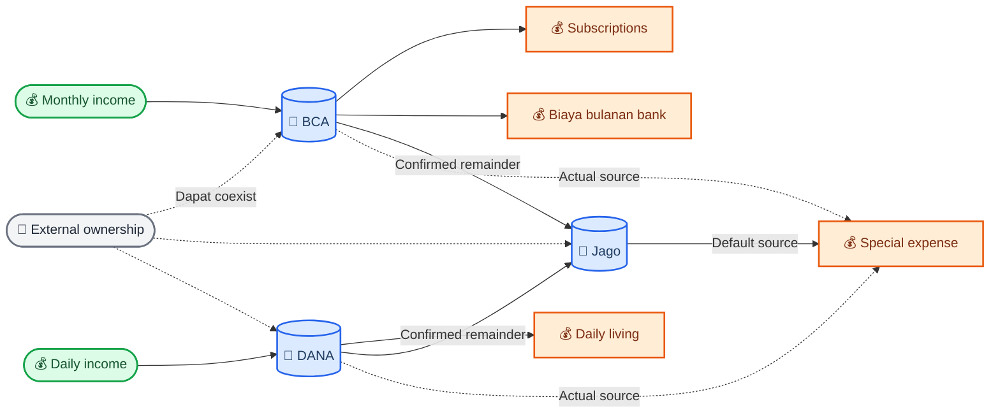
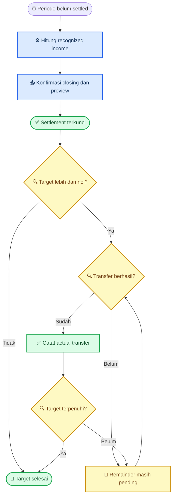
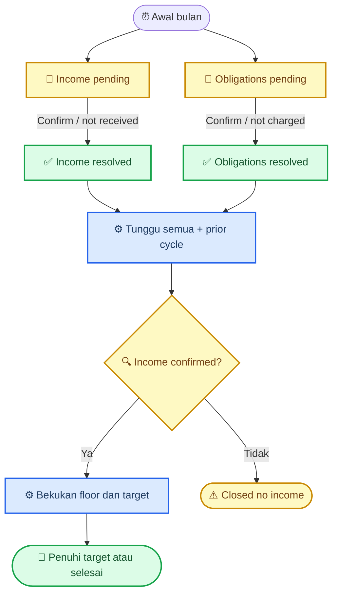
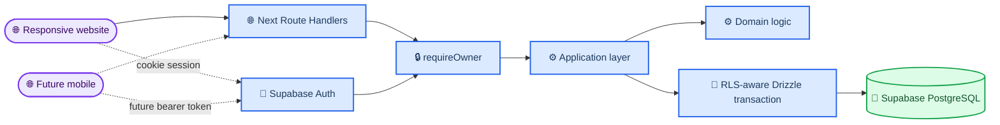

# FinTrack Product Requirements Document

_Living source of truth untuk arah produk, aturan cashflow, UX, dan arsitektur FinTrack._

---

| Metadata | Nilai |
| --- | --- |
| **Pemilik produk** | Agriby Chaniago |
| **Status** | Draft / discovery |
| **Versi dokumen** | 0.21 |
| **Terakhir diperbarui** | 2 Oktober 2026 (v0.21) |
| **Repository baru** | `/home/agribychaniago/www/fintrack_new` |
| **Target pertama** | Website responsif |
| **Target berikutnya** | Aplikasi mobile dengan backend yang sama |

> 📌 **Sumber kebenaran:** Dokumen ini menggantikan asumsi dari FinTrack/FinTech lama. Setiap keputusan produk baru harus memperbarui dokumen ini agar diskusi dan implementasi tidak berjalan dengan asumsi berbeda.

Label keputusan yang digunakan:

- **LOCKED** — telah disepakati
- **PREFERRED** — pilihan prioritas, digunakan ketika sesuai kebutuhan
- **CONDITIONAL** — hanya digunakan jika kebutuhan konkret muncul
- **PROPOSED** — rekomendasi saat ini, belum final
- **OPEN** — masih perlu dibahas
- **DEFERRED** — sengaja ditunda
- **OUT** — tidak termasuk arah produk

## 📋 Ringkasan produk

### Definisi

FinTrack adalah sistem cashflow pribadi yang ringan. FinTrack tidak meminta pengguna mencatat setiap pembelian, tetapi merekonstruksi kondisi keuangan dari recurring income, saldo aktual berkala, transfer antar-akun, dan pengeluaran khusus yang dicatat secara eksplisit.

> **One-line specification:** Low-input personal cashflow tracking with periodic balance settlement.

### Masalah yang diselesaikan

Expense tracker biasa membutuhkan input terlalu banyak untuk makanan, bensin, snack, dan kebutuhan kecil lain. Effort tersebut tidak sebanding dengan informasi yang diperoleh.

FinTrack harus menjawab dengan input sesedikit mungkin:

- Uang pribadi tersedia berapa
- Uang berada di akun mana
- Biaya hidup normal rata-rata per hari berapa
- Pengeluaran tidak rutin berapa
- Berapa yang benar-benar masuk ke reserve
- Berapa pertumbuhan bersih reserve setelah dipakai

### Pengguna dan platform

- **LOCKED:** FinTrack hanya digunakan oleh satu pengguna
- **LOCKED:** Website dikerjakan terlebih dahulu
- **LOCKED:** Website tetap responsif dan nyaman digunakan dari ponsel
- **DEFERRED:** Aplikasi mobile dibuat kemudian dengan API dan database yang sama
- **OUT:** Public signup, organisasi, role management, in-app/team invitation, billing, dan fitur SaaS

One-time owner invitation melalui Supabase Dashboard adalah langkah bootstrap operasional, bukan fitur invitation di dalam produk.

### Kondisi proyek

- **LOCKED:** FinTrack dibuat dari awal sebagai repository mandiri
- **LOCKED:** Tidak ada migrasi kode maupun data dari FinTrack lama
- **LOCKED:** Laravel, Keycloak, FinLyzer, FinGoals, dan arsitektur microservice lama bukan requirement
- **LOCKED:** Repository lama tidak menjadi sumber implementasi baru
- **LOCKED:** Repository lama dibiarkan apa adanya; penghapusan atau pengarsipannya bukan bagian proyek ini

## 🎯 Tujuan dan prinsip produk

### Tujuan utama

1. Menghasilkan informasi cashflow yang berguna dengan input minimal
2. Menampilkan personal cash secara jujur tanpa mencampurkan external funds
3. Menghitung biaya hidup harian melalui weekly settlement
4. Memisahkan pengeluaran rutin, subscription, dan pengeluaran tidak rutin
5. Menjaga transfer antar-akun agar tidak salah dihitung sebagai income atau expense
6. Mendukung penambahan akun baru tanpa mengubah business logic inti

### Prinsip

- **Minimal input:** jangan meminta data yang tidak memberikan nilai nyata
- **Truth over appearance:** jangan menampilkan saldo seolah-olah realtime tanpa integrasi bank
- **Actual remainder:** saving berasal dari sisa aktual, bukan target harian teoritis
- **Accountable transfers:** transfer baru dicatat setelah benar-benar dilakukan
- **Simple by default:** fitur lanjutan hanya ditambahkan ketika ada kebutuhan nyata
- **Configurable, not hardcoded:** nama akun dan routing merupakan data/configuration
- **Mobile-friendly:** interaksi penting harus singkat meskipun website menjadi target pertama

### Definisi keberhasilan

FinTrack berhasil apabila pengguna dapat membuka dashboard dan segera mengetahui:

- Personal cash beserta status confirmed/calculated-nya
- Saldo personal Jago, BCA, dan DANA
- Kapan saldo terakhir dikonfirmasi
- Biaya hidup dan average per day minggu berjalan/terakhir
- Status kewajiban bulanan BCA, termasuk subscription dan biaya bank
- Pengeluaran tidak rutin
- Personal component dari transfer yang benar-benar sudah masuk ke Jago
- Pertumbuhan bersih Jago

### Bukan tujuan

FinTrack bukan:

- Aplikasi pencatatan setiap transaksi harian
- Sistem akuntansi bisnis
- Platform multi-user
- Financial advisor
- Portfolio tracker pada MVP
- Sistem yang mengarang saldo realtime

## 💰 Model keuangan

### Akun saat ini

| Akun | Tipe | Purpose | Uang masuk normal | Uang keluar normal |
| --- | --- | --- | --- | --- |
| **Jago** | Bank | Reserve | Transfer BCA/DANA | Pengeluaran tidak rutin |
| **BCA** | Bank | Monthly | Income bulanan | Subscription dan biaya bulanan bank |
| **DANA** | E-wallet | Daily | Income harian | Biaya hidup harian |
| **Tunai** | Uang fisik | Daily (bersama DANA) | Tarik tunai DANA, tarik tunai ATM | Biaya hidup harian |

Nama akun di UI:

- `Jago — Reserve`
- `BCA — Monthly`
- `DANA — Daily`
- `Tunai — Daily` (opsional, diaktifkan saat settlement; lihat "Uang tunai dalam settlement mingguan")

### Pemisahan konsep

FinTrack membedakan tiga dimensi:

| Dimensi | Pertanyaan | Contoh |
| --- | --- | --- |
| **Account** | Uang berada di mana? | Jago, BCA, DANA |
| **Purpose** | Akun digunakan untuk apa? | Reserve, Monthly, Daily |
| **Ownership** | Uang tersebut milik siapa? | Personal, external subject |

Satu akun dapat berisi dana dengan ownership berbeda. BCA, misalnya, dapat memiliki personal funds dan dana titipan pada saat yang sama. Karena itu ownership tidak boleh menjadi satu field tunggal pada akun.

### Alur cashflow normal



### Accounting invariants

- `INCOME`, `EXPENSE`, `TRANSFER`, dan `BALANCE_ADJUSTMENT` adalah konsep berbeda
- Transfer BCA → Jago dan DANA → Jago bukan income baru
- Transfer antar-akun tidak mengubah total personal cash
- Balance adjustment mengubah calculated balance, tetapi bukan income, expense, atau transfer
- `CORRECTION_POSTING` memperbaiki known error dan tetap membawa record kind, physical/personal/ownership legs, serta reporting classification dari record yang dikoreksi
- `CORRECTION_POSTING` dan `BALANCE_ADJUSTMENT` tidak boleh diperlakukan sebagai jenis yang sama
- Correction terhadap transfer tetap berupa koreksi transfer dan tidak berubah menjadi expense atau income
- Opening balance bukan income
- Expense benar-benar mengurangi personal cash
- External funds adalah lapisan ownership, bukan account type
- External funds tetap dikecualikan dari personal cash selama ownership-nya external
- External receipt, return, dan authorized owner-use bukan personal income atau expense
- Explicit ownership change external → personal menjadi `Other/Gift income`
- Explicit ownership change personal → external menjadi non-living ownership outflow
- Personal balance merupakan signed amount, boleh negatif, dan tidak pernah di-clamp ke Rp0
- External component pada transfer tidak memenuhi saving target atau `Gross saved`
- Pengembalian external funds bukan personal expense
- Investment purchase adalah perubahan bentuk aset, bukan expense, tetapi investment belum termasuk MVP
- Akun dan purpose tidak boleh di-hardcode berdasarkan nama provider

Aturan akun merupakan workflow normal, bukan alasan untuk mencatat data palsu. Jika kejadian aktual berbeda, FinTrack harus dapat merekam sumber uang yang sebenarnya tanpa merusak klasifikasi laporan.

### External funds

External funds adalah ownership/custody layer. Outstanding amount berarti jumlah yang masih menjadi hak external subject, bukan hanya bagian yang kebetulan masih tertutup oleh saldo fisik account.

Rumus konseptual:

```text
External outstanding (account, as_of)
= opening external position
+ sum of signed effective external ownership effects through as_of
```

```text
Personal balance (account, as_of)
= physical balance (account, as_of)
- external outstanding (account, as_of)
```

```text
External fund shortfall
= max(0, external outstanding - physical balance)
= max(0, -personal balance)
```

Personal balance tidak di-clamp ke Rp0. Jika external outstanding melampaui physical balance, negative personal position dan `External fund shortfall` ditampilkan sebagai kondisi nyata yang perlu diperhatikan, bukan dikoreksi otomatis.

Struktur ownership minimum:

- `External subject` mewakili pemilik dana, misalnya `Dosen`
- Satu subject otomatis memiliki satu default holding pada MVP
- Position diturunkan per holding dan account dari opening position serta append-only movements
- Backend dapat mendukung beberapa holding/purpose untuk subject yang sama tanpa mengubah model; UI MVP hanya memakai default holding
- Effective holding balance > Rp0 berarti `OPEN`; Rp0 berarti `CLEARED`
- Subject/holding dengan seluruh position Rp0 boleh diarsipkan, tetapi history tidak dihapus
- Receipt baru dapat membuka kembali subject/holding yang sebelumnya `CLEARED`
- Effective external position per holding/account tidak boleh negatif

Efek setiap kejadian:

| Kejadian | Physical | External | Personal | Pelaporan personal |
| --- | ---: | ---: | ---: | --- |
| **Menerima uang titipan** | `+` | `+` | `0` | Bukan income |
| **Mengembalikan dana** | `-` | `-` | `0` | Bukan expense |
| **Membayar kebutuhan pemilik** | `-` | `-` | `0` | Bukan expense |
| **Memindahkan external antar-account** | Berpindah | Berpindah | `0` | Bukan saving |
| **External menjadi personal** | `0` | `-` | `+` | `Other/Gift income` |
| **Personal menjadi external** | `0` | `+` | `-` | Non-living ownership outflow |
| **External cash dipakai pribadi** | `-` | Tetap | `-` | Personal expense |

Ketentuan lifecycle:

- Receipt, return, authorized owner-use, ownership conversion, dan internal external transfer dicatat sebagai append-only external fund movements
- Return dapat parsial atau penuh dan tidak boleh melampaui effective external position holding pada source account; gunakan internal external transfer lebih dahulu jika dana dikembalikan dari account lain
- Return dari account berbeda pada MVP didahului external account transfer ke account sumber, lalu return; future UI boleh membungkusnya menjadi satu guided action
- Actual receipt, return, authorized spend, atau ownership change memakai tanggal kejadian sebenarnya dan bukan historical correction
- Personal expense ketika external funds berada di account tidak mengurangi external outstanding dan dapat menghasilkan shortfall
- Account workflow normal mengatur personal layer; external movement yang sah tidak dianggap pelanggaran purpose account

### Saldo awal

- **OPEN DATA:** Nominal opening terbaru Jago, BCA, DANA, serta external subject/amount belum diberikan
- **LOCKED:** Initial onboarding memakai satu shared `cutover_at` untuk seluruh active account awal; default-nya waktu sekarang dalam `Asia/Jakarta`
- Jago, BCA, dan DANA harus memiliki physical provider balance sebelum onboarding dapat dikonfirmasi
- `Saldo minimum ditahan` BCA wajib dipilih sebelum onboarding dapat dikonfirmasi; nilai ini adalah workflow setting, bukan opening position atau financial event
- Jika satu saldo belum dapat diperiksa, onboarding tetap `DRAFT` dan dapat dilanjutkan kemudian
- External section collapsed secara default; pengguna mengaktifkan `Ada uang milik orang lain` lalu mengisi subject dan exact amount bila relevan
- Personal opening balance selalu diturunkan dari physical balance dikurangi external position, bukan diinput sebagai angka kedua
- Review menampilkan physical, external, personal, total personal cash, dan shortfall sebelum konfirmasi
- Seluruh initial opening positions dikonfirmasi secara atomik
- Semua kejadian dengan waktu `<= cutover_at` dianggap sudah terkandung dalam opening position dan tidak boleh dibukukan ulang
- Opening physical balance dan opening external position bukan income, expense, transfer, atau adjustment
- Nilai provider disimpan persis dan tidak dibulatkan diam-diam
- Snapshot saldo lama tidak di-prefill dan tetap dinyatakan tidak berlaku
- Account yang ditambahkan setelah onboarding memiliki `activation_cutover_at` sendiri tanpa membuka ulang initial onboarding
- Selama onboarding masih `DRAFT`, seluruh input dapat diedit
- Setelah konfirmasi, salah opening data dikoreksi melalui superseding opening snapshot; original tetap tersedia untuk audit dan correction tidak membuat fake income/expense

Boundary automation setelah onboarding:

- Daily income default mulai pada calendar day setelah `cutover_at`
- Opsi eksplisit `Income hari ini belum termasuk — mulai hari ini` dapat memasukkan hari cutover
- Settlement DANA pertama dapat menjadi partial/nonstandard range dari effective start sampai Minggu pertama
- Recurring BCA default mulai pada calendar month berikutnya
- Current BCA cycle hanya diaktifkan secara opt-in jika occurrence bulan berjalan belum tercakup opening position
- Actual current-month movement setelah cutover tetap dapat dicatat meskipun automatic current cycle tidak diaktifkan

Konfigurasi awal yang dibuat onboarding:

- **LOCKED:** Bootstrap identity tetap tidak membuat account, rule, category, atau setting; seluruh konfigurasi finansial awal dibuat oleh financial onboarding
- **LOCKED:** Onboarding draft menyimpan definisi account awal `Jago — Reserve`, `BCA — Monthly`, dan `DANA — Daily` beserta provider, purpose, dan currency `IDR`; display name dapat diubah selama draft
- **LOCKED:** Onboarding draft juga menyimpan konfigurasi rutinitas awal:
  - Daily income rule untuk account Daily: amount default Rp50.000, effective start default hari setelah `cutover_at`, dengan opt-in `Income hari ini belum termasuk — mulai hari ini`
  - Monthly income rule untuk account Monthly: expected amount wajib diisi (saran awal Rp750.000 yang dapat diubah), `first_expected_cycle` default bulan berikutnya, dengan opt-in cycle berjalan bila income bulan ini belum diterima atau belum tercakup opening position
  - Nol atau lebih subscription: nama, expected day (saran tanggal 5), dan expected amount wajib; first cycle default bulan berikutnya dengan opt-in cycle berjalan per item
  - Satu bank-fee rule untuk account Monthly dengan expected day dan amount opsional; first cycle mengikuti aturan yang sama
  - `Saldo minimum ditahan` untuk account Monthly (wajib, lihat Monthly flow BCA)
- **LOCKED:** Aksi `Mulai FinTrack` membuat secara atomik: account awal, opening snapshot dan positions, external subjects/holdings, seluruh rule beserta initial state/revision, workflow settings (retained floor dan default special-expense source = account Reserve), serta seed category `Vape`. Seed `Vape` dibuat tepat sekali per owner
- **LOCKED:** Review sebelum konfirmasi menampilkan seluruh boundary dan opt-in yang dipilih, termasuk tanggal mulai daily income dan cycle BCA pertama untuk setiap rule
- **LOCKED:** Setelah onboarding, rule dan setting dikelola dari `Pengaturan` mengikuti aturan effective-dated masing-masing dan tidak membuka ulang onboarding
- **LOCKED:** Jika opt-in cycle berjalan hanya dipilih untuk obligation, tetapi tidak untuk monthly income karena income bulan ini sudah tercakup opening, cycle berjalan menjadi obligation-only cycle. Cycle ini tetap wajib resolved sebelum cycle berikutnya dapat ready, tetapi tidak pernah membuat automatic transfer target; setelah seluruh obligation resolved, state-nya `COMPLETE` dengan label `Tidak ada saran transfer otomatis`

## 🔄 Workflow inti

### Daily income DANA

- **LOCKED:** Income saat ini adalah Rp50.000 per eligible calendar day ketika rule `ACTIVE`
- **LOCKED:** Rule dibuat dengan status `ACTIVE` secara default
- **LOCKED:** Lifecycle rule hanya `ACTIVE` dan `PAUSED`; rule dapat di-pause dan di-resume, tetapi tidak dapat di-terminate atau dihapus
- Nominal dan effective start rule harus configurable
- Pada onboarding, effective start default ke calendar day setelah `cutover_at`; opsi eksplisit dapat memulai pada hari cutover jika income hari tersebut belum termasuk opening balance
- Boundary onboarding yang sudah dikonfirmasi tidak boleh menghasilkan daily income yang juga telah terkandung dalam opening position
- Zona waktu bisnis adalah `Asia/Jakarta`
- Hari ketika rule `ACTIVE` adalah eligible; hari ketika rule `PAUSED` tidak menghasilkan daily income
- Perubahan status disimpan sebagai riwayat periode agar settlement lama tetap dapat direkonstruksi
- Pause atau resume tidak mengubah financial event yang sudah confirmed maupun periode yang sudah settled
- Setiap hari eligible dihitung tepat satu kali meskipun aplikasi tidak dibuka
- Implementasi awal mengevaluasi rule secara lazy/idempotent; tidak memerlukan cron yang membuat row setiap hari
- Rule yang tidak lagi digunakan tetap berada dalam status `PAUSED` agar dapat diaktifkan kembali
- **LOCKED:** Pause/resume memiliki effective date yang dapat dipilih; default-nya tanggal bisnis hari ini jika masih terbuka, atau tanggal pertama setelah settlement terakhir jika hari ini sudah settled
- **LOCKED:** Pause/resume hanya dapat di-backdate ke tanggal dalam periode yang belum settled
- **LOCKED:** Effective date pada periode yang sudah settled harus ditolak; settlement yang selesai tidak dibuka atau dihitung ulang
- **LOCKED:** Pause atau resume dapat dijadwalkan ke tanggal masa depan
- MVP hanya mengizinkan satu upcoming state transition efektif per daily income rule
- Effective date bersifat inklusif dalam `Asia/Jakarta`: `Pause mulai 1 Oktober` membuat 1 Oktober tidak eligible, sedangkan `Resume mulai 10 Oktober` membuat 10 Oktober kembali eligible
- Upcoming transition harus mengubah projected state; pause ketika projected state sudah `PAUSED` atau resume ketika projected state sudah `ACTIVE` ditolak sebagai no-op
- Tidak boleh ada dua transition efektif pada rule dan business date yang sama
- Upcoming transition dapat dibatalkan atau dijadwal ulang sebelum effective date; revision history tetap dipertahankan
- Ketika business date telah mencapai effective date, transition secara logis sudah berlaku walaupun aplikasi belum dibuka; due transition harus dievaluasi sebelum aksi cancel/reschedule ditawarkan
- Setelah effective date tercapai, transition menjadi bagian state history pada effective date tersebut, bukan pada waktu lazy evaluation. Perubahan masih mengikuti correction pada periode terbuka dan ditolak jika tanggalnya sudah masuk settlement `SETTLED`
- Future transition dievaluasi secara lazy/idempotent; tidak memerlukan cron atau aplikasi dibuka pada effective date
- State periods tidak boleh overlap dan hanya boleh memiliki satu current open-ended period
- UI menampilkan current state dan upcoming transition, misalnya `Aktif sekarang · akan dijeda 1 Oktober`
- Planned pause range yang menjadwalkan pause dan resume sekaligus tidak masuk UI MVP; resume dapat dijadwalkan setelah pause mulai berlaku
- **LOCKED:** Hari `ACTIVE` yang tidak menerima income tidak mengubah state rule; gunakan sparse per-date override
- Tidak adanya override berarti nominal default rule diterima pada tanggal tersebut
- Override menyimpan non-negative actual amount; `0` berarti tidak diterima dan nominal lain berarti jumlah aktual berbeda dari default
- Override hanya berlaku pada tanggal ketika rule `ACTIVE`; penerimaan pada tanggal `PAUSED` dicatat sebagai actual income terpisah atau rule di-resume sesuai kejadian sebenarnya
- Override pada periode terbuka dapat diedit/dihapus; perubahan setelah settlement mengikuti correction path yang telah dikunci
- Income susulan dicatat pada tanggal uang benar-benar diterima, bukan dipindahkan secara semu ke tanggal yang terlewat

```text
Scheduled daily income
= active days × default rule amount

Recognized daily income
= scheduled daily income
+ sum(actual amount - default amount for override dates)
```

### Weekly settlement DANA

- Periode normal default: Senin–Minggu
- Jadwal normal settlement: Minggu malam setelah aktivitas hari tersebut
- Input utama: physical balance DANA yang terlihat pada provider sebelum remainder ditransfer ke Jago
- Closing personal DANA balance diturunkan dari physical balance dikurangi effective external outstanding pada as-of yang sama
- Input closing physical balance disimpan sebagai balance confirmation yang direferensikan oleh settlement snapshot
- Sistem menghitung scheduled income, recognized income, living expense, average per day, dan available remainder
- Income-eligible days dan settlement calendar days adalah dua nilai berbeda ketika rule pernah di-pause
- Settlement yang diselesaikan menyimpan snapshot tanggal `ACTIVE`, overrides, dan recognized income agar perubahan rule berikutnya tidak mengubah hasil historis
- **LOCKED:** Snapshot settlement membekukan seluruh input formula agar as-settled view dapat direproduksi tanpa membaca ledger yang berubah: range dan settlement days, opening personal balance, recognized income per tanggal, other personal inflows, personal transfer components in/out, recorded non-living deductions, referensi closing balance confirmation, closing physical, external outstanding pada closing, closing personal, living expense, average per day, available remainder, prior outstanding, dan initial target amount
- **LOCKED:** Karena daily income tidak dimaterialisasi sebagai row harian, target koreksi resmi untuk override yang salah setelah settlement adalah komponen recognized income pada snapshot settlement untuk tanggal tersebut; `CORRECTION_POSTING` mereferensikan settlement dan business date itu
- Settlement yang selesai bersifat immutable dan tidak dapat dibuka kembali
- Koreksi financial event/transfer yang sudah masuk settlement dibuat sebagai `CORRECTION_POSTING`; koreksi closing balance memakai replacement balance confirmation. Keduanya tidak menulis ulang snapshot settlement
- **LOCKED:** Settlement menjadi `SETTLED` setelah closing physical balance, derived personal balance, dan hasil rekonstruksi dikonfirmasi; penyelesaian transfer tidak menjadi syarat settlement
- Settlement yang menjadi `SETTLED` membekukan initial transfer target baru; target ini adalah suggestion non-financial, bukan transfer
- Setelah transfer benar-benar berhasil di DANA, pengguna mengonfirmasi actual transfer tersebut di FinTrack
- Settlement menghasilkan satu confirmed aggregate living-expense ledger contribution; bukan daftar transaksi makan/bensin
- As-settled view memakai aggregate contribution yang dibekukan saat settlement, sedangkan corrected view memakai satu recomputed contribution penggantinya
- Satu settlement dapat memiliki lebih dari satu confirmed transfer sehingga remainder dapat dipindahkan secara bertahap
- Transfer yang gagal di provider tidak menghasilkan confirmed financial record
- Progress transfer adalah label turunan dari effective target amount dan total effective allocations: `NOT_TRANSFERRED`, `PARTIALLY_TRANSFERRED`, `FULLY_TRANSFERRED`, atau `EXCEEDS_SUGGESTION`
- Partial transfer tidak mengubah living expense atau snapshot settlement
- Hanya personal transfer component yang dapat memenuhi target settlement; external component tidak mengubah fulfillment atau `Gross saved`
- Replacement closing balance atau correction lain yang mengubah available remainder membuat superseding transfer-target version untuk corrected view; initial target tetap tersedia pada as-settled view
- Jika settlement berikutnya dibuat saat target DANA sebelumnya belum penuh, prior outstanding dikurangkan dari closing personal balance sebelum target periode baru dibuat sehingga carry-over tidak disarankan dua kali

```text
Prior DANA outstanding at settlement
= sum of remaining actionable effective DANA → Jago targets
  from earlier settlements

New DANA transfer target
= max(0, closing personal DANA balance
         - prior DANA outstanding at settlement)
```

Total operational suggestion tetap dibatasi oleh current personal DANA balance. Bila outstanding target melebihi saldo karena remainder lama kemudian terpakai, FinTrack menampilkan liquidity warning dan tidak mengubah target historis secara diam-diam.

**LOCKED:** Jika remainder DANA lama sudah terpakai dan target tersebut tidak lagi realistis dipenuhi, pengguna dapat memilih aksi eksplisit `Tutup target` pada target DANA → Jago yang masih actionable:

- Aksi tersedia untuk target DANA maupun BCA yang masih actionable dengan remaining transferable amount > Rp0 dan memerlukan konfirmasi pengguna; perilaku BCA dijelaskan pada Monthly flow BCA
- FinTrack membuat superseding target version non-actionable dengan reason `LIQUIDITY_WRITE_OFF`; frozen amount dan basis versi sebelumnya tetap tersimpan untuk audit
- Allocation dan actual transfer yang sudah terjadi tidak berubah; linked confirmed amount tetap tercatat pada logical target
- Target yang ditutup tidak lagi masuk `Prior DANA outstanding at settlement` maupun operational transfer-now suggestion, sehingga target settlement berikutnya kembali dihitung dari closing personal balance
- Penutupan target bukan financial event, bukan expense, dan tidak mengubah living expense, saldo, atau snapshot settlement
- Penutupan bersifat final; FinTrack tidak otomatis menutup target dan tidak menyediakan aksi membuka kembali. Transfer aktual yang tetap dilakukan kemudian mengikuti auto-allocation normal ke target actionable yang tersisa

Aturan late dan catch-up settlement:

- Jika saldo historis Minggu malam diketahui, periode asli tetap dapat diselesaikan terlambat dengan business date asli
- Jika saldo historis tidak diketahui, FinTrack tidak mengarang closing balance
- Pengguna membuat satu catch-up settlement yang mencakup seluruh rentang hari contiguous yang belum diselesaikan sampai balance as-of yang benar-benar diketahui
- Settlement tidak boleh overlap atau meninggalkan gap di antara periode yang telah dicakup
- Periode default tetap Senin–Minggu; partial/nonstandard period hanya digunakan untuk onboarding atau catch-up
- Settlement pertama setelah onboarding dapat menjadi partial period dari effective start daily rule sampai Minggu pertama dan tetap tunduk pada invariant contiguous/no-overlap
- `DUE`, `OVERDUE`, `LATE`, dan `NONSTANDARD` adalah label turunan, bukan persisted settlement states



Rumus umum:

```text
Ordinary living expense
= opening personal balance
+ recognized daily income
+ other personal inflows
+ personal transfer components in
- personal transfer components out
- recorded non-living/special expenses paid from DANA
- closing personal balance
```

**LOCKED:** Himpunan komponen formula ditentukan berdasarkan klasifikasi, bukan daftar event kind:

- `Other personal inflows` = seluruh confirmed personal inflow pada DANA dalam range selain recognized daily income, termasuk actual income lain dan external → personal ownership conversion (`Other/Gift income`)
- `Recorded non-living deductions` = seluruh confirmed personal outflow pada DANA dalam range yang bukan ordinary living expense, yaitu special expense dan personal → external ownership outflow; recurring expense tidak dapat bersumber dari DANA
- Ownership-neutral external movement dan `BALANCE_ADJUSTMENT` tidak termasuk dalam kedua himpunan

Dalam kondisi normal setelah minggu sebelumnya disapu ke Jago dan tidak ada transaksi khusus di DANA:

```text
Ordinary living expense
= recognized daily income
- closing personal DANA balance
```

```text
Average daily living cost
= ordinary living expense / settlement calendar days
```

Income-eligible days menentukan scheduled income berdasarkan state `ACTIVE`; per-date override menentukan recognized income aktualnya. Average living cost tetap menggunakan jumlah hari kalender yang tercakup oleh settlement agar pause atau missed income tidak membuat biaya hidup per hari tampak lebih tinggi. Opening balance tidak boleh diasumsikan selalu nol oleh sistem.

**LOCKED:** Ordinary living expense hasil rekonstruksi boleh bernilai negatif, misalnya ketika DANA menerima uang yang belum tercatat:

- Settlement tetap dapat dikonfirmasi; FinTrack tidak memblokir konfirmasi dan tidak membuat adjustment otomatis
- Preview settlement menampilkan warning `Ada pemasukan yang belum tercatat` beserta signed living expense, lalu menyarankan pengguna mencatat inflow yang terlewat sebelum konfirmasi
- Living expense dan average per day negatif disimpan serta ditampilkan apa adanya dengan leading minus; nilai tidak di-clamp ke Rp0
- Warning memakai icon dan teks eksplisit, bukan warna saja, dan tetap terlihat pada detail settlement yang sudah `SETTLED`

### Uang tunai dalam settlement mingguan

**LOCKED (30 September 2026, disetujui pemilik):** Uang fisik di dompet dilacak sebagai account `Tunai` yang di-settle bersama DANA. Pemilik menarik tunai dari DANA kira-kira dua hari sekali dan kadang menyisakan uang di dompet; belanja tunai tidak dicatat satu per satu.

- `Tunai` adalah active cash account dengan `account_type = CASH` yang menunjuk account weekly settlement-nya (DANA). DANA dan Tunai membentuk satu *settlement pool*
- Tunai diaktifkan dari settlement DANA: pengguna memilih `Mulai lacak uang tunai` dan mengisi uang di dompet saat penutupan. Nilai itu menjadi opening position Tunai dengan `activation_cutover_at` = waktu saldo penutupan settlement tersebut. Settlement pengaktif dan seluruh settlement sebelumnya tidak berubah; Tunai ikut dalam pool mulai periode berikutnya
- Setelah aktif, setiap settlement meminta saldo penutupan DANA dan `Uang tunai di dompet` pada waktu penutupan yang sama. Keduanya wajib dan menjadi balance confirmation masing-masing account
- Tarik tunai dari DANA tidak perlu dicatat. Jika dicatat sebagai transfer DANA → Tunai, transfer internal pool tidak dihitung sebagai transfer masuk atau keluar
- Tarik tunai dari account lain dicatat sebagai transfer ke Tunai; pemasukan tunai dicatat sebagai income lain pada Tunai; pengeluaran khusus boleh bersumber dari Tunai. Ordinary expense dan balance confirmation manual tidak tersedia untuk Tunai, sama seperti DANA
- Formula pool:

```text
Ordinary living expense
= opening personal DANA + opening personal Tunai
+ recognized daily income
+ other personal inflows (pool)
+ personal transfer components in from outside the pool
- personal transfer components out to outside the pool
- recorded non-living deductions (pool)
- closing personal DANA - closing personal Tunai
```

- Living contribution di-posting per account agar saldo terhitung DANA dan Tunai masing-masing sama dengan saldo penutupannya; total contribution sama dengan living expense pool
- Target transfer DANA → reserve tetap memakai closing personal DANA saja; uang di dompet tidak disarankan untuk ditransfer
- Koreksi riwayat yang sudah di-settle, replacement saldo penutupan (DANA maupun Tunai), as-settled vs corrected view, dan freshness berlaku untuk seluruh pool
- Account card Tunai tampil di dashboard dan masuk `Personal cash tercatat`; statusnya mengikuti minggu berjalan DANA

### Monthly flow BCA

- Income saat ini sekitar Rp750.000 per bulan dan harus configurable
- Setelah onboarding, `first_expected_cycle` default ke calendar month berikutnya
- Current calendar cycle hanya dibuat melalui explicit opt-in jika income dan obligation terkait belum tercakup opening position
- External receipt/return tidak mengonfirmasi atau menyelesaikan monthly income maupun obligation occurrence
- Cycle readiness dan remainder selalu memakai personal BCA balance setelah effective external outstanding dikurangi
- **LOCKED:** Expected income window adalah tujuh hari pertama setiap bulan
- **LOCKED:** Tanggal income aktual tidak ditentukan sebelumnya
- Monthly income occurrence adalah record siklus yang stabil; effective status-nya adalah `PENDING`, `CONFIRMED`, atau `NOT_RECEIVED`
- `PENDING` berarti belum ada current resolution, sedangkan `CONFIRMED`/`NOT_RECEIVED` diturunkan dari latest non-superseded resolution
- Income bulanan muncul sebagai `PENDING` sejak awal expected window dan tidak memengaruhi confirmed balance
- Ketika dana benar-benar masuk, pengguna melakukan one-tap confirmation
- Tanggal dan nominal aktual dapat dikoreksi sebelum confirmation
- `CONFIRMED` secara atomik membuat atau menautkan actual income event pada BCA
- `NOT_RECEIVED` menyelesaikan occurrence tanpa ledger impact
- Income yang datang setelah expected window tetap dapat dikonfirmasi tanpa dibuat ulang
- Jika income datang setelah occurrence diselesaikan sebagai `NOT_RECEIVED`, aksi `Konfirmasi masuk terlambat` menambahkan resolution `CONFIRMED` yang men-supersede resolution sebelumnya dan membuat actual income event tanpa menghapus audit trail
- `OVERDUE` dan `LATE` adalah label turunan berdasarkan expected window dan actual date, bukan persisted states
- Monthly income rule memiliki `first_expected_cycle` dan optional `last_expected_cycle`
- Setelah `last_expected_cycle`, tidak ada occurrence baru; history tetap utuh dan status `SCHEDULED`, `ACTIVE`, atau `ENDED` hanya diturunkan dari periode rule
- Perpanjangan sumber yang sama memperbarui future schedule secara tercatat; sumber income baru menggunakan rule baru

Kewajiban bulanan BCA dimodelkan sebagai recurring expense definitions yang menghasilkan occurrence per siklus. Jenis awalnya adalah `SUBSCRIPTION` dan `BANK_FEE`. Istilah _monthly obligation occurrence_ dalam workflow adalah recurring expense occurrence yang menjadi kewajiban pada siklus bulanan BCA, bukan entity terpisah.

**LOCKED:** Aturan umum untuk recurring expense rule dan monthly income rule:

- Source account recurring expense rule dan actual source account pada occurrence wajib berupa active cash account yang tidak direkonsiliasi melalui weekly settlement; DANA tidak dapat menjadi source subscription atau biaya bank, dan aturan ini tidak bergantung pada provider name
- Jika kewajiban tersebut pernah benar-benar dibayar dari DANA, pembayaran dicatat sebagai special expense dari DANA agar terdeduksi sebagai non-living pada settlement, dan occurrence terkait diselesaikan `NOT_CHARGED` karena source account rule memang tidak didebit
- First cycle rule baru tidak boleh lebih awal dari cycle berjalan; default-nya cycle bulan berikutnya, sedangkan cycle berjalan hanya dapat dipilih melalui explicit opt-in bila occurrence bulan ini belum terjadi atau belum tercakup opening position
- Rule dengan first cycle di masa lalu ditolak; FinTrack tidak membuat backfill occurrence untuk cycle yang sudah lewat
- Tagihan atau income yang sudah terjadi sebelum first cycle rule tidak dibuat sebagai occurrence; jika terjadi setelah cutover dan belum tercatat, kejadian tersebut dicatat sebagai actual financial event biasa pada source account aktual

Subscription:

- **LOCKED:** Subscription adalah collection dinamis, bukan satu field khusus
- **LOCKED:** FinTrack mendukung satu atau lebih subscription
- Setiap subscription memiliki nama, source account, expected date, expected amount, dan active period
- Source account normal adalah BCA; DANA tidak diperbolehkan sebagai source subscription
- Subscription yang aktif saat ini memiliki expected date tanggal 5
- Expected date adalah perkiraan/reminder berbentuk day-of-month, bukan klaim tanggal debit aktual
- Setiap occurrence menyimpan snapshot expected date dan expected amount dari rule revision yang berlaku pada cycle tersebut
- Actual charged date disimpan terpisah dan tidak pernah otomatis mengubah expected date
- Expected amount dapat berubah dan actual charged amount harus dikonfirmasi
- Setiap subscription menghasilkan occurrence `PENDING` untuk siklus bulan terkait
- Setiap occurrence dikonfirmasi secara terpisah
- Nominal aktual terakhir dapat digunakan sebagai suggestion bulan berikutnya
- `NOT_CHARGED` hanya menyelesaikan occurrence bulan tersebut dan tidak menonaktifkan recurring rule
- Jika actual date berbeda, confirmation tetap selesai satu tap lalu UI dapat menawarkan secondary action `Ubah perkiraan menjadi tanggal X mulai bulan depan`
- Mengabaikan secondary action mempertahankan expected date lama
- Menerima secondary action membuat effective-dated rule revision mulai cycle berikutnya; current/past occurrence dan actual event tidak berubah
- Jika revision untuk `effective_from_cycle` yang sama sudah pending, keputusan terbaru men-supersede revision pending tersebut; tidak boleh ada dua effective revisions untuk rule/cycle yang sama
- Expected day 29–31 yang tidak ada pada suatu bulan jatuh pada calendar day terakhir bulan tersebut
- Debit lintas bulan menyelesaikan occurrence yang dipilih pengguna. `cycle_key` occurrence tetap menentukan BCA cycle, sedangkan actual charged date menentukan penempatan expense pada calendar report
- Perubahan actual amount tidak otomatis menulis ulang expected amount; nilai aktual terakhir tetap hanya suggestion

Biaya bulanan bank:

- **LOCKED:** BCA memiliki biaya bulanan bank sebagai recurring expense terpisah dari subscription
- Source account adalah BCA dan cadence-nya bulanan
- Biaya ini adalah true expense BCA: mengurangi personal cash dan masuk actual total outflow, bukan transfer atau special expense
- Expected date dan expected amount bersifat opsional karena keduanya belum diketahui
- Setiap siklus menghasilkan satu occurrence `PENDING` meskipun expected date dan amount kosong
- Actual charged date dan actual charged amount dikonfirmasi setelah debit benar-benar terlihat
- Actual periode sebelumnya boleh ditampilkan sebagai referensi, tetapi tidak otomatis dibukukan sebagai actual periode berikutnya
- Jika expected date kosong dan occurrence masih `PENDING`, UI menampilkan reminder untuk review menjelang akhir bulan
- Setelah actual pertama dikonfirmasi, FinTrack boleh menawarkan tanggal tersebut sebagai expected date mulai cycle berikutnya; pengguna harus memilih secara eksplisit

Monthly obligation occurrence juga merupakan record siklus yang stabil. Effective status `PENDING`, `CONFIRMED`, atau `NOT_CHARGED` diturunkan dari resolution history:

- `CONFIRMED` secara atomik membuat atau menautkan actual expense event serta mewajibkan actual date dan amount
- `NOT_CHARGED` menyelesaikan occurrence tanpa ledger impact
- Jika debit muncul setelah `NOT_CHARGED`, pengguna memakai aksi konfirmasi terlambat yang menambahkan resolution `CONFIRMED` yang men-supersede resolution sebelumnya dan mempertahankan audit trail
- Kesalahan pada actual event yang sudah confirmed mengikuti correction path financial event
- `DUE_SOON`, `OVERDUE`, dan `NEEDS_REVIEW` adalah label turunan, bukan effective status atau persisted state

Resolution occurrence bersifat append-only dan immutable:

- Setiap resolution menyimpan outcome, waktu aksi, actor, optional linked financial event, dan optional `supersedes_id`
- Hanya satu resolution yang boleh menjadi latest non-superseded resolution untuk satu occurrence
- Late confirmation tidak mengubah row `NOT_RECEIVED`/`NOT_CHARGED`; resolution baru men-supersede resolution lama
- Koreksi nominal/tanggal pada linked financial event mengikuti reversal/replacement, bukan mengubah resolution history
- Koreksi no-event → event menambahkan superseding resolution dan actual financial event baru
- Koreksi event → no-event menambahkan superseding resolution serta reversal-only void pada periode terbuka atau `CORRECTION_POSTING` reversal delta pada settled history; tidak membuat replacement event palsu
- Perubahan outcome, ledger correction, dan perubahan target terkait harus berhasil atau gagal secara atomik

**LOCKED:** FinTrack baru menawarkan remainder BCA → Jago setelah monthly income berstatus `CONFIRMED` dan seluruh monthly obligation occurrence aktif pada siklus tersebut resolved. Occurrence obligation dianggap resolved ketika `CONFIRMED` atau `NOT_CHARGED`. Selama masih ada occurrence yang unresolved, dana tetap ditahan di BCA dan tidak ada suggested remainder.

Siklus BCA diselesaikan secara kronologis. Cycle yang lebih baru tidak boleh membuat transfer target selama masih ada cycle BCA lebih lama dengan income atau obligation unresolved. Kondisi ini ditampilkan sebagai derived state `WAITING_FOR_PRIOR_CYCLE`; pengguna tetap boleh menyelesaikan occurrence pada cycle baru, tetapi readiness menunggu cycle lama.

Jika monthly income berstatus `NOT_RECEIVED`, cycle dapat ditutup sebagai `CLOSED_NO_INCOME`, tetapi FinTrack tidak memberikan automatic transfer suggestion. Actual transfer manual tetap dapat dicatat.

BCA memiliki setting configurable `retained_balance_floor`, ditampilkan sebagai `Saldo minimum ditahan`:

- Nilainya wajib dipilih secara eksplisit dan tidak boleh negatif; Rp0 adalah pilihan valid
- **LOCKED:** Floor menjadi field wajib pada financial onboarding; onboarding tidak dapat dikonfirmasi tanpa nilai floor untuk account monthly (initial: BCA), sehingga cycle yang memasuki ready branch selalu memiliki floor
- Account monthly yang diaktifkan setelah onboarding wajib memilih floor pada activation flow-nya sebelum remainder suggestion dapat dibuat
- Nilai ini bukan income, expense, reservation, atau ledger event
- Sistem tidak mengubah floor otomatis ketika expected subscription berubah
- Jika total expected obligation siklus berikutnya melebihi floor, FinTrack hanya menampilkan warning
- Personal balance untuk formula selalu mengecualikan external funds
- Perubahan setting floor hanya berlaku pada transfer target yang belum dibuat dan tidak menulis ulang target historis

```text
Prior BCA outstanding at readiness
= sum of remaining actionable effective BCA → Jago targets
  from earlier cycles

Current-cycle early fulfillment
= sum of confirmed personal-component target allocations
  assigned to this cycle before target creation

Balance basis at readiness
= personal BCA balance at readiness
+ current-cycle early fulfillment

Suggested transfer target
= max(0, balance basis at readiness
         - retained floor used
         - prior BCA outstanding at readiness)

Remaining transferable amount
= max(0, suggested transfer target
         - total effective confirmed personal allocations to target)
```

Ketika cycle pertama kali ready, FinTrack membekukan `personal_balance_at_readiness`, `current_cycle_early_fulfillment`, `prior_outstanding_at_readiness`, `retained_floor_used`, dan `suggested_transfer_target` sebagai non-financial transfer-target snapshot. Penambahan kembali early fulfillment mencegah transfer yang telanjur dilakukan sebelum readiness menghilang dari target, sedangkan pengurangan prior outstanding mencegah carry-over siklus lama disarankan dua kali.

Pending monthly income tidak masuk ke perhitungan remainder. Suggested amount bukan transfer dan tidak mengubah saldo sampai actual transfer dikonfirmasi.

Logical target bersifat stabil dan setiap target version immutable. Koreksi terkonfirmasi yang mengubah basis target membuat versi baru dengan `supersedes_id`; versi lama tetap tersedia untuk audit. Perubahan floor setelah target dibuat tidak mengubah cycle tersebut kecuali pengguna secara eksplisit meminta recalculation, yang juga membuat versi baru. Actual transfer dan allocation tidak pernah dibuat, diubah, atau dibatalkan otomatis oleh recalculation.

Jika monthly income dikoreksi dari `CONFIRMED` menjadi `NOT_RECEIVED`, FinTrack secara atomik membuat effective target version non-actionable dengan amount Rp0 dan reason `INCOME_NOT_RECEIVED`. Cycle menjadi `CLOSED_NO_INCOME`; target lama, allocation lama, dan actual transfer tetap tersedia untuk audit tetapi tidak masuk operational suggestion. Jika income kemudian benar-benar diterima, superseding `CONFIRMED` resolution membuat target version actionable baru dari basis yang telah dikoreksi.

Aturan ini adalah guardrail workflow dan UX, bukan larangan pada database. Jika transfer fisik sudah telanjur dilakukan sebelum siklus resolved, pengguna tetap dapat mencatat transfer aktual tersebut; FinTrack menampilkan bahwa siklus masih memiliki kewajiban unresolved.

- Transfer BCA → Jago dicatat setelah benar-benar dilakukan
- Satu cycle dapat dipenuhi oleh beberapa actual transfers; progress dihitung dari effective allocations, bukan status pada satu transfer
- Menambah subscription atau recurring expense instance lain tidak memerlukan perubahan schema
- Perhitungan `safe to transfer` dengan reserved estimate sebelum seluruh occurrence resolved ditunda di luar MVP
- FinTrack tidak menyimpan status cycle manual; state diturunkan dengan precedence berikut sehingga selalu mutually exclusive

| Urutan | Derived cycle state | Predicate |
| ---: | --- | --- |
| **1** | `WAITING_FOR_PRIOR_CYCLE` | Sedikitnya satu cycle BCA sebelumnya masih memiliki income atau obligation unresolved |
| **2** | `WAITING_FOR_INCOME` | Tidak ada prior-cycle blocker dan effective income status masih `PENDING`, apa pun status obligation |
| **3** | `WAITING_FOR_OBLIGATIONS` | Income sudah resolved dan sedikitnya satu obligation masih `PENDING` |
| **4** | `CLOSED_NO_INCOME` | Income `NOT_RECEIVED` dan seluruh obligation resolved; tidak ada actionable automatic target |
| **5** | `COMPLETE` | Income `CONFIRMED`, seluruh obligation resolved, dan target = Rp0 |
| **6** | `READY_TO_TRANSFER` | Target > Rp0 dan total effective allocation = Rp0 |
| **7** | `PARTIALLY_TRANSFERRED` | Total effective allocation > Rp0 tetapi masih di bawah target |
| **8** | `COMPLETE` | Total effective allocation sama dengan atau melampaui target |

Tabel dievaluasi dari atas ke bawah; baris 5–8 hanya dicapai setelah tidak ada prior-cycle blocker, income `CONFIRMED`, dan seluruh obligation resolved. `Target` berarti latest actionable effective target version dan fulfillment berarti total effective allocations. Target harus dibuat atomik ketika cycle memasuki ready branch; target yang hilang pada branch ini adalah invariant error, bukan user-facing state baru.

Jika total allocation melampaui target, cycle tetap `COMPLETE` dan UI menambahkan warning `EXCEEDS_SUGGESTION`. Target Rp0 disajikan sebagai “tidak ada transfer yang diperlukan”, bukan sebagai transfer Rp0.

**LOCKED:** Obligation-only cycle dari onboarding atau activation tidak pernah memasuki ready branch; setelah prior-cycle blocker tidak ada dan seluruh obligation resolved, cycle langsung `COMPLETE` dengan label `Tidak ada saran transfer otomatis`.

**LOCKED:** `Tutup target` juga tersedia untuk target BCA → Jago dengan aturan yang sama seperti DANA (reason `LIQUIDITY_WRITE_OFF`, final, tidak mengubah allocation). Jika effective target version cycle adalah non-actionable dengan reason tersebut, cycle bernilai `COMPLETE` dengan label `Target ditutup`; aturan ini dievaluasi sebelum baris 5–8 sehingga tidak menjadi invariant error.



### Exception state model

Persisted lifecycle dan effective status dijaga seminimal mungkin:

| Record | Lifecycle / effective status | Source of truth |
| --- | --- | --- |
| **Onboarding snapshot** | `DRAFT`, `CONFIRMED` | Persisted atomic lifecycle; confirmed correction memakai superseding snapshot |
| **Financial event** | `DRAFT`, `CONFIRMED` | Persisted lifecycle; confirmed record immutable |
| **External fund movement** | `DRAFT`, `CONFIRMED` | Persisted lifecycle; confirmed record immutable dan ownership effects append-only |
| **Monthly income occurrence** | `PENDING`, `CONFIRMED`, `NOT_RECEIVED` | Effective status dari latest non-superseded resolution; `PENDING` jika belum ada resolution |
| **Monthly obligation occurrence** | `PENDING`, `CONFIRMED`, `NOT_CHARGED` | Effective status dari latest non-superseded resolution; `PENDING` jika belum ada resolution |
| **DANA settlement** | `DRAFT`, `SETTLED` | Persisted lifecycle; closing dan rekonstruksi dikonfirmasi |
| **Actual transfer** | `DRAFT`, `CONFIRMED` | Persisted lifecycle; hanya confirmed memengaruhi balance |
| **Balance confirmation** | `DRAFT`, `CONFIRMED` | Persisted lifecycle; correction memakai replacement confirmation |

```mermaid
stateDiagram-v2
    accTitle: Monthly Occurrence Resolution
    accDescr: Diagram menunjukkan effective status; koreksi dua arah menambahkan resolution baru yang men-supersede resolution lama tanpa memutasinya

    state "Monthly income occurrence" as MonthlyIncome {
        [*] --> IncomePending
        IncomePending --> IncomeConfirmed: ✅ Dana diterima
        IncomePending --> IncomeNotReceived: ⚠️ Tidak diterima
        IncomeNotReceived --> IncomeConfirmed: 🔄 Append late resolution
        IncomeConfirmed --> IncomeNotReceived: 🔄 Append no-event correction
    }

    state "Monthly obligation occurrence" as MonthlyObligation {
        [*] --> ObligationPending
        ObligationPending --> ObligationConfirmed: ✅ Debit terlihat
        ObligationPending --> ObligationNotCharged: ⚠️ Tidak ditagih
        ObligationNotCharged --> ObligationConfirmed: 🔄 Append late resolution
        ObligationConfirmed --> ObligationNotCharged: 🔄 Append no-event correction
    }
```



Pada diagram tersebut, `CONFIRMED`, `NOT_RECEIVED`, dan `NOT_CHARGED` adalah resolved effective states. Panah dua arah hanya dapat ditempuh melalui explicit correction yang membuat resolution baru; bukan edit status lama.

Perubahan expected schedule selalu eksplisit dan prospective. FinTrack tidak menyimpulkan rule baru hanya dari satu atau beberapa actual charge dates.

### External fund workflow

Quick actions minimum:

- `Terima dana external`
- `Kembalikan` dengan default amount seluruh effective outstanding
- `Bayar kebutuhan pemilik`
- `Pindahkan antar-account`
- `Ubah ownership` external ↔ personal

Setiap actual external movement menyimpan business date, recorded time, subject/holding, signed physical effect, signed external ownership effect, dan personal reporting classification bila ada. Movement dibuat `DRAFT` selama form belum dikonfirmasi dan menjadi immutable setelah `CONFIRMED`.

Return normal menggunakan account yang memegang external position tersebut. Jika actual return akan dibayar dari account lain, pengguna terlebih dahulu memindahkan external position ke account sumber lalu mencatat return. UI masa depan boleh membungkusnya sebagai satu guided action, tetapi ledger tetap mempertahankan kedua langkah.

Receipt, return, authorized owner-use, atau ownership change yang benar-benar baru terjadi dicatat pada tanggal aktual. Kesalahan pada movement lama mengikuti correction path dan tidak disamarkan sebagai kejadian ekonomi baru.

### Special expense

Jago menjadi default source untuk pengeluaran tidak rutin, tetapi FinTrack selalu menyimpan active cash account yang benar-benar dipakai. Vape termasuk special expense, bukan ordinary daily living. Pemilihan source satu kali tidak mengubah default berikutnya.

Form minimum:

| Field | Perilaku |
| --- | --- |
| **Nominal** | Wajib |
| **Kategori** | Active reusable categories dan sentinel `Lainnya…` |
| **Nama custom** | Wajib jika memilih `Lainnya…`; dibuat atau disambungkan saat konfirmasi |
| **Tanggal** | Default hari ini |
| **Catatan** | Opsional |
| **Source account** | Seluruh active cash accounts; default Jago |

Aturan kategori:

- `Vape` adalah seed category biasa dengan stable ID; business rule tidak bergantung pada nama kategori
- `Lainnya…` hanya sentinel UI dan tidak pernah disimpan sebagai kategori
- Konfirmasi nama custom membuat kategori reusable baru atau memakai kategori existing dengan normalized name yang sama
- Normalisasi melakukan trim, collapse whitespace, dan case-insensitive comparison agar label setara tidak menjadi duplikat
- Kategori dapat di-rename dan di-archive, tetapi tidak dihapus setelah pernah dipakai
- Rename mempertahankan stable ID dan historical grouping; archived category tidak tampil pada form baru tetapi tetap tampil pada history/report
- Salah category pada confirmed event diperbaiki melalui correction path, bukan dengan rename category

Aturan source dan reporting:

- Source account harus mencerminkan account pembayaran aktual; Jago hanya default workflow
- Special expense dari account mana pun masuk `Special outflow` dan `Actual total outflow`, tetapi tidak masuk ordinary living expense atau average daily living cost
- Special expense dari DANA menjadi recorded non-living deduction pada settlement agar tidak tersamarkan sebagai living expense
- Special expense dari BCA mengurangi current personal balance dan operational transferable liquidity, tetapi tidak menyelesaikan subscription/bank-fee occurrence atau menulis ulang frozen transfer target
- Special expense dari Jago mengurangi net reserve growth
- Insufficient personal balance memunculkan warning tanpa memblokir pencatatan kejadian aktual
- Special expense personal tidak pernah mengurangi external outstanding; jika personal position tidak cukup, hasilnya dapat menjadi negative personal balance/external shortfall
- Source account harus aktif ketika event baru dibuat. Jika default source telah diarsipkan, UI meminta pilihan eksplisit dan tidak memilih account pengganti secara diam-diam; historical event tetap menunjuk archived source yang sah
- Special expense DANA yang baru ditemukan atau dikoreksi setelah settlement terkait selesai memakai explicit settled-history reclassification: as-settled snapshot tetap, corrected living expense berkurang, special outflow bertambah, dan physical cash effect tidak dihitung dua kali
- Category dan source account adalah dua dimensi reporting yang terpisah

### Attachment dan bukti

- **OUT:** Lampiran
- **OUT:** Screenshot
- **OUT:** Nota
- **OUT:** Bukti transfer
- **OUT:** OCR
- **OUT:** Supabase Storage

Catatan teks tetap opsional. Dokumen/bukti tidak menjadi bagian dari sumber kebenaran FinTrack.

## 📊 Metrics dan perhitungan

### Metrics utama

| Metric | Arti |
| --- | --- |
| **Confirmed personal cash** | Jumlah latest confirmed personal balance pada seluruh cash account aktif; menjadi konteks karena timestamp antar-account dapat berbeda |
| **Calculated personal cash** | Jumlah personal calculated balance pada seluruh cash account aktif; tampil sebagai headline user-facing `Personal cash tercatat` |
| **Physical balance** | Saldo aktual provider sebelum ownership dikurangi |
| **External outstanding** | Ownership yang masih menjadi hak external subjects pada account/as-of |
| **Personal balance** | Physical balance dikurangi external outstanding pada as-of yang sama; boleh negatif |
| **External fund shortfall** | Bagian external outstanding yang tidak tertutup physical balance |
| **Calculated physical balance** | Physical balance hasil opening dan seluruh recorded physical effects |
| **Personal calculated balance** | Calculated physical balance dikurangi calculated external outstanding |
| **Physical balance discrepancy** | Selisih confirmed physical dan calculated physical balance |
| **Unexplained adjustment** | Adjustment terkonfirmasi untuk discrepancy yang penyebabnya tidak diketahui |
| **Scheduled daily income** | Active days dikali default rule amount |
| **Recognized daily income** | Scheduled income setelah per-date overrides |
| **Income-eligible days** | Hari ketika daily income rule berstatus `ACTIVE` |
| **Income-received days** | Hari aktif dengan recognized amount lebih dari nol |
| **Settlement days** | Hari kalender yang tercakup oleh settlement |
| **Living expense** | Pengeluaran hidup hasil rekonstruksi |
| **Average per day** | Living expense dibagi settlement days |
| **Available remainder** | Saldo yang tersedia sebelum ditransfer |
| **Gross saved** | Confirmed personal transfer components yang benar-benar masuk Jago |
| **Special outflow** | Seluruh confirmed special expense dalam scope dari account mana pun |
| **Net reserve growth** | Perubahan bersih personal position Jago dari seluruh effective personal effects dalam scope, tanpa opening dan adjustment |
| **Actual total outflow** | Seluruh classified personal wealth-decreasing outflow contributions pada view, tanpa personal transfer atau ownership-neutral movement |

### Rumus agregat

```text
Calculated physical balance (account, date, view)
= opening physical balance
+ all effective physical account effects through date
```

```text
External outstanding (account, date, view)
= opening external position
+ all effective external ownership effects through date
```

```text
Personal calculated balance
= calculated physical balance - external outstanding

Confirmed personal balance
= confirmed physical balance
- external outstanding at the same confirmation time

Confirmed personal cash
= sum of signed latest confirmed personal balances
  for every active cash account

Calculated personal cash
= sum of signed personal calculated balances
  for every active cash account
```

Physical effects mencakup income, expense, seluruh physical transfer legs, external receipt/return, reversal, replacement, `CORRECTION_POSTING`, `BALANCE_ADJUSTMENT`, dan tepat satu aggregate living-expense contribution per settlement. Ownership-neutral external receipt, return, owner-use, serta internal external transfer menghasilkan personal effect Rp0. Ownership conversion dan penggunaan external cash untuk kebutuhan personal berkontribusi sesuai reporting classification-nya.

```text
Physical balance discrepancy
= confirmed physical balance at confirmation time
- calculated physical balance at the same confirmation time
```

Jika pengguna memilih `BALANCE_ADJUSTMENT`, amount adjustment sama dengan physical balance discrepancy yang telah dikonfirmasi dan seluruh effect-nya diklasifikasikan sebagai personal.

```text
Corrected actual total outflow (report scope)
= sum of expense reporting contributions
  from confirmed effective financial and ownership legs in scope
```

```text
Special outflow (report scope)
= sum of confirmed effective special-expense contributions
  from every source account in scope
```

Untuk financial/reporting legs, konvensi tanda canonical `account_effect` tetap berarti positif menambah personal balance account dan negatif menguranginya. External movement membawa `physical_effect` dan `external_ownership_effect` terpisah; derived `personal_effect = physical_effect - external_ownership_effect`. Untuk event kind `EXPENSE`, reporting contribution adalah `-account_effect`; untuk `INCOME`, reporting contribution sama dengan `account_effect`; personal transfer tidak berkontribusi pada income atau outflow.

Koreksi expense dari Rp150.000 menjadi Rp120.000, misalnya, memiliki `account_effect +Rp30.000` dan expense reporting delta `-Rp30.000`. Reversal dan replacement pada periode terbuka dihitung dengan konvensi yang sama.

```text
Net Jago reserve growth
= sum of confirmed effective personal account effects on Jago
  in scope, excluding opening position and BALANCE_ADJUSTMENT
```

Personal-to-personal transfer tidak masuk actual total outflow. Ownership-neutral external movement dan `BALANCE_ADJUSTMENT` juga tidak masuk. Personal → external ownership change merupakan non-living ownership outflow; `CORRECTION_POSTING` tetap memengaruhi corrected metrics sesuai classification record asalnya.

### Calendar-month reporting

Calendar-month view adalah reporting projection, bukan ledger kedua. Financial event yang memiliki business date ditempatkan pada tanggal aktualnya. Ordinary living expense DANA hanya diketahui sebagai aggregate settlement, sehingga settlement yang menyentuh lebih dari satu bulan memakai metode `CALENDAR_DAY_PRORATA_V1`:

```text
Raw month share
= settlement living expense
× calendar days of settlement inside month
÷ total settlement calendar days
```

Ketentuan allocation:

- Bobot memakai settlement calendar days, bukan income-eligible days; pause tidak mengubah pembagian living expense
- Hitung dari canonical settlement living expense, bukan dari displayed rounded average per day
- Allocation dibuat dalam exact minor unit IDR: floor magnitude setiap raw share, bagikan sisa minor unit dengan largest-remainder, lalu terapkan kembali tandanya; jika remainder sama, bulan lebih awal mendapat prioritas
- Jumlah seluruh month allocations wajib tepat sama dengan aggregate settlement living expense
- Allocation hanya reporting projection; tidak membuat fake daily expense, tidak menjadi financial event, dan tidak dijumlahkan kembali bersama aggregate contribution yang sama
- UI memakai label `Estimasi alokasi biaya hidup dari settlement mingguan` serta marker `≈`
- Catch-up settlement yang menyentuh lebih dari dua bulan memakai aturan yang sama untuk setiap calendar month yang overlap

Contoh settlement 27 Oktober–2 November dengan living expense Rp240.000 mengalokasikan Rp171.428,57 ke Oktober dan Rp68.571,43 ke November. Kedua allocation tetap berjumlah tepat Rp240.000.

| Komponen | Penempatan calendar month |
| --- | --- |
| **Daily income** | Business date setiap eligible/override day |
| **BCA income** | Actual received date |
| **Subscription / bank fee** | Actual charged date; occurrence `cycle_key` tetap dipakai untuk BCA-cycle status |
| **Special expense** | Actual expense date dari source account aktual |
| **Transfer / Gross saved** | Actual confirmed transfer date |
| **Ordinary living expense DANA** | `CALENDAR_DAY_PRORATA_V1` |
| **Balance adjustment** | Terpisah berdasarkan effective business date |

Calendar-month completeness:

- `Sementara` jika masih ada settlement yang overlap bulan tersebut tetapi belum `SETTLED`
- `Lengkap` setelah seluruh calendar date dalam reporting coverage tercakup settlement yang selesai
- `Periode parsial` untuk bulan onboarding atau activation yang memang dimulai di tengah bulan
- Bulan yang berakhir di tengah minggu baru dapat menjadi `Lengkap` setelah cross-month settlement terkait selesai
- Missing coverage tidak pernah dianggap living expense Rp0; report menampilkan jumlah covered days serta gap/overlap error jika invariant coverage rusak
- As-settled view mempertahankan original allocations; corrected view hanya memakai effective corrected settlement result, menjalankan metode yang sama terhadap corrected living expense, dan tidak menjumlahkan original/superseded allocation sebagai expense kedua

### Available, saved, dan retained

Istilah berikut tidak boleh dicampur:

- `Available remainder`: tersedia untuk dipindahkan, tetapi belum tentu sudah dipindahkan
- `Gross saved`: personal transfer component ke Jago sudah dilakukan dan confirmed
- `Net reserve growth`: perubahan bersih personal position Jago dalam report scope
- `Retained balance floor`: saldo personal minimum yang sengaja tetap berada di account; bukan expense atau reservation event
- `Remaining transferable amount`: suggestion yang masih tersisa setelah effective transfer allocations

Setiap actual transfer memiliki ownership composition:

```text
External transfer component
= sum of explicit external components by holding

Personal transfer component
= confirmed physical transfer amount
- external transfer component
```

Ketentuan ownership composition:

- External component harus non-negative dan totalnya tidak boleh melampaui physical transfer amount
- Tanpa external component eksplisit, seluruh transfer dianggap personal
- Satu transfer dapat memiliki personal component dan lebih dari satu external component
- Seluruh physical amount tetap berpindah antara source/destination account
- External positions berpindah hanya sebesar component holding terkait
- Mixed transfer tetap satu actual provider transfer
- External-only transfer memiliki personal component Rp0
- Hanya personal component yang memenuhi saving target atau dihitung sebagai `Gross saved`

Transfer target adalah logical non-financial fulfillment context yang stabil untuk satu settlement/cycle dan route. Nilai suggestion disimpan pada immutable transfer-target versions yang memuat target amount, frozen calculation basis, `is_actionable`, optional retirement reason, waktu pembuatan, dan optional `supersedes_id`. Hanya latest non-superseded version yang menjadi effective version; logical target serta fulfillment historis tidak dihapus.

Relasi actual transfer dan logical target menggunakan transfer allocation, bukan satu foreign key langsung ke target version. Dengan demikian, target correction tidak melepaskan fulfillment yang sudah terjadi. Satu transfer dapat otomatis dialokasikan ke beberapa outstanding targets dan satu target dapat dipenuhi beberapa transfers. Default allocation adalah oldest-first untuk route source/destination yang sama agar UX tetap satu langkah; pengguna tidak perlu membagi transfer secara manual pada alur normal.

Invariant allocation:

- Target-allocation magnitude harus positif; signed fulfillment effect mengikuti original/reversal/replacement personal transfer leg
- Total target-allocation magnitude per transfer tidak boleh melampaui confirmed personal transfer component
- Draft/failed transfer tidak memiliki effective allocation
- External-only transfer tidak memiliki target allocation
- Correction transfer menambahkan physical, ownership, dan target-allocation legs untuk reversal/replacement, bukan mengubah histori
- Early personal BCA transfer component boleh dialokasikan ke cycle context sebelum target dibuat, lalu menjadi current-cycle fulfillment saat target dibekukan
- Auto-allocation memenuhi remaining actionable targets secara oldest-first
- Jika personal component melebihi seluruh remaining targets, surplus personal dialokasikan ke actionable target terbaru pada route tersebut sehingga progress-nya menjadi `EXCEEDS_SUGGESTION`; jika route belum memiliki actionable target, surplus tetap unallocated

```text
Linked confirmed amount
= max(0, sum of signed effective allocation effects
         from confirmed personal transfer components
         to logical target)

Remaining transferable amount
= max(0, target amount - linked confirmed amount)

Operational transfer-now suggestion
= min(total remaining actionable effective targets for route,
      max(0, current personal source balance
             - current operational floor))
```

Operational floor DANA adalah Rp0; BCA memakai current `retained_balance_floor`. Non-actionable target tidak masuk outstanding atau operational suggestion. Nilai “transfer sekarang” boleh berubah mengikuti current liquidity tanpa menulis ulang historical target. Jika correction mengubah target lama yang menjadi basis target setelahnya, FinTrack membuat superseding target versions secara kronologis untuk seluruh affected chain dalam correction flow yang atomik; jika chain gagal direkalkulasi, seluruh correction dibatalkan. Tidak ada partial atau silent update.

**LOCKED:** Recalculation chain didefinisikan sebagai berikut:

- **Lingkup:** seluruh logical target pada route yang sama (source dan destination account) yang context-nya sama dengan atau lebih akhir dari target yang basis-nya berubah. Urutan context DANA memakai `end_date` settlement; BCA memakai `cycle_key`
- **Pemicu:** replacement closing balance confirmation DANA, correction yang mengubah input basis target yang sudah dibekukan, dan explicit recalculation BCA. `Tutup target` tidak memicu chain; penutupan hanya memengaruhi target yang dibuat setelahnya
- **Urutan:** evaluasi berjalan kronologis dari target terdampak paling awal sampai target terbaru pada route. Untuk setiap target, basis dihitung ulang dari corrected view, sedangkan prior outstanding memakai effective target versions hasil langkah sebelumnya dan allocation yang sudah efektif pada waktu versi pertama target tersebut dibekukan
- **Versi:** superseding version hanya dibuat jika amount atau basis berubah. Target non-actionable tetap non-actionable dan berkontribusi Rp0 pada prior outstanding
- **Allocation:** allocation dan actual transfer tidak pernah diubah atau dipindahkan. Jika target mengecil di bawah linked confirmed amount, progress menjadi `EXCEEDS_SUGGESTION` tanpa realokasi otomatis
- **Batas:** jumlah iterasi dibatasi jumlah target pada route. Tidak ada early termination karena prior outstanding target berikutnya bergantung pada seluruh target sebelumnya
- **Atomicity:** seluruh chain berjalan dalam satu transaction yang mengunci route milik owner; kegagalan satu langkah membatalkan seluruh correction

Transfer progress tidak disimpan sebagai status pada transfer. Untuk operational UI, FinTrack menurunkannya dari actionable effective target version dan total effective allocations; non-actionable version hanya muncul pada audit history:

| Derived progress | Predicate / makna |
| --- | --- |
| `NOT_TRANSFERRED` | Target > Rp0 dan linked confirmed amount = Rp0 |
| `PARTIALLY_TRANSFERRED` | Linked confirmed amount > Rp0 dan masih di bawah target |
| `FULLY_TRANSFERRED` | Target > Rp0 dan linked confirmed amount sama dengan target |
| `EXCEEDS_SUGGESTION` | Linked confirmed amount melampaui target; actual tetap dicatat dan warning ditampilkan |

Target Rp0 tidak menampilkan progress transfer; context langsung selesai dengan label “tidak ada transfer yang diperlukan”. Jika linked amount melampaui target Rp0 karena early/manual transfer, context tetap selesai dengan warning `EXCEEDS_SUGGESTION`.

FinTrack tidak menggunakan Rp20.000 per hari atau angka theoretical lain sebagai saving guarantee. Saving selalu berasal dari kejadian aktual.

### Freshness saldo

Karena tidak ada integrasi bank:

- Dashboard tidak boleh mengklaim saldo realtime
- Headline utama memakai calculated personal cash dengan label user-facing `Personal cash tercatat`
- Kata `saldo saat ini`, `realtime`, atau wording lain yang menyiratkan provider balance aktual tidak boleh dipakai untuk headline calculated
- Confirmed personal cash tidak menjadi headline tandingan berukuran sama; setiap account tetap menampilkan confirmed personal balance dan waktu physical confirmation terakhir sebagai konteks
- Recorded movements setelah konfirmasi menghasilkan calculated balance dan status `Terhitung setelah konfirmasi`
- Pengguna tetap harus dapat mengonfirmasi saldo aktual secara ringan
- Balance confirmation tidak menimpa financial history atau calculated balance secara diam-diam
- Confirmed physical balance, confirmed personal balance, personal calculated balance, dan unresolved physical discrepancy tetap merupakan nilai berbeda ketika belum cocok
- Confirmed personal balance memakai effective external outstanding pada timestamp physical confirmation yang sama
- Dashboard memisahkan physical, external, personal, dan shortfall ketika external ownership relevan
- Negative personal position adalah valid dan ditampilkan dengan warning; bukan otomatis dianggap input error

Derived balance-status labels:

| Label UI | Makna |
| --- | --- |
| **Dikonfirmasi** | Nilai berasal dari latest physical confirmation dan belum memiliki newer recorded movement, incomplete settlement, atau discrepancy |
| **Terhitung setelah konfirmasi** | Nilai calculated sudah memasukkan recorded movements setelah konfirmasi terakhir |
| **Minggu berjalan** | DANA memiliki open weekly period dengan daily living expense yang belum direkonstruksi |
| **Perlu diperiksa** | Reconciliation prompt sudah due, confirmation belum tersedia, atau settlement DANA sudah waktunya diselesaikan |
| **Ada selisih** | Confirmed physical balance berbeda dari calculated physical balance pada confirmation timestamp yang sama |

`Ada selisih` memiliki prioritas lebih tinggi daripada freshness label lain dan tetap tampil sampai reconciliation selesai. `External fund shortfall` adalah warning ownership terpisah dan dapat tampil bersamaan.

Setiap account card memakai tepat satu primary balance-status badge dengan precedence:

```text
Ada selisih
> Perlu diperiksa
> Minggu berjalan
> Terhitung setelah konfirmasi
> Dikonfirmasi
```

Disclosure DANA dan ownership warnings bukan primary badge sehingga tetap dapat tampil bersamaan. Supporting confirmed amount pada card adalah confirmed personal balance. Jika external ownership relevan, detail card memperlihatkan confirmed physical, external outstanding pada confirmation timestamp, dan derived confirmed personal secara terpisah.

Perlakuan DANA di antara settlement:

- DANA card menampilkan latest confirmed personal balance, waktu physical confirmation, serta recorded income/known movements setelahnya
- Calculated DANA tidak boleh disebut current actual balance karena daily living expense belum diketahui
- Selama periode masih terbuka, tampilkan pesan `Biaya hidup minggu berjalan belum direkonstruksi`
- Selama account DANA aktif dan period-nya terbuka, pesan ketidakpastian wajib terlihat tepat di bawah headline dan tidak boleh disembunyikan hanya di tooltip

Cadence reconciliation:

- DANA dikonfirmasi melalui weekly settlement
- Jago dan BCA mendapat satu soft reconciliation prompt bulanan setelah seluruh occurrence BCA cycle resolved dan transfer context selesai (`target = Rp0`, income `NOT_RECEIVED`, atau target fulfilled)
- Jika target masih incomplete ketika cycle bulan berikutnya dibuka, prompt bulan sebelumnya tetap menjadi due tanpa menutup atau mengubah transfer target
- **LOCKED:** Jika tidak ada BCA cycle aktif pada suatu calendar month, misalnya setelah `last_expected_cycle`, Jago dan BCA tetap mendapat soft reconciliation prompt pada hari terakhir calendar month tersebut
- Prompt tidak memblokir penggunaan aplikasi dan pengguna tetap dapat mengonfirmasi account kapan saja

Istilah `personal cash` digunakan pada MVP. Istilah `net worth` dapat digunakan kemudian ketika investment, asset, dan liability sudah dimodelkan dengan benar.

### Correction dan reconciliation

Status saat ini: **LOCKED**.

| Kondisi | Aksi pengguna | Perilaku sistem |
| --- | --- | --- |
| **Onboarding masih draft** | Edit | Opening physical dan external positions dapat diubah langsung |
| **Confirmed opening salah** | Koreksi opening | Buat superseding opening snapshot; jangan membuat fake income/expense |
| **Draft** | Edit atau hapus | Record diperbarui langsung |
| **Confirmed value salah, periode terbuka** | Pilih `Koreksi` | Buat reversal dan replacement yang saling terhubung |
| **Confirmed external movement salah** | Pilih `Koreksi` | Periode terbuka memakai linked reversal/replacement; locked dependency memakai `CORRECTION_POSTING` |
| **Confirmed occurrence ternyata no-event, periode terbuka** | Pilih `Tidak terjadi` | Append superseding resolution dan buat reversal-only void |
| **Financial event/transfer masuk settlement** | Pilih `Koreksi` | Buat `CORRECTION_POSTING`; settlement lama tetap immutable |
| **Confirmed balance salah** | Pilih `Koreksi` | Buat replacement balance confirmation; record lama menjadi superseded |
| **External ownership belum dapat dijelaskan** | Review | Biarkan unresolved; jangan mengarang ownership atau adjustment |
| **Saldo berbeda** | Pilih penyebab atau adjustment | Jangan pernah menimpa history secara otomatis |

Correction rules:

- Hanya record `DRAFT` yang boleh diedit atau dihapus secara langsung
- Record `CONFIRMED` bersifat immutable
- Confirmed opening snapshot immutable; correction membuat superseding snapshot dan mempertahankan original untuk audit
- Confirmed external movement immutable; correction pada periode terbuka memakai linked reversal/replacement atas seluruh physical, ownership, dan reporting effects, sedangkan locked dependency memakai `CORRECTION_POSTING`
- Koreksi value pada confirmed record dalam periode terbuka menghasilkan reversal dan replacement dengan audit link ke record asal
- Untuk value correction, reversal dan replacement dibuat secara atomik sebagai pasangan confirmed; sistem tidak boleh menyimpan hanya salah satunya
- Outcome correction event → no-event membuat superseding occurrence resolution bersama reversal-only void pada periode terbuka atau `CORRECTION_POSTING` reversal delta pada settled history; ketiadaan replacement memang disengaja
- Original event, reversal, dan replacement dijumlahkan sebagai signed ledger movements sehingga tidak terjadi double count
- Koreksi record yang sudah masuk settlement dicatat pada periode terbuka sebagai `CORRECTION_POSTING` yang mereferensikan record asal
- `CORRECTION_POSTING` membawa target type/id, record kind (`INCOME`, `EXPENSE`, `TRANSFER`, atau `EXTERNAL_MOVEMENT`), affected physical/personal/ownership legs, category ketika relevan, dan signed delta dari known error yang dikoreksi
- Koreksi transfer membawa source dan destination legs secara atomik; jumlah dampaknya terhadap seluruh personal cash account tetap nol
- `effective_business_date` koreksi mengikuti business date record asal, sedangkan `recorded_at` menunjukkan kapan koreksi dibuat
- Corrected reports dan calculated-balance timeline menggunakan `effective_business_date`; activity/audit view menggunakan `recorded_at`
- Refund atau pergerakan uang baru yang benar-benar terjadi hari ini dicatat sebagai actual financial event baru, bukan koreksi historis
- External receipt, return, owner-use, atau ownership conversion yang baru terjadi juga memakai tanggal aktual dan bukan koreksi historis
- Snapshot settlement asli tidak dihitung ulang, tetapi corrected/cumulative reporting menerapkan reversal, replacement, reversal-only void, dan `CORRECTION_POSTING`
- Reversal (termasuk reversal-only void), replacement, `CORRECTION_POSTING`, dan `BALANCE_ADJUSTMENT` yang disimpan sudah `CONFIRMED` serta immutable; preview UI tidak perlu dipersist sebagai draft
- Kesalahan pada correction record diperbaiki dengan correction record baru yang saling mereferensikan, bukan mengedit history
- UI menggunakan aksi sederhana `Koreksi`; detail reversal tetap menjadi mekanisme internal

Contoh correction pada periode terbuka:

```text
Original expense cash effect      -Rp150.000
Reversal cash effect              +Rp150.000
Replacement cash effect           -Rp120.000
Net cash effect                   -Rp120.000
Corrected actual outflow           Rp120.000
```

Untuk event yang sudah settled, snapshot asli tetap memperlihatkan nilai yang disettlement-kan. Corrected view menampilkan hasil setelah `CORRECTION_POSTING` dan menandai bahwa terdapat koreksi setelah settlement.

| View | Perilaku |
| --- | --- |
| **As settled** | Snapshot asli immutable untuk audit |
| **Corrected** | Menerapkan reversal, replacement, reversal-only void, dan `CORRECTION_POSTING` |

Untuk DANA, corrected settlement view mengevaluasi ulang formula settlement yang sama menggunakan corrected ledger chain dan latest non-superseded closing balance confirmation. Calendar boundary serta settlement days dari snapshot asli tidak berubah. Dengan demikian:

- Koreksi income, transfer, atau recorded non-living expense mengubah corrected living expense sesuai tanda pada formula
- Replacement closing balance mengubah corrected living expense dan available remainder
- Corrected average tetap memakai corrected living expense dibagi settlement days asli
- Actual transfer yang sudah terjadi tetap merupakan record terpisah dan tidak otomatis berubah ketika remainder terkoreksi
- Setiap view hanya memakai satu aggregate living-expense contribution: as-settled memakai nilai snapshot, corrected memakai nilai hasil recompute sebagai replacement projection
- Corrected contribution tidak dijumlahkan dengan full as-settled contribution; hanya selisihnya yang menjadi derived settlement correction effect pada calculated balance

```text
Living account effect (view)
= - living expense (view)

Derived settlement correction effect
= corrected living account effect
- as-settled living account effect
```

Jika correction pada income/transfer ikut memiliki account-effect legs, derived settlement correction effect diterapkan bersama legs tersebut secara atomik. Hasil akhirnya harus membuat corrected calculated DANA balance sama dengan authoritative corrected closing balance tanpa double count.

Lifecycle yang dimaksud pada aturan di atas dibatasi sebagai berikut:

| Record | Lifecycle minimum | Cara koreksi setelah final |
| --- | --- | --- |
| **Onboarding snapshot** | `DRAFT` → `CONFIRMED` secara atomik | Buat superseding opening snapshot; jangan membuat fake financial event |
| **Opening account position** | Mengikuti onboarding snapshot | Correction mengikuti superseding snapshot dan corrected downstream chain |
| **Financial event / transfer** | `DRAFT` → `CONFIRMED` | Value correction memakai reversal + replacement; event → no-event memakai reversal-only void; settled history memakai `CORRECTION_POSTING` |
| **External fund movement** | `DRAFT` → `CONFIRMED` | Reversal + replacement; locked dependency memakai `CORRECTION_POSTING` dengan physical/ownership/reporting effects |
| **Daily income override** | Editable selama periode terbuka | Setelah settlement, buat correction yang mempertahankan as-settled snapshot |
| **Settlement** | `DRAFT` → `SETTLED` | Snapshot tidak diubah; corrected view menerapkan correction chain, authoritative confirmation, dan satu recomputed living contribution |
| **Balance confirmation** | `DRAFT` → `CONFIRMED` | Buat replacement confirmation dengan `supersedes_id`; confirmation lama tetap ada dan ditandai superseded; jangan membuat adjustment untuk memperbaiki typo |
| **Monthly income occurrence** | Stable occurrence + append-only resolution history | `PENDING` berarti belum ada resolution; late receipt menambahkan superseding resolution; confirmed event mengikuti financial-event correction |
| **Monthly obligation occurrence** | Stable occurrence + append-only resolution history | `PENDING` berarti belum ada resolution; late debit menambahkan superseding resolution; confirmed event mengikuti financial-event correction |
| **Occurrence resolution** | Immutable setelah dibuat | Resolution baru memakai `supersedes_id`; resolution lama tidak diubah atau dihapus |
| **Transfer target** | Stable logical fulfillment context | Tetap terhubung ke settlement/cycle dan route sepanjang history |
| **Transfer target version** | Immutable setelah dibuat | Correction/recalculation membuat superseding version; actual transfers tidak berubah otomatis |
| **Transfer allocation** | Mengikuti effective confirmed transfer/logical target | Correction memakai reversal/replacement allocation; tidak memutasi fulfillment lama |

Resolution tanpa financial event tetap mempertahankan activity/audit history ketika kemudian disupersede.

Reconciliation rules:

- Regular balance confirmation hanya meminta physical balance yang terlihat pada provider dan business timestamp-nya
- External outstanding selalu berasal dari opening external position dan append-only external ledger pada timestamp yang sama
- UI boleh menampilkan derived external breakdown untuk diafirmasi, tetapi confirmation tidak menjadi source of truth baru dan tidak menimpa ownership
- Confirmed personal balance diturunkan dari confirmed physical balance dikurangi effective external outstanding pada as-of yang sama
- FinTrack membandingkan confirmed physical balance dengan calculated physical balance terlebih dahulu
- Jika ownership breakdown diketahui salah, pengguna harus mencatat missing external movement atau correction; tidak ada free overwrite external amount
- External discrepancy diselesaikan sebelum personal discrepancy dihitung ulang agar tidak terjadi double adjustment
- Jika terdapat physical discrepancy, pengguna dapat mencatat income/expense yang terlewat, transfer yang terlewat, external movement yang terlewat, atau personal `BALANCE_ADJUSTMENT`
- `BALANCE_ADJUSTMENT` hanya dibuat setelah konfirmasi eksplisit dan wajib memiliki reason
- Adjustment dengan penyebab tidak diketahui menggunakan reason `UNKNOWN_DISCREPANCY`
- `BALANCE_ADJUSTMENT` mengubah personal calculated/physical position agar dapat cocok dengan confirmed physical balance
- `BALANCE_ADJUSTMENT` tidak boleh membuat, mengurangi, memindahkan, atau mengubah subject/holding external maupun transfer ownership composition
- Adjustment bukan income, expense, transfer, living expense, subscription, special expense, atau actual total outflow
- Adjustment ditampilkan terpisah sebagai unexplained adjustment
- `BALANCE_ADJUSTMENT` mereferensikan balance confirmation yang memicunya, bukan original financial event
- `BALANCE_ADJUSTMENT` tidak boleh digunakan untuk known error yang seharusnya memakai reversal/replacement, reversal-only void, atau `CORRECTION_POSTING`
- Jika discrepancy mungkin terkait ownership tetapi subject/amount belum diketahui, reconciliation tetap unresolved dan tidak otomatis dianggap personal
- Latest non-superseded confirmation menjadi authoritative untuk account dan business date tersebut
- Jika confirmation yang di-supersede sudah memiliki `BALANCE_ADJUSTMENT`, adjustment lama tidak dihapus otomatis; reconciliation ditandai perlu ditinjau dan pengguna mengonfirmasi correction yang sesuai
- FinTrack tidak membuat adjustment dan tidak menimpa saldo secara otomatis

Perlakuan per account:

- DANA menggunakan closing physical balance weekly settlement lalu menurunkan closing personal balance; ownership-neutral external movements tidak menjadi living expense
- Jago dan BCA menggunakan balance confirmation untuk membandingkan confirmed physical dan calculated physical balance sebelum personal position diturunkan
- Jika penyebab discrepancy diketahui, actual event yang sesuai lebih diutamakan daripada `BALANCE_ADJUSTMENT`

## 🎨 Website dan UX

### Arah desain

- **LOCKED:** Konsep visual `Quiet Ledger`: calm, precise, data-first, dan bukan fintech-marketing dashboard
- **LOCKED:** Full visual redesign
- **LOCKED:** UI minimalis
- **LOCKED:** UX menjadi prioritas utama
- **LOCKED:** Light/dark mode toggle
- **LOCKED:** Kunjungan pertama mengikuti system preference
- **LOCKED:** Pilihan tema pengguna disimpan
- **LOCKED:** Responsive sejak versi website pertama
- **LOCKED:** Input penting harus dapat diselesaikan dengan cepat dari ponsel

### Preferensi frontend

Status berikut menentukan apakah setiap library menjadi baseline wajib, preferred, conditional, atau deferred; tidak seluruh dependency dipasang sejak awal.

| Tool | Status | Tanggung jawab |
| --- | --- | --- |
| [daisyUI](https://daisyui.com/docs/install/) | LOCKED | UI baseline, custom theme, dan visual components |
| [Motion](https://motion.dev/docs/react#install) | PREFERRED | React layout, enter/exit, dan gesture |
| [Anime.js](https://animejs.com/documentation/getting-started/installation) | DEFERRED | Future timeline, SVG, atau sequence kompleks yang konkret |
| [Chart.js](https://www.chartjs.org/docs/latest/getting-started/installation.html) | PREFERRED | Visualisasi setelah minimum-history threshold terpenuhi |
| [Embla Carousel](https://www.embla-carousel.com/docs/get-started/react) | DEFERRED | Future carousel hanya jika ada use case konkret non-dashboard |
| [Zustand](https://zustand.docs.pmnd.rs/learn/guides/nextjs.html) | CONDITIONAL | Shared ephemeral client state |
| [Radix Primitives](https://www.radix-ui.com/primitives/docs/overview/introduction) | CONDITIONAL | Primitive interaksi kompleks dan accessible |
| [shadcn/ui](https://ui.shadcn.com/docs/installation) | DEFERRED | Hanya alternatif pengganti terisolasi, bukan design system kedua |

Aturan integrasi:

- daisyUI menjadi visual/component baseline; jangan membuat dua design system paralel
- Motion menjadi pilihan utama untuk animation yang mengikuti React state
- Jika kelak digunakan, Anime.js hanya menangani imperative timeline yang memang lebih tepat, bukan menduplikasi Motion
- Jika kelak digunakan, Anime.js dan Motion tidak boleh mengontrol property yang sama pada element yang sama
- Jika kelak digunakan pada React, Anime.js harus di-scope ke ref dan dibersihkan ketika component unmount
- Animation harus menghormati `prefers-reduced-motion`
- Chart.js ditempatkan pada client boundary dan dimuat hanya pada halaman yang membutuhkannya
- Chart.js hanya mendaftarkan controller, scale, element, dan plugin yang digunakan
- Embla tidak digunakan untuk menyembunyikan informasi dashboard yang seharusnya langsung terlihat
- Zustand tidak menjadi source of truth untuk financial data atau server data
- Jika Zustand dipakai, store harus mengikuti pola per-request/provider dan tidak diakses dari React Server Components
- Radix ditambahkan per kebutuhan dan distyle menggunakan token/theme FinTrack
- shadcn bukan lapisan UI kedua; adopsinya membutuhkan keputusan eksplisit untuk mengganti atau mengisolasi bagian dari baseline daisyUI
- Jika shadcn diadopsi, gunakan basis Radix dan sesuaikan seluruh komponen ke token/theme FinTrack
- Jangan memakai komponen daisyUI dan shadcn yang setara dalam surface yang sama
- Prefer CSS transition untuk interaction sederhana agar animation dependency tidak dipakai secara berlebihan

### Financial data onboarding flow

Financial onboarding hanya tersedia setelah private auth bootstrap selesai dan `requireOwner()` menghasilkan owner principal. Website memakai satu-column flow yang tetap nyaman dari ponsel:

1. Pilih shared `cutover_at`, default sekarang
2. Masukkan physical balance Jago, BCA, dan DANA yang terlihat pada provider
3. Aktifkan external toggle hanya pada account yang memerlukannya, lalu isi subject dan amount
4. Pilih `Saldo minimum ditahan` BCA secara eksplisit; Rp0 valid, tetapi field tidak boleh kosong. Langkah ini menjadi bagian `Rutinitas awal` yang juga memuat daily income, monthly income, subscription, dan biaya bank beserta opt-in boundary masing-masing
5. Review physical, external, signed personal balance, total personal cash, shortfall, retained floor, serta seluruh rule beserta tanggal mulainya
6. Konfirmasi seluruh opening snapshot dengan satu aksi `Mulai FinTrack`

Input amount memakai numeric keyboard dan formatting rupiah saat mengetik, tetapi tidak membulatkan nilai provider. External section collapsed secara default dan mendukung tambah subject tanpa menjadikan form utama panjang. Confirmation button dapat sticky pada layar kecil.

Jika satu active account atau retained floor belum diisi, pengguna dapat menyimpan draft tetapi belum dapat menyelesaikan onboarding. Account yang ditambahkan setelahnya memakai activation flow sendiri dengan `activation_cutover_at` baru.

### Information architecture

Status: **LOCKED**.

FinTrack memakai empat primary destinations dan satu secondary area:

| Area | Fungsi |
| --- | --- |
| **Beranda** | Personal cash, warning/disclosure, actionable task queue, account cards, serta ringkasan minggu/bulan |
| **Rutinitas** | Weekly DANA, monthly BCA, transfer-context progress, dan reconciliation due |
| **Aktivitas** | Timeline financial/external events, opening snapshot, transfer, correction, adjustment, detail, dan correction entry |
| **Akun** | Daftar account dinamis, balance, opening position, ownership, external funds, dan reconciliation |
| **Pengaturan** | Automation rules, subscription, biaya bank, retained floor, theme, preferensi, dan logout controls |

`Rutinitas` dipakai sebagai navigation label karena lebih luas dan lebih mudah dipahami daripada `Settlement`: area ini menampung DANA settlement, BCA cycle, dan reconciliation. `Settlement` tetap menjadi istilah domain internal.

Tidak ada top-level page terpisah untuk report, transfer, special expense, external funds, correction, investment, atau goal pada MVP. Fitur tersebut hadir pada destination, detail, filter, atau action yang sesuai. Sejak v0.20, Laporan hadir sebagai sub-view Aktivitas (`/aktivitas/laporan`, P5), bukan destination kelima.

System auth routes `/login`, `/forgot-password`, `/auth/callback`, dan `/reset-password` berada di luar authenticated app shell dan bukan primary destination.

Navigation shell:

- Desktop memakai sidebar dengan `Beranda`, `Rutinitas`, `Aktivitas`, dan `Akun`
- Desktop menempatkan `+ Catat` sebagai action yang jelas; `Pengaturan` dan theme toggle berada di bagian bawah sidebar
- Mobile memakai bottom navigation berisi empat destination yang sama dan urutan yang konsisten
- Mobile menampilkan floating `+ Catat` di atas bottom navigation
- `+ Catat` adalah action, bukan navigation destination atau tab kelima
- Mobile membuka `Pengaturan` melalui profile/gear action

Pembagian action:

| Surface | Action |
| --- | --- |
| **Global `+ Catat`** | Pengeluaran khusus; actual transfer; update/konfirmasi saldo; dana external |
| **`Perlu dilakukan` / Rutinitas** | Weekly/catch-up settlement, konfirmasi income atau kewajiban BCA, `NOT_RECEIVED`, `NOT_CHARGED`, daily-income exception, dan `Tutup target` untuk target DANA/BCA yang tidak lagi dapat dipenuhi |
| **Detail Aktivitas** | Correction terhadap record yang dipilih |
| **Detail Akun** | Reconciliation, ownership-aware balance review, dan `Catat income/expense lain` untuk actual income atau ordinary expense di luar occurrence dan special expense; flow reconciliation memakai form yang sama untuk missing event |
| **Pengaturan rule** | Pause/resume daily income dan konfigurasi recurring rules |
| **Detail external subject** | Return, move, owner-use, dan ownership conversion |

Global action tidak menampilkan seluruh kemampuan FinTrack sekaligus. Action yang hanya masuk akal pada kondisi tertentu tetap contextual dan baru muncul ketika relevan.

Task reconciliation dari Beranda/Rutinitas selalu deep-link ke flow reconciliation canonical pada Detail Akun; tidak ada form atau reconciliation logic kedua. Opening snapshot muncul pada audit history di Akun dan Aktivitas. Aksi correction dari kedua entry tersebut menuju satu superseding-opening flow yang sama.

Khusus `Update saldo` untuk DANA aktif, action selalu masuk ke settlement router:

- Normal settlement jika period saat ini dapat diselesaikan
- Draft settlement yang sudah ada jika belum dikonfirmasi
- Catch-up flow jika terdapat overdue contiguous period tanpa historical closing yang memadai
- Informational next-settlement state jika belum ada period yang dapat diselesaikan

FinTrack tidak menyediakan regular ad-hoc DANA balance confirmation yang melewati living-expense reconstruction.

### Dashboard hierarchy

Status: **LOCKED**.

Urutan informasi mobile sekaligus reading priority:

1. `Personal cash tercatat`
2. Mandatory DANA disclosure, primary status badge, dan seluruh applicable warnings
3. `Perlu dilakukan`, hanya ketika terdapat task yang actionable
4. Seluruh active cash-account cards; initial set adalah Jago, BCA, dan DANA
5. Ringkasan DANA minggu berjalan dan latest completed settlement
6. Ringkasan BCA cycle bulan berjalan dan latest completed cycle
7. Jago reserve growth dan special outflow lintas-account
8. External outstanding, hanya ketika relevan

Pada desktop, headline dan `Perlu dilakukan` dapat berdampingan, account cards memakai grid, serta weekly/monthly summary dapat berdampingan. Information priority dan urutan baca tetap sama; informasi sekunder berada di bawah fold.

Account cards tidak memakai carousel karena seluruh saldo penting harus dapat dilihat langsung. Dashboard awal tidak membutuhkan chart. Chart baru ditambahkan setelah history cukup dan visual tersebut lebih jelas daripada angka atau trend text sederhana.

Account cards diturunkan dari seluruh active cash accounts dan tidak di-hardcode ke provider name. Archived/non-cash accounts tidak muncul pada dashboard cash cards.

Period-summary semantics:

- `Minggu berjalan` menampilkan recognized income/known movements to date serta `Menunggu settlement` untuk living expense dan average yang belum direkonstruksi
- Latest completed DANA settlement menampilkan living expense dan average final untuk periode tersebut
- BCA current-cycle summary hanya menampilkan confirmed actuals dan unresolved occurrence status; label `Belum final` tetap ada sampai cycle context complete
- Latest completed BCA cycle ditampilkan terpisah dari current partial cycle
- Dashboard BCA cycle summary bukan calendar-month report. Calendar-month summary memakai tanggal aktual untuk event dan `CALENDAR_DAY_PRORATA_V1` untuk ordinary living expense lintas bulan

Status precedence hanya memilih satu primary balance badge. DANA disclosure, discrepancy details, negative personal warning, dan external shortfall yang applicable tetap terlihat dan tidak disembunyikan oleh badge tersebut.

Pada account card, calculated value tidak boleh menghapus konteks confirmed personal balance dan waktu physical confirmation terakhir. Jika external ownership relevan, physical/external/personal breakdown tersedia pada detail. Khusus DANA selama minggu berjalan, latest confirmed personal balance serta recorded changes ditampilkan terpisah agar calculated amount tidak terlihat seperti provider balance aktual.

### UX constraints

- Jangan meminta pencatatan makanan, bensin, snack, atau transaksi daily lain satu per satu
- Jangan membuat form panjang untuk aksi yang sering dilakukan
- Jangan menyembunyikan derived transfer progress, termasuk partial dan exceeds-suggestion warning
- Jangan menyamakan calculated balance dengan confirmed physical balance
- Jangan menggunakan kata `realtime` atau `saldo saat ini` untuk calculated balance
- Jangan menyembunyikan status incomplete DANA hanya di tooltip
- Jangan mengandalkan warna saja untuk `Ada selisih`, negative personal balance, atau external shortfall
- Jangan menggunakan jargon accounting jika bahasa sederhana cukup
- Jangan menampilkan attachment control karena fitur tersebut tidak ada
- Jangan meminta ownership split ketika seluruh transfer bersifat personal
- Tampilkan external composition hanya ketika pengguna menandai transfer mengandung external funds
- Jangan clamp atau menyembunyikan negative personal balance
- Jangan meminta external breakdown diinput ulang pada regular balance confirmation

### Visual language dan component behavior

Status: **LOCKED**.

#### Theme dan palette

daisyUI memakai dua custom themes, `fintrack-light` dan `fintrack-dark`; stock theme tidak digunakan tanpa penyesuaian.

Core palette adalah `Petrol & Paper`; tabel token lengkap berada di `Visual refresh dan fitur pasca-MVP (v0.20)` → P1. Palette indigo/abu-abu sebelumnya sudah diganti.

Dark mode memakai navy-charcoal, bukan pure black. Surface bersifat flat dengan border tipis. Token `Border` adalah divider/surface separation non-esensial; ia tidak boleh menjadi satu-satunya boundary control. Input dan control tanpa filled shape memakai `Interactive control boundary`, yang memiliki rasio minimal 3:1 terhadap surface. Shadow hanya dipakai untuk overlay, floating action, dialog, dan bottom sheet. Gradient dominan, glassmorphism, glow, decorative illustration besar, nested card berlebihan, dan provider-brand color tidak menjadi visual language FinTrack. Satu-satunya tempat warna brand provider muncul adalah ikon aplikasi provider pada tile akun (v0.20 P8).

Theme preference memiliki nilai `system`, `light`, atau `dark`. First visit memakai `system`; quick toggle membuat explicit override; `Ikuti sistem` tetap tersedia di Pengaturan. Theme harus diselesaikan sebelum first paint dan tidak memakai global full-page transition yang menyebabkan flash.

#### Semantic color

| Makna | Light foreground/background | Dark foreground/background | Cue non-warna |
| --- | --- | --- | --- |
| **Dikonfirmasi** | `#344054` / `#F2F4F7` | `#D0D5DD` / `#1D2939` | Check + explicit label |
| **Calculated / minggu berjalan** | `#175CD3` / `#EFF8FF` | `#84CAFF` / `#102A43` | Calculator/clock + explicit label |
| **Perlu diperiksa** | `#854A0E` / `#FFFAEB` | `#FEC84B` / `#422006` | Warning icon + explicit label |
| **Discrepancy / negative / shortfall** | `#B42318` / `#FEF3F2` | `#FDA29B` / `#4A1512` | Alert icon + signed amount/text |
| **Income / successful completion** | `#027A48` / `#ECFDF3` | `#6CE9A6` / `#073D2A` | Direction/check + explicit label |
| **Normal expense / outflow** | `#9C2A10` / `#FFF4ED` | `#FDB022` / `#431407` | Direction/minus + explicit label; bukan error red |
| **External ownership** | `#344054` / `#F2F4F7` | `#D0D5DD` / `#1D2939` | Ownership label/icon; memakai red hanya ketika shortfall |
| **`NOT_RECEIVED` / `NOT_CHARGED`** | `#344054` / `#F2F4F7` | `#D0D5DD` / `#1D2939` | Explicit resolved-state label; bukan error |

Foreground/background semantic pairs di atas memenuhi minimal 4.5:1 untuk normal text. Mereka dipakai untuk badge/banner status, bukan sebagai default button palette. Primary action memiliki state deterministik:

| State | Light | Dark |
| --- | --- | --- |
| **Default** | `#FFFFFF` on `#0E6170` | `#0D1316` on `#4FC3CF` |
| **Hover** | `#FFFFFF` on `#0B4F5B` | `#0D1316` on `#7DD6DE` |
| **Pressed** | `#FFFFFF` on `#083E48` | `#0D1316` on `#A8E5EA` |
| **Disabled** | `#475467` on `#EAECF0` | `#D0D5DD` on `#273140` |
| **Focus ring** | `#0E6170` | `#4FC3CF` |

Warna tidak pernah menjadi satu-satunya pembawa arti. Final implementation token dan setiap state tetap harus diuji terhadap pasangan surface aktual; token tidak boleh diubah hanya karena terlihat serupa.

#### Typography dan density

- Primary typeface: Geist Sans dengan system-sans fallback; tidak ada display font atau monospace kedua
- Financial numbers memakai `tabular-nums` dan tidak dianimasikan dengan count-up/rolling number, kecuali headline `Personal cash tercatat` (v0.21 P9)
- Headline amount: 32px mobile dan 40px desktop
- Account amount: 20–24px
- Body/action: 16px; supporting text: 14px; metadata minimum: 12px
- Sentence case digunakan; bold dan uppercase tidak dipakai berlebihan
- Layout memakai 4px base grid dengan common spacing `8/12/16/24/32`
- Page padding 16px pada mobile dan 24–32px pada desktop
- Card memakai 1px border, sudut siku tanpa radius (v0.20 P7), padding 16px mobile dan 20–24px desktop
- Touch target minimum 44×44px; primary mobile action idealnya 48px
- MVP memiliki satu comfortable density dan tidak menyediakan density setting

#### Form dan action behavior

- Satu primary action per surface; danger styling hanya untuk destructive/corrective decision yang sebenarnya
- Global `+ Catat` membuka popover pada desktop dan bottom action sheet pada mobile
- Form pendek satu sampai tiga field dapat memakai sheet/dialog
- Onboarding, settlement, reconciliation, dan correction memakai canonical full-page guided flow
- Nested modal tidak digunakan
- Label selalu terlihat; placeholder hanya menjadi contoh
- Amount input memakai visual `Rp` prefix, numeric/decimal keyboard, tabular digits, Indonesian grouping, exact fractional parsing, dan inline validation
- Mobile submit bar boleh sticky tetapi tidak boleh tertutup bottom navigation, floating action, atau safe area
- Monthly one-tap action menyediakan `Konfirmasi sesuai saran`; `Ubah detail` membuka actual amount/date fields
- Correction menampilkan effect summary sebelum konfirmasi

Financial mutation tidak memakai optimistic confirmation. UI mencegah duplicate submission, menampilkan local progress, dan baru menyatakan record confirmed setelah server acknowledgement. Record immutable tidak memiliki generic `Undo`; pengguna diarahkan ke `Koreksi`.

#### Feedback dan responsive behavior

- Toast hanya supplemental; important success/error/status tetap berada pada relevant surface
- Loading memakai geometry-matched skeleton agar layout tidak meloncat
- Empty state menjelaskan next useful action tanpa decorative illustration besar
- Error tampil inline, mempertahankan input, dan menyediakan retry jika relevan
- Tables berubah menjadi labeled list rows pada mobile, bukan memaksa horizontal scrolling
- Dialog/sheet mengelola focus trap/restore; Escape/back hanya menutup sebelum final submission
- Tidak ada swipe-only atau hover-only action
- Status changes yang relevan diumumkan melalui polite live region

#### Motion

- CSS transition untuk hover/focus/pressed dan simple color change: sekitar 120–160ms
- Motion untuk meaningful enter/exit/layout, sheet, dialog, dan task-list movement: sekitar 160–220ms dengan ease-out; animasi masuk halaman, isi progress, count-up headline, dan gambar chart memakai durasi v0.21 P9 (260–700ms)
- Tidak ada bounce berlebihan, parallax, confetti, pulsing balance, atau scroll hijacking. Count-up hanya untuk headline Personal cash, dan koreografi halaman hanya berupa section yang muncul berurutan sekali per halaman (v0.21 P9)
- `prefers-reduced-motion` menghapus transform/layout motion non-esensial, mematikan chart animation, dan menyederhanakan sisanya
- Anime.js tetap approved tetapi deferred sampai ada SVG/timeline kompleks yang nyata; tidak menjadi dependency MVP hanya untuk memenuhi preferensi
- Embla tidak menjadi dependency MVP karena dashboard carousel telah dilarang

#### Chart

Dashboard awal tetap tanpa chart. Chart.js baru eligible setelah data cukup:

- Weekly trend setelah minimal empat completed DANA settlements
- Monthly trend setelah minimal tiga completed BCA cycles

Line chart dipakai untuk average daily living cost; bar chart untuk reserve growth atau outflow per period. Chart maksimal dua series, bar dimulai dari nol, tidak memakai pie/doughnut, gauge, 3D, atau dekorasi yang tidak membawa informasi. Setiap chart memiliki visible unit/date, exact-IDR tooltip, serta accessible text summary atau adjacent data list/table. Chart dibedakan dengan label/shape selain warna dan di-lazy-load hanya pada page yang membutuhkannya.

#### Accessibility

- Target WCAG 2.2 AA: normal text contrast minimal 4.5:1 dan large text/UI minimal 3:1
- Visible focus ring 2px dengan offset pada kedua theme
- Seluruh workflow dapat digunakan dengan keyboard
- Icon-only control memiliki accessible name dan tooltip yang sesuai
- Touch target minimum 44px
- Discrepancy, negative personal, dan shortfall selalu memakai icon, explicit text, serta signed amount—bukan warna saja
- Theme, chart, disabled, loading, skeleton, focus, dan semantic states mempunyai token yang valid pada light dan dark mode

### Visual refresh dan fitur pasca-MVP (v0.20)

Status: **LOCKED** (1 Oktober 2026, disetujui pemilik setelah meninjau preview; P7 dan P8 ditambahkan atas permintaan pemilik). Setelah MVP dipakai, pemilik menilai UI terlalu kosong dan palette terlalu datar, belum ada animasi, dan belum ada pengingat. Bagian ini mengganti beberapa keputusan **LOCKED** sebelumnya; setiap keputusan yang diganti disebut eksplisit dan dicatat pada tabel superseded.

#### P1 — Palette `Petrol & Paper`

Mengganti core palette pada `Theme dan palette`; konsep `Quiet Ledger`, semantic color, dan aturan non-warna tetap sama. Canvas kertas hangat menggantikan abu-abu dingin, dan primary petrol menggantikan indigo. Petrol dipilih karena cukup berbeda dari hijau income, biru calculated, kuning review, merah discrepancy, dan oranye outflow.

| Token | Light | Dark |
| --- | --- | --- |
| **Canvas** | `#F6F5F1` | `#0D1316` |
| **Surface** | `#FFFFFF` | `#141B1F` |
| **Surface subtle/elevated** | `#EEECE6` | `#1B2428` |
| **Border** | `#E3E0D8` | `#2A353B` |
| **Interactive control boundary** | `#7A8589` | `#6B7C84` |
| **Text** | `#1A1F22` | `#F2F4F3` |
| **Muted text** | `#5F6B70` | `#9AA8AD` |
| **Primary petrol** | `#0E6170` | `#4FC3CF` |
| **Primary hover** | `#0B4F5B` | `#7DD6DE` |
| **Primary pressed** | `#083E48` | `#A8E5EA` |
| **Primary content** | `#FFFFFF` | `#0D1316` |
| **Soft primary** | `#E3F2F3` | `#0F2E33` |
| **Secondary accent (plum)** | `#7A5AA6` | `#B9A3E0` |

Kontras terhitung (WCAG): text ≥15:1, muted ≥4.65:1 pada seluruh surface, control boundary ≥3.2:1 termasuk di atas surface subtle, primary content pada primary 7.09:1 (light) dan 8.95:1 (dark), primary text pada soft primary ≥6.16:1. Secondary accent hanya untuk series chart kedua dan aksen dekoratif kecil, tidak untuk teks berukuran normal di atas canvas tanpa pengecekan ulang. Disabled state dan semantic pairs tidak berubah.

Membuka ulang: tabel core palette pada `Theme dan palette` dan baris superseded `Custom Quiet Ledger themes dengan neutral surfaces dan indigo accent`.

#### P2 — Kepadatan visual tanpa dekorasi

Ditambahkan elemen yang membawa informasi, bukan ilustrasi:

- Headline `Personal cash tercatat` berada pada panel soft primary
- Setiap account card memiliki tile akun: ikon aplikasi provider bila provider dikenali (P8), glyph uang tunai untuk account `CASH`, dan selain itu monogram (huruf awal display name). Warna monogram diambil berurutan dari palette aksen FinTrack berdasarkan urutan account, bukan dari brand provider. Palette aksen: petrol, plum, ochre `#7D5F27`/`#E0B872`, dan sage `#4D6B57`/`#9CC9A9` (light/dark)
- Setiap section title memiliki icon
- Progress bar untuk: fulfillment target transfer, kewajiban BCA yang sudah resolved (`3/5 selesai`), dan kelayakan chart (`1/4 settlement`). Progress bar selalu disertai teks angka dan bukan chart
- Strip tujuh hari income DANA minggu berjalan: satu penanda per hari dengan state diterima, override, paused, atau belum terjadi; setiap state memakai bentuk/icon dan label teks, bukan warna saja
- Empty state memakai icon kecil dan satu kalimat next action
- Mark FinTrack (ikon aplikasi) tampil sebelum nama FinTrack di sidebar, header mobile, dan kartu login
- Pada aksi occurrence bulanan, tombol utama selebar kartu dan aksi sekunder membagi satu baris secara rata

Gradient dominan, glassmorphism, glow, dan ilustrasi besar tetap tidak dipakai.

#### P3 — Motion diadopsi

Motion (sudah PREFERRED) dipasang memakai `LazyMotion` + `domAnimation` dan hanya untuk surface berikut: item `Perlu dilakukan` keluar setelah selesai dan sisa daftar bergeser (layout), transisi langkah onboarding dan settlement, sheet/popover `+ Catat`, expand/collapse detail, dan toast sukses. Hover/pressed, progress bar, dan munculnya konten setelah skeleton memakai CSS transition. Durasi dan larangan pada `Motion` tetap berlaku, termasuk larangan count-up balance dan aturan `prefers-reduced-motion` (dilonggarkan oleh P9 pada v0.21).

Pelaksanaan S16: `<details>` bawaan di server component dianimasikan dengan CSS `::details-content`, bukan Motion; hasil pencatatan yang sudah diakui server muncul dengan fade; toast hanya mengonfirmasi aksi Rutinitas yang berubah di tempat (konfirmasi occurrence, tandai tidak diterima/ditagih, tutup target). Dengan `prefers-reduced-motion`, slide langsung berada di posisi akhir dan lipatan menjadi fade, sehingga tidak ada elemen yang bergeser atau melompat. Ketiga form pencatatan (pengeluaran khusus, transfer, dana titipan) memakai satu komponen submit yang sama.

#### P4 — Chart dengan teaser kelayakan

Threshold chart tetap (empat settlement DANA atau tiga BCA cycle). Perubahan:

- Sebelum threshold, tampil kartu kelayakan berisi progress `n/4` atau `n/3` dan kalimat kapan chart muncul. Chart.js tidak dimuat
- Pada layar di bawah breakpoint `md`, chart tidak dirender dan Chart.js tidak dimuat; yang tampil adalah accessible text summary/data list yang memang wajib ada
- Chart berada di halaman Laporan (P5), bukan di Beranda. Beranda tetap tanpa chart

#### P5 — Halaman Laporan

Membuka ulang: `Tidak ada top-level page terpisah untuk report` pada `Information architecture` dan `Separate reports page` pada `Tidak termasuk MVP`.

- Route `/aktivitas/laporan`, dibuka melalui segmented control `Riwayat | Laporan` di Aktivitas. Empat primary destinations tidak berubah
- Isi per calendar month (default bulan berjalan, dapat dipilih): income, living expense dengan `CALENDAR_DAY_PRORATA_V1`, pengeluaran khusus per kategori, pertumbuhan reserve, dan selisih terhadap bulan sebelumnya dalam signed amount
- Status completeness bulan ditampilkan seperti pada laporan bulanan yang sudah ada
- Bagian tren memuat chart P4: line average daily living cost per settlement dan bar reserve growth/outflow per bulan
- Halaman hanya membaca dan masuk query budget dengan jumlah query yang tidak tumbuh terhadap panjang history
- Pelaksanaan S17: bulan dipilih lewat `?bulan=YYYY-MM` (default dan maksimum bulan berjalan; nilai tidak valid kembali ke bulan berjalan); delta dibanding bulan sebelumnya dianggap nol sebelum income harian dimulai; batang bulanan memakai enam bulan sampai bulan terpilih; grafik memakai font Geist dan warna token theme

#### P6 — Pengingat Telegram

Membuka ulang: `Push/email reminders dan background notifications` pada `Tidak termasuk MVP`.

- Satu bot Telegram satu arah. Bot tidak memproses pesan masuk dan tidak memiliki webhook
- Pesan hanya dikirim ke satu `TELEGRAM_CHAT_ID` milik pemilik. Token bot dan chat id disimpan sebagai secret environment, tidak pernah di repository atau log
- Digest harian pukul 08:00 `Asia/Jakarta`, dipicu GitHub Actions ke internal route bertoken seperti keepalive
- Pesan hanya dikirim jika ada task `Perlu dilakukan`; isinya judul task dan link ke FinTrack, tanpa nominal, saldo, atau nama dana titipan
- Maksimal satu digest per tanggal bisnis
- Kegagalan Telegram tidak memengaruhi aplikasi dan tercatat sebagai failure di workflow
- Pelaksanaan S18: route tanpa sesi membuka owner transaction biasa lewat fungsi `fintrack.reminder_owner_auth_user_id()` (SECURITY DEFINER, hanya untuk `fintrack_app`), tanpa `BYPASSRLS`; tanggal kirim dicatat di `fintrack.reminder_delivery` sebelum mengirim, sehingga pengiriman gagal di-rollback dan dicoba lagi pada run berikutnya

#### P7 — Geometri siku (`extra crispy`)

Permintaan pemilik: tampilan tegas dan kotak, tanpa sudut membulat dan tanpa bentuk lingkaran.

- Seluruh card, panel, list, input, select, button, tag/badge, progress bar, penanda strip harian, tile akun, floating `+ Catat`, popover, dialog, sheet, toast, dan skeleton memakai sudut siku (radius 0). Tidak ada bentuk pill atau lingkaran pada elemen UI FinTrack
- Radius daisyUI (`--radius-selector`, `--radius-field`, `--radius-box`) bernilai 0 pada kedua theme
- Pengecualian tunggal: radio input tetap bulat. Radio dan checkbox yang sama-sama kotak membuat pilihan tunggal dan pilihan ganda tidak dapat dibedakan sebelum dipilih
- Glyph icon dan ikon aplikasi provider tidak diubah bentuknya
- Garis tetap 1px; ketegasan berasal dari sudut siku dan kontras token, bukan border tebal

Mengganti: `Card memakai 1px border, 12px radius` pada `Typography dan density`.

#### P8 — Ikon aplikasi provider

Permintaan pemilik: tile akun menampilkan ikon aplikasi BCA, DANA, dan Jago.

- Provider dikenali dari `provider_name` yang dinormalisasi (huruf kecil, tanpa spasi dan tanda baca), bukan dari display name atau id: `bca`, `bankbca`, `bankcentralasia`, `mybca` → BCA; `dana` → DANA; `jago`, `bankjago`, `jagosyariah` → Jago
- BCA memakai logo BCA saja: wordmark dari logo resmi, putih di atas biru BCA `#0060AF`, bukan ikon aplikasi myBCA atau BCA mobile (permintaan pemilik). DANA dan Jago memakai ikon aplikasi masing-masing
- Account `CASH` (Tunai) memakai glyph uang tunai FinTrack; provider lain memakai monogram P2
- Ikon disimpan sebagai file statis di repository, tidak di-hotlink, dan ditampilkan pada tile siku 40px dengan teks alternatif kosong karena nama akun selalu tertulis di sebelahnya
- Warna brand provider hanya muncul di dalam ikon; surface kartu, aksen, dan status tetap memakai token FinTrack
- Tile akun muncul pada account card Beranda, daftar Akun, dan header detail Akun

Mengganti sebagian: `provider-brand color tidak menjadi visual language FinTrack` pada `Theme dan palette`, khusus untuk ikon. `Provider-branded card colors` pada `Tidak termasuk MVP` tetap berlaku.

#### P9 — Motion ekspresif-tenang (v0.21)

Status: **LOCKED** (2 Oktober 2026, pemilik memilih kedelapan animasi dari demo interaktif). Pemilik menilai animasi v0.20 masih terlalu minimalis. Level yang dipilih adalah ekspresif-tenang: gerak terasa hidup, tetapi singkat, terjadi sekali, dan tidak mengganggu angka yang sedang dibaca.

- Section halaman muncul berurutan sekali setiap halaman dibuka: naik 12px sambil memudar masuk, 260ms per section, jeda 50ms antar-section, jeda maksimum 300ms
- Count-up hanya untuk angka headline `Personal cash tercatat` di Beranda: 600ms dari Rp0 dengan ease-out, dibulatkan ke ribuan selama berjalan, dan selalu berhenti tepat pada nilai canonical. HTML server sudah berisi nilai canonical sehingga halaman benar tanpa JavaScript; perhitungan memakai bilangan bulat (`BigInt`), bukan `number`. Angka lain tidak dianimasikan
- Progress bar terisi dari kosong dalam 600ms; penanda strip tujuh hari DANA dan segmen kewajiban muncul satu per satu dengan jeda 40ms
- Kartu yang membuka detail terangkat 2px saat hover (hanya perangkat yang memiliki hover) dan mengecil 2% saat ditekan; tombol mengecil 2% saat ditekan; 160ms
- Ikon `+` pada tombol `+ Catat` berputar 45° menjadi `×` selama sheet terbuka; sheet mobile naik dari tepi bawah dan popover desktop naik 16px, 220ms
- Centang sukses pada pesan yang sudah diakui server dan pada toast tergambar dalam 400ms
- Grafik Laporan tergambar dalam 700ms: garis dari kiri ke kanan, batang tumbuh berurutan
- Toast memiliki garis hitung mundur yang menyusut selama 3,5 detik, sama dengan umur toast
- Satu easing bersama `cubic-bezier(0.2, 0.7, 0.2, 1)`; tetap tanpa bounce, parallax, confetti, pulsing, atau scroll hijacking
- Dengan `prefers-reduced-motion`, tidak ada elemen yang bergeser, berputar, menghitung, atau tergambar: konten langsung tampil pada state akhir, delay dihapus, chart tanpa animasi, dan garis hitung mundur toast disembunyikan

Mengganti: larangan `animated balance count-up` dan `global page choreography` pada `Motion`, aturan `tidak dianimasikan dengan count-up/rolling number` pada `Typography dan density`, serta `count-up balance` pada `Tidak termasuk MVP`, masing-masing hanya sejauh daftar di atas. Rentang durasi P3 tetap berlaku untuk surface P3 selain yang disebut di sini.

#### Tetap ditunda

Forecasting dan investasi tetap **DEFERRED**. Pengingat tidak menjadi notification center.

## ⚙️ Arsitektur teknis

### Baseline yang dipilih

| Layer | Pilihan | Status |
| --- | --- | --- |
| **Language** | TypeScript strict | LOCKED |
| **Web framework** | Next.js App Router | LOCKED |
| **Application shape** | Modular monolith | LOCKED |
| **API** | Versioned REST via Route Handlers | LOCKED |
| **Database** | Supabase PostgreSQL | LOCKED |
| **Authentication** | Supabase Auth | LOCKED |
| **ORM** | Drizzle ORM | LOCKED |
| **Runtime** | Node.js | LOCKED |
| **Styling baseline** | Tailwind CSS + daisyUI | LOCKED |
| **Chart engine** | Chart.js | PREFERRED |
| **React animation** | Motion | PREFERRED |
| **Special animation** | Anime.js untuk future SVG/timeline use case | DEFERRED |
| **Deployment** | Vercel + Supabase | LOCKED |
| **Future mobile** | Expo consuming REST API | DEFERRED |

### System overview



### Boundary rules

- Financial tables tidak diakses langsung oleh browser
- Website dan mobile menggunakan backend/API FinTrack
- Endpoint menggunakan namespace seperti `/api/v1`
- Domain/application logic ditulis sebagai TypeScript murni dan tidak melekat pada Next.js
- Supabase digunakan sebagai managed PostgreSQL dan authentication infrastructure
- Financial records tetap memakai `owner_id`, tetapi nilainya menunjuk stable FinTrack `app_owner.id`, bukan langsung ke lifecycle `auth.users`
- Supabase Auth UUID hanya menjadi binding akses pada singleton `app_owner`; email tidak pernah menjadi authorization identity
- Semua protected financial page, Route Handler, dan server-side use case melewati central `requireOwner()`; internal keepalive adalah pengecualian nonfinansial yang memakai secret tersendiri
- `owner_id` selalu diturunkan server-side dari authenticated principal dan tidak pernah dipercaya dari request body
- Row Level Security tetap digunakan sebagai defense in depth
- Semua normal runtime query memakai RLS-aware Drizzle transaction; raw/admin database client diisolasi untuk migration, bootstrap, dan recovery
- Public signup, anonymous sign-in, dan provider yang tidak dipakai dinonaktifkan

### Kesederhanaan operasional

Tidak digunakan tanpa kebutuhan nyata:

- Microservices
- Monorepo
- Redis
- Queue/worker
- Realtime
- Edge Functions
- Application cron untuk daily income atau domain transition
- Hono, Fastify, atau Nest

Daily income tidak membutuhkan application cron karena dapat dihitung secara lazy dan idempotent berdasarkan rule dan tanggal lokal. GitHub Actions schedule hanya dipakai untuk maintenance operasional yang dijelaskan di bawah.

### Authentication

#### Login dan session

- **LOCKED:** Login MVP menggunakan verified email + password melalui Supabase Auth
- **LOCKED:** Magic link, email OTP, social login, phone login, dan anonymous login bukan metode login MVP
- Session website memakai cookie-based SSR flow dan bersifat persisten agar quick input tidak meminta login berulang
- Multiple session/device diperbolehkan agar website dan future mobile dapat aktif bersamaan
- Tidak ada checkbox `Ingat saya` dan tidak ada custom idle timeout pada MVP
- Pengaturan keamanan menyediakan `Keluar dari perangkat ini` dan `Keluar dari semua perangkat`
- MFA/TOTP, passkey, biometric/app PIN, serta device-management UI lengkap ditunda; MFA baru dapat diwajibkan setelah recovery procedure matang

#### Bootstrap owner pertama

Bootstrap identitas terpisah dari financial onboarding:

1. Public signup dan anonymous sign-in dimatikan sebelum deployment production dibuka
2. Satu owner dikirim invitation melalui Supabase Dashboard atau trusted one-off admin command
3. Supabase Auth UUID hasil invitation diikat secara eksplisit ke singleton `app_owner`
4. Owner menyelesaikan invitation dan membuat password
5. Setelah login berhasil, owner baru masuk ke opening financial snapshot

Bootstrap tidak membuat account, balance, income, atau financial event. Tidak ada public `/signup`, `/bootstrap`, `/claim-owner`, trigger auto-owner, atau pola “first authenticated user wins”.

Trusted bootstrap harus idempotent:

- Binding UUID yang sama berhasil tanpa membuat owner kedua
- Binding UUID berbeda ketika owner sudah terikat harus hard fail
- Service-role/secret hanya boleh berada pada trusted bootstrap/recovery environment dan tidak pernah masuk browser atau normal runtime path

#### Stable owner identity

Model konseptual:

```text
app_owner
├── id                stable FinTrack owner ID
├── singleton_key     database constraint: hanya satu row
└── auth_user_id      unique nullable binding ke Supabase Auth UUID
```

- Financial records menunjuk `app_owner.id`
- Mengganti email atau password tidak mengubah ownership data
- Penghapusan Auth user tidak boleh menghapus financial history; `auth_user_id` menjadi kosong/inactive dan aplikasi fail closed
- Rebind ke Auth user pengganti hanya dapat dilakukan melalui explicit privileged recovery setelah ownership diverifikasi
- Tidak ada cascade delete dari `auth.users` menuju account, event, settlement, transfer, atau financial history lain

#### Authorization dan database access

Semua protected request menggunakan satu server-side guard:

```text
verified cookie atau bearer token
            ↓
       requireOwner()
            ↓
verified immutable Auth UUID / JWT sub
            ↓
match app_owner.auth_user_id
            ↓
       AuthPrincipal
```

- Valid Supabase user belum otomatis memiliki akses; UUID harus cocok dengan owner binding
- `proxy.ts` hanya menangani refresh cookie dan optimistic redirect, bukan security boundary
- Setiap protected financial Route Handler, Server Action, page data load, dan use case tetap menjalankan `requireOwner()`
- Internal keepalive tidak menerima owner credential, tidak dapat membaca financial tables, dan hanya memiliki akses read-only ke probe nonfinansial
- API memakai `401` untuk identity yang tidak ada/invalid, `403` untuk authenticated non-owner, dan `503 APP_NOT_INITIALIZED` jika bootstrap belum selesai
- API selalu mengembalikan JSON untuk error API dan tidak mengalihkan request API ke halaman HTML
- Jika cookie web dan Bearer token hadir bersamaan dengan identity berbeda, request ditolak sebagai ambiguous

Karena direct Drizzle connection tidak otomatis membawa Supabase user context, setelah token diverifikasi seluruh normal financial query dijalankan melalui `withOwnerDb()`. Wrapper membuka transaction, memasang verified claims secara transaction-local, lalu menjalankan `requireOwner(tx)` dan use case dengan transaction handle yang sama:

```text
verified claims
      ↓
withOwnerDb()
      ↓
transaction-local claims sebagai role fintrack_app
      ↓
requireOwner(tx) → AuthPrincipal
      ↓
Drizzle use case dengan explicit owner predicate
      ↓
PostgreSQL RLS
```

- Plain privileged Drizzle client tidak diekspor ke feature/application modules
- Runtime database role bukan table owner dan tidak memiliki `BYPASSRLS`; migration/bootstrap credential memakai jalur terpisah
- Claims dan role dipasang dengan transaction-local semantics agar tidak bocor ke request berikutnya pada pooled connection
- Commit maupun rollback wajib menghapus transaction-local auth context
- Repository protected hanya menerima transaction handle dari `withOwnerDb()`, bukan bare/global Drizzle client
- RLS policy memeriksa authenticated UUID terhadap owner binding
- Application query tetap memakai explicit `owner_id` predicate; RLS menjadi lapisan tambahan, bukan pengganti authorization
- Admin connection hanya digunakan oleh migration, one-time bootstrap, dan explicit recovery

**LOCKED:** Database roles dan schema:

| Role | Dipakai oleh | Hak |
| --- | --- | --- |
| Admin bawaan Supabase (`postgres`) | Trusted release runner, bootstrap, recovery | Table owner; tidak pernah dipakai runtime |
| `fintrack_app` | Runtime melalui `withOwnerDb()` | LOGIN, bukan superuser, bukan table owner, `NOBYPASSRLS`; hanya grant DML yang dibutuhkan pada schema `fintrack`; seluruh policy RLS ditujukan ke role ini |
| `fintrack_probe` | Internal keepalive route | LOGIN; hanya `SELECT` pada relasi `ops.keepalive_probe`; tidak memiliki akses ke schema `fintrack` |
| `fintrack_backup` | Workflow backup harian | LOGIN, read-only, dan dapat membaca seluruh data untuk logical dump; kebutuhan `BYPASSRLS` serta kemampuan membuat role tersebut di Supabase harus dibuktikan saat spike |

- Financial tables berada pada schema `fintrack` yang tidak diekspos Supabase Data API dan tidak memberi grant apa pun kepada `anon` maupun `authenticated`. Dengan demikian browser yang memegang session JWT tetap tidak dapat membaca financial tables melalui Data API
- Runtime tidak melakukan `SET ROLE authenticated`; `withOwnerDb()` terhubung sebagai `fintrack_app` lalu memasang verified claims secara transaction-local
- Relasi `ops.keepalive_probe` berisi satu row nonfinansial statis dan menjadi satu-satunya target query keepalive
- Migration membuat role tanpa password (`NOLOGIN`); pengaktifan LOGIN beserta password per environment dilakukan oleh provisioning step terpisah dari secret environment, sehingga credential tidak pernah masuk Git
- Connection string runtime, probe, dan backup berbeda serta tersimpan hanya pada environment yang membutuhkannya

#### Recovery dan auth UX

Public auth routes dibatasi pada:

- `/login`
- `/forgot-password`
- `/auth/callback`
- `/reset-password`

Password-reset request selalu memberi respons generik dan memakai exact allowlisted redirect. Setelah password diperbarui, user diminta login kembali. Kehilangan akses email atau Auth user memerlukan Supabase Dashboard/private recovery runbook; tidak ada security question atau UI backdoor.

Custom SMTP wajib tersedia sebelum invite/password recovery disebut production-ready. Tidak dibuat permanent custom account lockout; provider rate limit/cooldown digunakan agar owner tidak mudah mengunci dirinya sendiri.

Auth UI berada di luar app shell, memakai layout Quiet Ledger yang ringkas, mengikuti preference `system`/`light`/`dark`, dan tidak menampilkan marketing, social login, atau tautan registrasi.

#### Future mobile auth

- Website memakai secure cookie session; future mobile memakai `Authorization: Bearer <access_token>`
- Keduanya dinormalisasi menjadi `AuthPrincipal` yang sama dan menggunakan API/use case yang sama
- Future mobile memakai owner account yang sama, persistent secure platform storage, dan explicit deep-link redirect allowlist
- Database password serta service-role/secret key tidak pernah dikirim ke web atau mobile client

Referensi implementasi resmi:

- [Supabase Auth configuration](https://supabase.com/docs/guides/auth/general-configuration)
- [Supabase SSR client guidance](https://supabase.com/docs/guides/auth/server-side/creating-a-client)
- [Supabase password recovery](https://supabase.com/docs/guides/auth/passwords)
- [Supabase Row Level Security](https://supabase.com/docs/guides/database/postgres/row-level-security)
- [Drizzle Row-Level Security](https://orm.drizzle.team/docs/rls)
- [Next.js authentication guide](https://nextjs.org/docs/app/guides/authentication)

### Deployment dan operations

#### Hosting dan environment

- **LOCKED:** Website dan Next.js Route Handlers berjalan di Vercel; PostgreSQL dan Auth menggunakan Supabase hosted
- Vercel Hobby dan Supabase Free adalah tier awal untuk penggunaan pribadi; tier dapat dinaikkan ketika kebutuhan availability, managed backup, atau usage berubah
- Production dan staging Supabase dibuat pada region Singapore `ap-southeast-1`; Vercel Node.js Functions dikonfigurasi pada `sin1`
- Business timezone tetap `Asia/Jakarta` dan tidak diturunkan dari lokasi server
- Development memakai localhost + Supabase lokal dengan synthetic seed
- Vercel Preview memakai satu shared Supabase staging project dengan synthetic/disposable data
- Vercel Production memakai Supabase production project dengan data pribadi aktual
- URL, Auth, owner binding, database, dan secrets dipisahkan per environment; Preview tidak pernah diberi production credential atau data
- Preview deployment dilindungi Vercel Authentication; staging boleh di-reset atau pause, sedangkan production dipantau
- Production data tidak disalin ke shared staging; restore drill memakai recovery environment lokal/terisolasi
- Vercel/Supabase account, GitHub, email recovery, dan backup storage memakai MFA

#### Migration dan release

- Drizzle schema dan committed SQL migration menjadi satu-satunya migration authority
- Custom SQL migration dipakai untuk RLS, grants, database role, constraint, atau data migration yang tidak terwakili schema TypeScript
- `drizzle-kit push` dan perubahan schema manual melalui Dashboard tidak dipakai pada staging/production
- Migration tidak berjalan saat build, application startup, atau request pertama; satu trusted release runner menjalankannya
- Release melewati lint, typecheck, test, build, database rebuild dari nol, staging migration, staging smoke check, production confirmation, pre-release backup, production migration, deployment, dan production smoke check
- Schema change harus kompatibel dengan versi aplikasi sebelumnya; destructive change mengikuti expand → backfill → contract dalam release terpisah
- Vercel rollback hanya mengembalikan aplikasi. Database diperbaiki dengan forward migration atau prosedur recovery terkontrol; full restore tidak digunakan untuk kesalahan input biasa
- Production dan staging memakai scoped environment variables; database URL, SMTP, dan admin credentials tetap server-only dan tidak dicetak ke log

#### Keepalive Supabase Free

Selama production menggunakan Supabase Free, GitHub Actions pada default branch mengirim satu heartbeat ke database setiap hari pukul 02:17 UTC (`17 2 * * *`). `workflow_dispatch` tersedia untuk percobaan manual. Ini adalah maintenance operasional, bukan domain automation:

- Workflow memanggil `POST /api/internal/keepalive` pada production melalui HTTPS dengan random Bearer secret yang sama-sama tersimpan di GitHub Actions dan Vercel secrets
- Internal route memvalidasi secret, melakukan satu query read-only nyata ke relasi probe nonfinansial, lalu memberi `204` tanpa data dan dengan `Cache-Control: no-store`
- Internal route hanya tersedia pada production dan mengembalikan error bila environment bukan production
- Route tidak membuat income, event, balance, transfer, audit finansial, atau mutation lain
- Workflow tidak menyimpan database URL, Supabase service-role key, owner password, atau financial data
- Workflow gagal pada timeout atau response selain `204`; GitHub failure notification dan email peringatan pause Supabase dipantau
- Hanya production diping; staging boleh pause. Jika GitHub repository bersifat public, owner harus memperhatikan bahwa scheduled workflow dapat dinonaktifkan setelah 60 hari tanpa aktivitas repository
- Jika project terlanjur pause, owner melakukan resume dari Supabase Dashboard dan memeriksa backup serta workflow
- Aktivasi workflow dilakukan setelah endpoint, database probe, production URL, dan secrets siap; sebelum itu scheduled job berstatus disabled melalui repository variable `FINTRACK_KEEPALIVE_ENABLED`
- Setelah aktivasi, jalankan `workflow_dispatch` sekali untuk membuktikan response 204 sebelum mengandalkan jadwal harian
- Variable `FINTRACK_KEEPALIVE_URL` menunjuk tepat ke production endpoint dan secret `FINTRACK_KEEPALIVE_TOKEN` disimpan di GitHub Actions serta Vercel Production

Supabase menyatakan beberapa user database queries **per hari** biasanya cukup, tetapi tidak menerbitkan ambang pasti. Satu query per hari mengikuti batas bawah panduan tersebut, tetapi pause tetap mungkin terjadi karena GitHub schedule dapat terlambat atau terlewat. Heartbeat ini best effort; bila warning pause muncul, owner mengevaluasi ulang frekuensinya. Supabase Pro adalah pilihan bila production tidak boleh pause akibat inactivity.

#### Backup dan restore

- GitHub Actions membuat encrypted logical database backup setiap hari ke private Cloudflare R2 bucket di luar Supabase; archive dienkripsi sebelum upload
- Recovery bundle memuat manifest, checksum, roles, schema, dan data; backup tidak masuk Git, log CI, atau public bucket
- Private decryption key disimpan terpisah dari archive di password manager dan satu offline copy
- Retention minimum: 30 daily snapshots dan 12 monthly snapshots; snapshot tambahan dibuat sebelum destructive migration atau mass repair
- Backup job harus memberi failure notification dan mencatat timestamp sukses terakhir; backup yang belum diuji restore tidak dianggap cukup
- Target RPO maksimal 24 jam berlaku ketika backup harian berhasil; target RTO satu hari baru dianggap tervalidasi setelah restore drill
- Restore drill dilakukan sebelum production pertama, setiap enam bulan, dan setelah perubahan material pada schema atau backup pipeline
- Full restore hanya untuk database/project loss atau corruption: hentikan mutation, simpan forensic snapshot, restore pada recovery environment terisolasi, verifikasi schema/ledger/RLS, lalu lakukan repair atau cutover
- Kesalahan input sehari-hari ditangani melalui correction dan reconciliation yang sudah dikunci
- Recovery data keuangan tidak bergantung pada pemindahan password/session Supabase Auth: Auth owner dapat dibuat ulang dan binding ke stable `app_owner` dapat dipulihkan secara privileged
- Jika attachment/Storage kelak masuk, backup object harus dirancang sebelum fitur tersebut dirilis

#### Export data milik pengguna

- **LOCKED:** `Pengaturan → Data → Export semua data` masuk MVP
- Download menghasilkan ZIP dengan versioned full `fintrack.json`, CSV per dataset, dan `manifest.json`
- Export mencakup active/archived accounts, external funds, rules/history, settlements, actual events, transfers/allocations, correction, reconciliation, dan audit history
- Amount berupa exact decimal/minor-unit string; date-only tetap `YYYY-MM-DD`; external ownership tetap eksplisit
- Export diambil dari satu consistent database snapshot, di-stream ke browser, memakai `Cache-Control: no-store`, dan tidak disimpan di server/object storage
- Password, session, token, Auth UUID binding, provider log, dan secret tidak masuk export
- Export adalah format portability, bukan mekanisme disaster restore; import otomatis, filtered export, PDF, dan email export ditunda

#### Installable website dan observability

- **LOCKED:** Website MVP memiliki manifest, icon termasuk maskable icon, HTTPS, dan `display: standalone` agar dapat ditambahkan ke home screen
- UI tetap online-only; tidak ada service worker, offline read/write, background sync, atau push notification pada MVP
- Financial data tidak disimpan di localStorage, IndexedDB, atau Cache Storage; authenticated HTML/RSC/API memakai `no-store`
- Ketika mutation gagal, form mempertahankan input selama tab masih terbuka, menampilkan `Belum tersimpan`, dan menyediakan retry manual dengan idempotency key yang sama
- Tidak ada forced reload ketika form belum tersimpan; bantuan install berada secara pasif di Pengaturan
- Observability MVP memakai Vercel/Supabase logs, request ID, stable error code, deployment/backup failure notification, dan post-deploy smoke check
- Log tidak memuat cookie, token, reset link, connection string, nominal, saldo, atau description transaksi
- Sentry, log drain, advanced APM, multi-region, PITR, dan Supabase Branching ditunda

Referensi operasional: [Supabase project pausing](https://supabase.com/docs/guides/platform/free-project-pausing), [Supabase backups](https://supabase.com/docs/guides/platform/backups), [GitHub scheduled workflows](https://docs.github.com/en/actions/reference/workflows-and-actions/events-that-trigger-workflows), [Vercel environments](https://vercel.com/docs/environment-variables), dan [Next.js PWA guide](https://nextjs.org/docs/app/guides/progressive-web-apps).

## 💾 Model domain konseptual

Model berikut adalah arah konseptual, bukan schema final.

### Entities

| Entity | Tanggung jawab |
| --- | --- |
| **App owner** | Stable singleton pemilik data FinTrack dengan unique nullable binding ke Supabase Auth UUID |
| **Account** | Lokasi fisik/logis uang |
| **Onboarding snapshot** | Shared initial cutover dan atomic lifecycle `DRAFT`/`CONFIRMED` |
| **Opening account position** | Opening physical balance dan external positions per account |
| **External subject** | Identitas pemilik dana external; dapat diarsipkan tanpa menghapus history |
| **External holding** | Logical obligation kepada subject; UI MVP membuat satu default holding |
| **External fund movement** | Append-only physical/ownership effects dan personal reporting classification |
| **Daily income rule** | Definisi recurring daily income tanpa terminal state atau penghapusan |
| **Daily income state transition** | Effective-dated `ACTIVE`/`PAUSED` change, termasuk scheduled/cancelled revision history dan maksimal satu pending transition pada UI MVP |
| **Daily income state period** | Effective `ACTIVE`/`PAUSED` periods yang diturunkan dari transition history untuk settlement reconstruction |
| **Daily income override** | Sparse actual-amount override untuk tanggal `ACTIVE` tertentu |
| **Monthly income rule** | Definisi income bulanan, expected window, serta first/last expected cycle |
| **Monthly income occurrence** | Record stabil untuk income yang diharapkan pada satu siklus |
| **Occurrence resolution** | Append-only outcome suatu income/expense occurrence, optional linked event, dan optional `supersedes_id` |
| **Financial event** | Income atau expense aktual |
| **Transfer** | Perpindahan physical aktual antar-account dengan ownership composition |
| **Transfer ownership component** | External composition per holding; personal component merupakan residual |
| **Transfer target** | Logical non-financial fulfillment context untuk satu settlement/cycle dan route |
| **Transfer target version** | Immutable suggestion amount, frozen basis, actionability/retirement reason (`INCOME_NOT_RECEIVED` atau `LIQUIDITY_WRITE_OFF`), dan optional `supersedes_id` |
| **Transfer allocation** | Signed/effective fulfillment dari personal transfer component ke logical targets |
| **Settlement** | Rekonstruksi cashflow untuk rentang contiguous tanpa overlap/gap |
| **Balance confirmation** | Physical provider balance aktual pada waktu tertentu |
| **Correction posting** | Signed physical/personal/ownership legs untuk known error pada record yang telah masuk settlement; tetap membawa record kind, reporting classification, dan target asal |
| **Balance adjustment** | Event reconciliation eksplisit untuk unknown discrepancy dan mereferensikan balance confirmation |
| **Recurring expense rule** | Identitas dan active period kewajiban seperti subscription atau biaya bank |
| **Recurring expense rule revision** | Effective-dated expected day/amount untuk future cycle tanpa menulis ulang occurrence lama |
| **Recurring expense occurrence** | Record stabil dengan `cycle_key` dan expected snapshot untuk satu siklus; disebut monthly obligation occurrence pada workflow BCA |
| **Special expense category** | Reusable category dengan stable ID, normalized name, serta active/archived lifecycle |

Tidak ada entity attachment.

### Account requirements

Account minimal mendukung:

```text
id
owner_id
display_name
provider_name
account_type
purpose_label
currency
is_active
created_at
```

Ketentuan:

- `owner_id` menunjuk stable `app_owner.id`, bukan langsung ke `auth.users.id`
- `display_name` dapat diubah tanpa merusak history
- Provider dan purpose disimpan terpisah
- Business rules menunjuk `account_id`, bukan string `Jago`/`BCA`/`DANA`
- Account yang sudah memiliki history diarsipkan, bukan dihapus
- Account baru dapat ditambahkan tanpa schema migration
- Workflow setting menunjuk `account_id`; `retained_balance_floor` BCA tidak boleh di-hardcode pada nama provider
- Default special-expense source menunjuk active cash `account_id`; initial value adalah Jago dan harus diganti jika account tersebut diarsipkan, tanpa silent fallback ke account lain
- Initial active accounts berbagi onboarding `cutover_at`
- Account yang ditambahkan kemudian memiliki `activation_cutover_at` sendiri
- History dengan waktu `<= activation_cutover_at` dianggap telah terkandung dalam opening position account tersebut
- **LOCKED:** Account menyimpan klasifikasi eksplisit `is_cash_account`; hanya active cash account yang masuk personal cash, dashboard cash cards, dan pilihan source special expense. Seluruh account MVP adalah cash account
- **LOCKED:** Account hanya dapat diarsipkan ketika calculated physical balance dan external outstanding-nya Rp0, tidak menjadi source/destination rule yang masih aktif, dan tidak memiliki settlement, occurrence, atau transfer target yang belum selesai. Jika syarat belum terpenuhi, FinTrack menolak arsip dan menjelaskan langkah yang diperlukan

### Financial event rules

- Income dan expense menunjuk account terkait
- Transfer memiliki source dan destination
- Transfer tidak boleh diduplikasi sebagai income/expense
- Confirmed transfer amount sama dengan personal component ditambah seluruh external ownership components
- Tanpa explicit external component, seluruh transfer amount dianggap personal
- External ownership component memindahkan holding position source → destination dan tidak mengubah total personal cash
- Transfer allocation menghubungkan personal transfer component dan transfer target secara many-to-many; default allocation oldest-first untuk route yang sama
- Allocation magnitude selalu positif, signed fulfillment effect mengikuti personal transfer leg, dan total magnitude per transfer tidak boleh melampaui confirmed personal component
- External-only transfer memiliki personal component Rp0, tidak memiliki target allocation, dan tidak menghasilkan `Gross saved`
- Surplus personal setelah seluruh remaining targets terpenuhi dialokasikan ke actionable target terbaru untuk menghasilkan `EXCEEDS_SUGGESTION`; tanpa actionable target, surplus tetap unallocated
- Early personal BCA component dapat membawa cycle context sebelum target tersedia agar dapat direkonstruksi saat readiness
- Provider-side transfer attempt yang gagal tidak menghasilkan confirmed transfer
- Transfer correction membalik/mengganti physical legs, ownership components, dan target allocations secara atomik
- Event memiliki tanggal bisnis dan waktu pencatatan
- Event otomatis harus idempotent
- Onboarding snapshot dikonfirmasi atomik; opening physical/external positions bukan financial events dan tidak dilaporkan sebagai income
- Confirmed opening snapshot immutable; correction membuat superseding snapshot
- Calculated physical balance memasukkan external movements yang memiliki physical effect
- External fund movement menyimpan signed physical effect dan signed external ownership effect
- Derived personal effect external movement adalah physical effect dikurangi external ownership effect
- External outstanding hanya diturunkan dari effective opening position dan append-only external movements; tidak memiliki mutable balance source kedua
- Ownership-neutral receipt, return, owner-use, dan internal external transfer tidak membuat personal income/expense
- External → personal dan personal → external movement memiliki explicit personal reporting classification
- Confirmed external movement immutable; periode terbuka memakai linked reversal/replacement dan locked dependency memakai `CORRECTION_POSTING`
- Internal external transfer membuat source/destination physical dan ownership effects secara atomik
- External holding position tidak boleh negatif, sedangkan personal calculated balance boleh negatif
- Holding lifecycle `OPEN`/`CLEARED` diturunkan dari effective outstanding; subject hanya dapat diarsipkan ketika seluruh holding position Rp0
- Reversal, replacement, dan `CORRECTION_POSTING` bukan aktivitas ekonomi baru; corrected metrics menerapkan signed delta sesuai record kind dan reporting classification asal
- Financial event minimal mendukung status `DRAFT` dan `CONFIRMED`
- Confirmed special expense wajib menunjuk stable category dan actual source `account_id`; Jago hanya default pilihan UI
- Semua confirmed special expense masuk special/actual outflow dan dikecualikan dari ordinary living-cost metrics tanpa bergantung pada nama category
- `Vape` adalah seeded special-expense category; sentinel `Lainnya…` membuat atau memakai reusable category dan tidak disimpan sebagai category
- Category name unik setelah trim, whitespace normalization, dan case-insensitive comparison; category yang sudah dipakai hanya dapat di-rename atau di-archive
- Special expense DANA yang terjadi dalam settlement range dikurangkan sebagai recorded non-living expense pada reconstruction DANA; special expense account lain tidak masuk deduction tersebut
- Record `DRAFT` dapat diedit atau dihapus
- Record `CONFIRMED` tidak dapat diedit atau dihapus langsung
- Value correction pada confirmed record dalam periode terbuka membuat reversal dan replacement yang mereferensikan original event
- Outcome correction event → no-event memakai reversal-only void pada periode terbuka atau `CORRECTION_POSTING` reversal delta pada settled history
- Correction terhadap event dalam settlement membuat `CORRECTION_POSTING` pada periode terbuka tanpa mengubah snapshot settlement
- `CORRECTION_POSTING` mereferensikan original settled record serta menyimpan target type/id, record kind, signed physical/personal/ownership legs, reporting classification, dan category ketika relevan
- Correction record menyimpan `effective_business_date` record asal serta `recorded_at` saat koreksi dibuat
- `BALANCE_ADJUSTMENT` adalah event terpisah yang mereferensikan balance confirmation, memengaruhi calculated balance, dan dikecualikan dari income/expense metrics
- `BALANCE_ADJUSTMENT` hanya untuk discrepancy yang penyebabnya tidak diketahui, wajib dibuat melalui konfirmasi pengguna, dan memiliki reason
- `BALANCE_ADJUSTMENT` hanya memengaruhi personal position dan tidak pernah mengubah external subject/holding atau ownership composition
- Status `DRAFT`/`CONFIRMED` berlaku untuk financial event, transfer, dan balance confirmation; settlement menggunakan `DRAFT`/`SETTLED`, sedangkan effective occurrence status diturunkan dari resolution history
- Daily income rule memiliki status awal `ACTIVE` dan hanya mendukung transisi `ACTIVE` ↔ `PAUSED`
- Riwayat state daily income menentukan eligibility per tanggal dan tidak boleh ditimpa oleh status terbaru
- Daily income rule tidak memiliki status terminal dan tidak dapat dihapus
- Effective date pause/resume default ke hari ini jika masih terbuka; jika sudah settled, default ke hari pertama setelah settlement terakhir
- Tanggal minimum yang dapat dipilih adalah nilai paling akhir antara effective start rule dan hari pertama setelah `end_date` settlement terakhir
- Perubahan state yang menyentuh periode settled harus ditolak
- MVP mengizinkan maksimal satu upcoming pause/resume transition efektif per rule; transition harus mengubah projected state dan tidak boleh berbagi effective date
- Upcoming transition dapat dibatalkan/diganti secara tercatat sebelum effective date dan diterapkan lazy/idempotent ketika tanggalnya tercapai
- Pause/resume effective date bersifat inklusif; planned range dengan dua upcoming transitions sekaligus tidak masuk UI MVP
- Due transition membentuk state period baru pada effective date meskipun baru dievaluasi kemudian; state periods tidak overlap dan hanya satu yang current/open-ended
- Daily income override unik per rule dan business date; tidak adanya row berarti default amount berlaku
- Daily income override pada tanggal `PAUSED` harus ditolak
- Monthly income occurrence memiliki effective status `PENDING`, `CONFIRMED`, atau `NOT_RECEIVED`; `PENDING` berarti belum memiliki current resolution
- Hanya `CONFIRMED` monthly income yang membuat income event dan memengaruhi saldo
- Monthly income rule memiliki `first_expected_cycle` dan optional `last_expected_cycle`; tidak ada occurrence baru setelah cycle terakhir
- Recurring expense rule memiliki `kind`; nilai awalnya `SUBSCRIPTION` dan `BANK_FEE`
- Perubahan expected schedule membuat rule revision dengan `effective_from_cycle`; occurrence menyimpan expected date/amount snapshot dari revision yang berlaku
- Configured expected day yang tidak ada dalam cycle month memakai calendar day terakhir tanpa mengubah configured day aslinya
- Expected date/amount pada recurring expense occurrence boleh kosong
- Recurring expense occurrence membedakan `cycle_key` dari actual charged date; BCA-cycle state memakai `cycle_key`, sedangkan cashflow/reporting memakai actual date
- Occurrence identity unik untuk `(recurring_expense_rule_id, cycle_key)` pada cadence bulanan satu-charge-per-cycle
- Occurrence menyimpan expected snapshot, optional actual charged date/amount, dan actual source `account_id`; expected fields tidak pernah membuat cashflow effect
- Hanya linked confirmed actual expense event yang mengurangi account balance dan masuk outflow sehingga expected dan actual tidak dapat terhitung ganda
- Recurring expense occurrence memiliki effective status `PENDING`, `CONFIRMED`, atau `NOT_CHARGED`; `PENDING` berarti belum memiliki current resolution
- Recurring expense occurrence `CONFIRMED` wajib memiliki actual date, actual amount, dan linked expense event
- `NOT_RECEIVED` dan `NOT_CHARGED` tidak menghasilkan financial event
- Resolution occurrence immutable; late receipt/debit menambahkan resolution dengan `supersedes_id` dan tidak memutasi resolution sebelumnya
- Outcome correction dan ledger effect-nya diproses atomik; income yang berubah menjadi `NOT_RECEIVED` juga membuat effective target version non-actionable
- Setiap recurring expense occurrence dikonfirmasi secara independen
- Settlement hanya memakai `DRAFT` dan `SETTLED`; settlement finality tidak bergantung pada transfer fulfillment
- Logical transfer target stabil; immutable target version menyimpan amount/basis, dan recalculation membuat superseding version tanpa mengubah actual transfer atau allocation secara diam-diam
- Correction transfer mempertahankan histori allocation melalui reversal/replacement legs; target fulfillment dihitung dari signed effective allocation effects
- BCA target tidak boleh dibuat sebelum seluruh cycle sebelumnya resolved
- Cycle readiness dan transfer progress adalah derived labels, bukan persisted lifecycle states

### Representasi uang

Baseline teknis:

- Jangan gunakan JavaScript floating-point `number` untuk perhitungan uang
- Simpan nilai sebagai integer minor unit/`bigint` atau representasi presisi setara
- Kirim amount melalui API sebagai string
- MVP hanya menerima, menghitung, dan melaporkan IDR
- Field `account.currency` tetap wajib dan bernilai `IDR`; pembuatan account non-IDR ditolak sampai FX/multi-currency model tersedia
- Beberapa currency tidak pernah dijumlahkan tanpa explicit FX model
- Format tampilan menggunakan locale Indonesia
- Opening dan balance confirmation harus menerima exact value yang ditampilkan provider, termasuk fractional amount, tanpa silent rounding
- IDR menerima paling banyak dua fractional digits; input dengan presisi lebih tinggi ditolak, bukan dibulatkan
- Whole-rupiah amount ditampilkan tanpa `,00`, misalnya `Rp400.000`
- Jika fractional amount non-zero, tampilkan dua digits dan pertahankan trailing zero, misalnya `Rp831.999,93` atau `Rp831.999,90`
- Negative amount memakai leading minus, misalnya `−Rp50.000`
- Derived average dihitung dengan canonical precision penuh; summary card menampilkan nearest whole rupiah dengan half-up tie-breaking dan approximation marker, misalnya `≈ Rp34.286/hari`
- Display formatting atau rounding tidak pernah mengubah canonical ledger amount

### Time rules

- Seluruh business-date range pada product/domain layer memakai endpoint inklusif `[start_date, end_date]`; sebuah date termasuk range ketika `start_date <= date <= end_date`
- State transition berlaku pada seluruh effective date tersebut, dan calendar-month overlap menghitung setiap included date tepat satu kali
- Implementasi database boleh memakai half-open range secara internal, tetapi wajib melakukan konversi eksplisit dan tidak mengubah semantik domain inklusif
- Business timezone: `Asia/Jakarta`
- Initial opening positions memakai shared `cutover_at` dalam `Asia/Jakarta`
- Kejadian dengan timestamp `<= cutover_at` dianggap telah terkandung dalam opening dan tidak dibukukan ulang
- Account yang ditambahkan kemudian memakai `activation_cutover_at` sendiri
- Week boundary: Senin–Minggu
- Date-only business event tidak boleh bergeser akibat konversi UTC
- Daily income rule memiliki effective start dan riwayat `ACTIVE`/`PAUSED`, tanpa terminal end state
- Effective date pause/resume menggunakan business date `Asia/Jakarta`; backdate tidak boleh lebih awal dari effective start rule atau hari pertama setelah settlement terakhir
- Monthly income menggunakan expected window tanggal 1–7
- Monthly income rule menggunakan first dan optional last expected month key
- Daily rule dan BCA first cycle mengikuti onboarding boundary yang telah dikonfirmasi
- Recurring expense menyimpan expected date terpisah dari actual charged date; expected date boleh kosong
- Expected day-of-month 29–31 menggunakan last-day fallback pada bulan yang lebih pendek, lalu kembali ke configured day pada bulan berikutnya
- Actual charged date boleh berada pada calendar month berbeda tanpa mengubah occurrence `cycle_key` yang dipilih
- Settlement range wajib contiguous tanpa overlap/gap; default Senin–Minggu, dengan partial/nonstandard range hanya untuk onboarding atau catch-up
- **LOCKED:** Urutan kanonik ledger adalah `(effective_business_date, recorded_at, id)`; seluruh perhitungan saldo, timeline, dan audit memakai urutan yang sama
- **LOCKED:** Balance confirmation dan `cutover_at` adalah timestamp, sedangkan financial event memakai business date. Event dengan business date D termasuk dalam posisi as-of timestamp T jika D lebih awal dari tanggal lokal T, atau D sama dengan tanggal lokal T dan event tercatat (`recorded_at`) tidak lebih lambat dari record yang memuat T
- **LOCKED:** Event baru dengan business date sebelum tanggal lokal cutover account ditolak
- **LOCKED:** Untuk special expense, transfer, external movement, dan `Catat income/expense lain` yang dicatat setelah onboarding dengan business date sama dengan tanggal lokal cutover (atau `activation_cutover_at` account), form menanyakan `Sudah termasuk saldo awal?`. Jawaban `Ya` membatalkan pencatatan karena kejadian tersebut sudah terkandung dalam opening position; jawaban `Tidak` membukukannya sebagai kejadian setelah cutover. Daily income dan occurrence tidak memakai pertanyaan ini karena boundary-nya sudah dipilih saat onboarding
- **LOCKED:** `cycle_key` berformat `YYYY-MM` dan dipakai bersama oleh monthly income occurrence dan recurring expense occurrence. Monthly cycle adalah grouping turunan per owner, account monthly, dan `cycle_key`, bukan entity yang dipersist

## 📦 Scope MVP dan acceptance

### Termasuk MVP

- Private single-owner email + password authentication melalui Supabase Auth
- Out-of-band one-time owner invitation/bootstrap tanpa public signup atau claim-owner endpoint
- Stable `app_owner` identity yang terpisah dari Auth user lifecycle
- Persistent multi-device website session, generic password recovery, local logout, dan global logout
- Central `requireOwner()` authorization serta RLS-aware Drizzle runtime transaction
- Dynamic accounts
- Draft + atomic confirmation opening snapshot
- Shared initial `cutover_at` dan future per-account activation cutover
- Opening physical/external positions tanpa income recognition
- External subjects dengan satu default holding pada UI MVP
- Append-only external receipt, return, owner-use, ownership conversion, dan internal external transfer
- Superseding opening snapshot serta reversal/replacement external movement
- Personal/external ownership composition pada mixed transfer
- Negative personal position dan `External fund shortfall` warning
- Calculated-cash headline, derived freshness labels, dan DANA incomplete-state disclosure
- Exact IDR formatting serta IDR-only currency enforcement
- Daily income rule DANA dengan pause/resume dan maksimal satu upcoming future transition
- Sparse daily income override untuk missed/custom actual amount
- Weekly DANA settlement
- Late/catch-up settlement dengan contiguous period invariant
- Aggregate living expense
- Average daily living cost
- Monthly income flow BCA
- Monthly income `NOT_RECEIVED` resolution dan bounded first/last expected cycle
- Append-only occurrence resolution history untuk late income/debit
- Actual monthly obligation confirmation untuk subscription dan biaya bank
- Explicit next-cycle recurring-expense schedule revision tanpa auto-learning dari actual date
- Monthly obligation `NOT_CHARGED` resolution
- Configurable BCA retained-balance floor
- Chronological BCA cycle gating
- Stable logical transfer target dengan immutable versions untuk DANA settlement dan BCA cycle
- Automatic oldest-first transfer allocation across outstanding targets
- Confirmed personal transfer components BCA/DANA → Jago
- Multiple linked transfers dan derived fulfillment progress
- Explicit `Tutup target` untuk target DANA dan BCA yang tidak lagi dapat dipenuhi
- Special expense dari actual active cash account dengan Jago sebagai default
- Reusable special-expense categories dengan seeded `Vape` dan inline `Lainnya…`
- Calendar-month `CALENDAR_DAY_PRORATA_V1` allocation untuk cross-month living expense
- Account balances dan last-confirmed status
- Physical-only regular balance confirmation dan ownership-aware reconciliation untuk Jago/BCA
- Explicit balance adjustment untuk unknown discrepancy
- Dashboard metrics inti
- Activity/history
- Responsive app shell dengan desktop sidebar dan mobile bottom navigation
- Empat primary destinations: `Beranda`, `Rutinitas`, `Aktivitas`, dan `Akun`
- Secondary `Pengaturan` access melalui sidebar footer atau profile/gear
- Contextual `Perlu dilakukan` queue dan global `+ Catat`
- Locked dashboard composition dengan seluruh active cash-account cards dan tanpa carousel
- Canonical reconciliation dan superseding-opening flows dengan contextual deep links
- Custom `fintrack-light`/`fintrack-dark` Quiet Ledger themes dan semantic color system
- Geist Sans typography, tabular financial numbers, comfortable responsive density, dan accessible focus/touch targets
- Deterministic form, loading, empty, inline error, server-acknowledged mutation, dan reduced-motion behavior
- Light/dark mode
- Responsive website
- Correction path minimum
- Reversal-only void atau settled `CORRECTION_POSTING` untuk confirmed occurrence yang ternyata tidak terjadi
- Isolated local, staging, dan production environments dengan scoped secrets
- Trusted, reviewed migration/release flow dengan pre-release backup dan smoke check
- Daily encrypted database backup ke private R2, failure notification, serta tested restore procedure
- GitHub Actions production keepalive untuk Supabase Free setelah app endpoint dan probe tersedia
- Owner-initiated ZIP export berisi versioned JSON, CSV, dan manifest
- Installable online-only website dengan manifest/icon dan tanpa offline financial cache
- Minimal operational logs, request ID, stable error codes, dan failure notifications

### Tidak termasuk MVP

- Native mobile app
- Investments dan market pricing
- Financial goals engine
- Hobby asset valuation
- Advanced liability management
- Advanced multi-holding/purpose management UI untuk external subject
- Automatic inference bahwa suatu transfer memakai external funds
- One-step wrapped external return dari account berbeda; ledger MVP memakai move-then-return
- External fund due date, interest, atau repayment-plan engine
- Bank/e-wallet integration
- Automatic transaction import
- AI assistant
- OCR dan receipt recognition
- WhatsApp bot
- Forecasting/prediction
- Advanced analytics
- Separate reports page dan customizable dashboard widgets (Laporan pasca-MVP hadir sebagai sub-view Aktivitas, v0.20 P5)
- Global search dan notification center
- Dashboard carousel atau chart yang belum memiliki cukup history/use case
- Anime.js atau Embla dependency tanpa concrete MVP use case
- Decorative animation, count-up balance selain headline Personal cash (v0.21 P9), parallax, confetti, glow, glassmorphism, dan provider-branded card colors
- Gamification
- Push/email reminders dan background notifications; in-app pending prompt tetap termasuk MVP (pasca-MVP: digest Telegram satu arah, v0.20 P6)
- Multiple queued future daily-income transitions atau planned pause range dalam satu aksi
- Automatic learning/perubahan expected subscription date dari actual charge history
- Automatic special-expense categorization
- User attachments, receipt/bukti, dan in-app file storage; encrypted operational backup di private R2 tetap termasuk
- Automatic data import, filtered/PDF/email export
- Offline use, service worker/background sync, dan push notification
- PITR, Supabase Branching, multi-region, advanced APM, dan Sentry
- Multi-user/SaaS features
- Public signup, in-app invitation, social/phone/anonymous login, dan passwordless login sebagai metode utama
- App-level MFA/TOTP, passkey, biometric/app PIN, custom CAPTCHA, serta full session/device-management UI

Hobby assets tidak dihitung sebagai cash selama belum dijual. Investment tetap terpisah dari cash jika fitur tersebut dibuat di masa depan.

`External fund shortfall` warning termasuk MVP karena diperlukan untuk menampilkan ownership secara jujur. Warning ini bukan debt engine: MVP tidak menghitung jatuh tempo, bunga, cicilan, atau repayment plan.

### Konteks finansial yang ditunda

Kebutuhan seperti penggantian HP dan persiapan MEXT dapat menjadi goal di masa depan, tetapi belum memerlukan goals engine pada MVP. Upgrade RAM dan penggantian motor tetap merupakan keputusan kondisional; jika benar-benar terjadi sebelum fitur goal tersedia, keduanya cukup dicatat sebagai special expense.

FinTrack tidak boleh mengarang nominal goal. Saham dan crypto, jika kelak ditambahkan, harus dimodelkan sebagai asset terpisah dari cash. Pembelian investment bukan ordinary expense dan perubahan nilai investment memengaruhi net worth, bukan living cost.

### Locked full-month validation fixture

> 📌 **Data validasi:** Seluruh nominal berikut adalah dummy test fixture, bukan opening balance, default setting, atau data aktual pengguna.

Periode contoh Februari 2027 terdiri dari empat minggu Senin–Minggu:

Angka average pada fixture mengikuti display policy yang dikunci: canonical calculation menyimpan presisi penuh, sedangkan summary membulatkan ke rupiah terdekat dan memakai approximation marker pada UI.

| Minggu | Kondisi income | Recognized income | Living / average | Remainder |
| --- | --- | ---: | ---: | ---: |
| **1–7 Feb** | 7 hari normal | Rp350.000 | Rp240.000 / ≈ Rp34.286 | Rp110.000 |
| **8–14 Feb** | 1 override Rp0 | Rp300.000 | Rp230.000 / ≈ Rp32.857 | Rp70.000 |
| **15–21 Feb** | 7 hari normal | Rp350.000 | Rp270.000 / ≈ Rp38.571 | Rp80.000 |
| **22–28 Feb** | Pause 2 hari | Rp250.000 | Rp190.000 / ≈ Rp27.143 | Rp60.000 |

```text
Recognized DANA income     Rp1.250.000
Ordinary living expense     Rp930.000
Gross personal DANA → Jago  Rp320.000
28-day living average      ≈ Rp33.214/hari
```

Minggu ketiga divalidasi dengan dua confirmed transfers, Rp50.000 lalu Rp30.000. Settlement tetap selesai sebelum keduanya dan living expense tidak berubah.

Fixture BCA menguji income yang datang setelah subscription:

```text
Opening personal BCA       Rp400.000
5 Feb subscription        -Rp400.000
7 Feb monthly income      +Rp750.000
25 Feb bank fee            -Rp15.000
                           ----------
Balance before transfer    Rp735.000
Dummy retained floor       Rp400.000
Suggested transfer         Rp335.000
```

Target Rp335.000 membekukan basis balance Rp735.000, prior outstanding Rp0, dan floor Rp400.000. Pada 26 Februari, dummy personal transfer component BCA → Jago Rp335.000 dikonfirmasi dan seluruhnya dialokasikan ke target sehingga ending personal BCA kembali Rp400.000. Perubahan current BCA balance atau floor setting setelah target dibuat tidak menulis ulang fixture target ini.

Dengan dummy special expense Vape Rp150.000, seluruh fixture merekonsiliasi sebagai berikut:

```text
Total recognized income   Rp2.000.000
Actual total outflow      Rp1.495.000
Confirmed personal Jago inflow Rp655.000
Net reserve growth          Rp505.000
```

Pada full-month fixture di atas, seluruh external amount tetap dikecualikan dari personal balance selama ownership-nya external; fixture tersebut tidak memuat ownership conversion.

### Locked onboarding and external-funds fixture

> 📌 **Data validasi:** Angka berikut adalah dummy/historical test fixture, bukan saldo terkini, onboarding default, atau data yang akan di-prefill.

Opening snapshot memakai exact provider-displayed value:

| Account | Physical | External — Dosen | Personal |
| --- | ---: | ---: | ---: |
| **BCA** | Rp831.999,93 | Rp431.999,93 | Rp400.000 |
| **Jago** | Rp0 | Rp0 | Rp0 |
| **DANA** | Rp0 | Rp0 | Rp0 |

Atomic onboarding confirmation tidak menghasilkan income. Urutan berikut menguji lifecycle dan ownership split:

| Step | Kejadian | BCA: physical / external / personal | Jago: physical / external / personal |
| ---: | --- | --- | --- |
| **1** | Terima titipan Rp200.000 ke BCA | Rp1.031.999,93 / Rp631.999,93 / Rp400.000 | Rp0 / Rp0 / Rp0 |
| **2** | Return parsial Rp150.000 | Rp881.999,93 / Rp481.999,93 / Rp400.000 | Rp0 / Rp0 / Rp0 |
| **3** | Authorized owner-use Rp80.000 | Rp801.999,93 / Rp401.999,93 / Rp400.000 | Rp0 / Rp0 / Rp0 |
| **4** | Mixed BCA → Jago Rp250.000: personal Rp100.000 + external Rp150.000 | Rp551.999,93 / Rp251.999,93 / Rp300.000 | Rp250.000 / Rp150.000 / Rp100.000 |
| **5** | Personal expense BCA Rp350.000 | Rp201.999,93 / Rp251.999,93 / **−Rp50.000** | Rp250.000 / Rp150.000 / Rp100.000 |
| **6** | Personal replenishment Jago → BCA Rp70.000 | Rp271.999,93 / Rp251.999,93 / Rp20.000 | Rp180.000 / Rp150.000 / Rp30.000 |
| **7** | External Rp60.000 di Jago diberikan kepada user | Rp271.999,93 / Rp251.999,93 / Rp20.000 | Rp180.000 / Rp90.000 / Rp90.000 |

```text
Final physical total       Rp451.999,93
Final external total       Rp341.999,93
Final personal total       Rp110.000

Personal reconciliation
= Rp400.000 opening
- Rp350.000 personal expense
+ Rp60.000 Other/Gift income
= Rp110.000

External reconciliation
= Rp431.999,93 opening
+ Rp200.000 receipt
- Rp150.000 return
- Rp80.000 authorized owner-use
- Rp60.000 ownership release
= Rp341.999,93
```

Hanya personal component Rp100.000 pada step 4 memenuhi saving target dan `Gross saved`; external component Rp150.000 hanya memindahkan ownership position. Step 5 menghasilkan BCA `External fund shortfall` Rp50.000 tanpa clamp. Step 6 menghapus shortfall tanpa income dan tidak mengubah total personal cash. Step 7 tidak mengubah physical balance, tetapi menghasilkan `Other/Gift income` Rp60.000.

### Acceptance scenario private authentication

Sebelum financial onboarding dapat dimulai, FinTrack harus dapat:

1. Menonaktifkan public signup, anonymous sign-in, dan provider yang tidak digunakan
2. Mengirim satu owner invitation secara out-of-band dan mengikat Auth UUID-nya ke singleton `app_owner`
3. Menjalankan bootstrap ulang dengan UUID yang sama secara idempotent serta menolak UUID berbeda
4. Login memakai verified email + password dan mempertahankan session pada lebih dari satu perangkat
5. Menolak seluruh protected access ketika owner belum di-bootstrap
6. Menolak valid Supabase user yang UUID-nya bukan owner
7. Menentukan `owner_id` server-side tanpa menerima ownership identity dari request payload
8. Menjalankan owner resolution dan normal financial query melalui satu RLS-aware Drizzle transaction
9. Melakukan generic password recovery tanpa mengungkap apakah email terdaftar
10. Melakukan logout pada perangkat ini atau seluruh perangkat
11. Mempertahankan seluruh financial history dan mengunci akses jika Auth user terhapus
12. Melakukan explicit privileged rebind ke replacement Auth user tanpa mengubah stable owner atau financial records
13. Menggunakan principal yang sama untuk cookie website dan future Bearer-token mobile request

### Acceptance scenario operations

Sebelum production dinyatakan siap:

1. Development, Preview/staging, dan production memakai project serta credential terpisah; Preview tidak dapat mengakses data production
2. Database baru dapat dibangun dari committed migrations, termasuk RLS/grants, lalu lulus staging smoke check
3. Pre-release backup berhasil sebelum production migration, dan aplikasi versi sebelumnya tetap kompatibel selama expand/backfill release
4. Encrypted daily backup masuk private R2; manifest/checksum benar, archive tidak muncul di Git/log, dan failure notification terlihat
5. Restore drill pada environment terisolasi membuktikan ledger, owner binding/recovery, dan RLS bekerja tanpa menyalin production data ke shared staging
6. Owner dapat mengunduh full JSON+CSV ZIP dari satu consistent snapshot; export tidak berisi password, token, atau secret
7. Website dapat di-install dari browser tetapi tetap jujur online-only; gagal menyimpan tidak menampilkan status sukses dan tidak meninggalkan data keuangan di offline cache
8. Setelah diaktifkan, workflow GitHub melakukan query read-only nyata ke production probe; response selain 204 atau timeout menjadi failure yang terlihat
9. Keepalive tidak membuat financial event dan tidak memberikan GitHub Actions akses database credential atau financial data

### Acceptance scenario utama

Sebelum schema dan UI dinyatakan final, FinTrack harus dapat menjelaskan satu siklus utuh:

1. Membuat onboarding snapshot berstatus `DRAFT` untuk Jago, BCA, dan DANA
2. Menetapkan satu shared `cutover_at` awal dalam zona waktu `Asia/Jakarta`
3. Memasukkan exact physical balance dari provider untuk seluruh account aktif
4. Menambahkan external subject dan opening external holding pada account yang relevan
5. Meninjau physical, external, derived personal, dan shortfall sebelum konfirmasi
6. Mengonfirmasi seluruh opening snapshot secara atomik tanpa membuat income atau expense
7. Memulai daily automation pada hari setelah cutover secara default dan BCA recurring cycle pada bulan berikutnya secara default, dengan explicit opt-in jika periode berjalan memang belum termasuk opening balance
8. Menghitung tujuh daily income DANA tanpa membuka aplikasi pada minggu ketika rule selalu `ACTIVE`
9. Menerima closing physical balance DANA pada Minggu malam dan menurunkan personal balance pada timestamp yang sama
10. Menghitung living expense dan average per day
11. Menampilkan available remainder tanpa menganggapnya sudah saved
12. Menjadikan settlement `SETTLED`, lalu mengalokasikan hanya personal component dari satu atau beberapa confirmed transfers DANA → Jago ke target terkait
13. Mengonfirmasi pending income bulanan BCA dengan one-tap
14. Mengonfirmasi actual date dan amount untuk subscription serta biaya bulanan bank
15. Menahan suggestion selama masih ada monthly obligation occurrence yang unresolved
16. Membekukan personal BCA balance basis dan retained floor menjadi immutable transfer-target version sebelum menampilkan suggestion
17. Mencatat satu atau beberapa personal transfer components BCA → Jago setelah cycle ready
18. Mencatat Vape dari default Jago serta satu reusable custom category dari source account lain yang benar-benar dipakai
19. Menerima, memindahkan antar-account, menggunakan atas otorisasi pemilik, dan mengembalikan external funds tanpa mengubah personal cashflow selama ownership tetap external
20. Mengoreksi draft secara langsung, opening snapshot melalui superseding snapshot, serta confirmed financial/external movement melalui reversal/replacement
21. Mengoreksi settled event melalui `CORRECTION_POSTING` tanpa mengubah as-settled snapshot
22. Membuktikan bahwa personal transfer tidak mengubah total personal cash dan setiap account tetap memenuhi `physical = personal + external`
23. Menampilkan calculated personal cash sebagai headline `Personal cash tercatat` tanpa menyebutnya realtime
24. Menampilkan latest confirmed personal DANA, recorded changes, dan incomplete-week message sebelum settlement berikutnya
25. Memformat whole, fractional, negative, serta derived-average IDR sesuai display policy tanpa mengubah canonical amount
26. Menjangkau seluruh workflow MVP melalui `Beranda`, `Rutinitas`, `Aktivitas`, `Akun`, atau secondary `Pengaturan`
27. Menggunakan desktop sidebar dan mobile bottom navigation dengan urutan empat destination yang sama
28. Menampilkan global `+ Catat` sebagai action terpisah dari navigation dan menjaga condition-specific action tetap contextual
29. Mengarahkan setiap `Update saldo` DANA aktif ke normal, draft, catch-up, atau informational settlement state—bukan regular balance confirmation
30. Menampilkan seluruh active cash-account cards tanpa provider-name hardcode atau carousel dan hanya menampilkan section/task kondisional ketika relevan
31. Membedakan current partial week/cycle dari latest completed settlement/cycle tanpa menampilkan living expense yang belum direkonstruksi sebagai angka final
32. Mengarahkan reconciliation task dan opening correction entry menuju masing-masing canonical flow yang sama
33. Merender custom light/dark Quiet Ledger theme tanpa first-paint flash dan mempertahankan semantic meaning pada kedua theme
34. Menyelesaikan quick form serta guided financial flow dengan visible labels, safe-area-aware actions, dan keyboard/touch interaction
35. Menunggu server acknowledgement sebelum menampilkan financial mutation sebagai confirmed serta mempertahankan input ketika gagal
36. Menyampaikan state, warning, dan chart information tanpa bergantung pada warna, hover, gesture, atau motion
37. Tidak memuat Anime.js, Embla, atau Chart.js sebelum concrete use case dan minimum-history rule terpenuhi
38. Menjadwalkan satu future pause/resume transition, menampilkan projected state, lalu menerapkannya secara inklusif tanpa cron
39. Mengonfirmasi subscription pada actual date yang berbeda tanpa mengubah expected schedule, lalu secara eksplisit membuat revision mulai cycle berikutnya
40. Menghitung expected day 31 sebagai hari terakhir Februari dan kembali ke tanggal 31 pada Maret
41. Menyelesaikan settlement lintas bulan dan membuktikan seluruh `CALENDAR_DAY_PRORATA_V1` allocation berjumlah tepat sama dengan settlement living expense
42. Membuat, memakai ulang, me-rename, dan mengarsipkan special-expense category tanpa menghapus historical grouping
43. Mencatat special expense dari Jago, DANA, dan BCA dengan source effect yang benar serta special outflow total yang tidak bergantung pada source

Jalur pengecualian juga wajib diuji:

- Missing, expired, atau forged credential ditolak sebelum data access
- Valid JWT milik Supabase user lain menghasilkan unauthorized-owner response dan tidak melewati RLS
- `app_owner` yang belum terikat menghasilkan fail-closed `APP_NOT_INITIALIZED`
- Dua bootstrap process yang bersamaan tidak dapat menghasilkan owner kedua
- Invite expired/dipakai ulang tidak membuat binding atau financial record tambahan
- Email/password change tidak mengubah stable financial ownership
- Auth user deletion tidak menghapus financial data dan stale identity tidak dapat dipakai setelah owner binding hilang
- Cookie dan Bearer token dengan identity berbeda ditolak sebagai ambiguous request
- Local logout tidak mematikan perangkat lain; global logout mengakhiri seluruh refresh session sesuai semantics provider
- Daily income dapat di-pause lalu di-resume tanpa menghapus rule, mengubah history, atau menghitung income pada hari paused
- Hari `ACTIVE` dapat memiliki override Rp0/custom amount tanpa mem-pause rule; active-day count dan recognized income tetap berbeda
- Effective date pause/resume default hari ini atau tanggal terbuka berikutnya, dapat dipilih pada periode terbuka, dan ditolak jika menyentuh periode settled
- Satu upcoming transition dapat dibatalkan/diganti sebelum effective date; upcoming transition kedua dan projected-state no-op ditolak
- Pause effective date tidak menghasilkan income pada tanggal tersebut, sedangkan resume effective date mulai menghasilkan income pada tanggal tersebut
- Aplikasi yang baru dibuka beberapa hari setelah effective date tetap merekonstruksi state sejak effective date; transition yang sudah due tidak dapat dibatalkan sebagai future transition
- Late settlement memakai historical closing jika tersedia atau satu contiguous catch-up period jika tidak tersedia
- Partial transfer menggunakan beberapa confirmed transfers; provider-side transfer attempt yang gagal tidak membuat financial record
- Satu confirmed transfer dapat dialokasikan oldest-first ke beberapa outstanding targets tanpa input pecahan manual
- Settlement baru mengurangkan prior outstanding dari closing personal DANA balance sehingga carry-over tidak menjadi target ganda
- Monthly income dapat diselesaikan sebagai `NOT_RECEIVED` tanpa ledger impact atau automatic transfer suggestion
- Monthly obligation dapat diselesaikan sebagai `NOT_CHARGED` tanpa ledger impact
- Actual subscription charge lintas bulan dapat menyelesaikan occurrence cycle yang dipilih tanpa menggeser expected schedule atau salah menempatkan actual cashflow date
- Expected schedule revision hanya berlaku mulai cycle berikutnya dan tidak mengubah expected snapshot current/past occurrence
- Dua perubahan expected date untuk future cycle yang sama menghasilkan satu effective latest revision melalui supersession, bukan dua schedule aktif
- Late receipt/debit setelah no-event resolution menambahkan superseding resolution tanpa mengubah resolution lama
- Koreksi outcome no-event → event membuat actual event; event → no-event memakai reversal-only void atau settled `CORRECTION_POSTING`; semuanya atomik dengan superseding resolution
- Cycle BCA baru tetap `WAITING_FOR_PRIOR_CYCLE` sampai seluruh occurrence cycle lama resolved
- Early personal BCA transfer component direkonstruksi ke balance basis saat target dibuat sehingga tidak hilang atau dihitung dua kali
- Partial BCA transfer mengurangi remaining target yang dibekukan dan tidak menghitung ulang target dari current balance
- BCA target Rp0 menghasilkan cycle `COMPLETE` tanpa transfer; transfer yang melampaui target tetap dicatat dengan warning
- Surplus personal component dari actual transfer setelah seluruh target terpenuhi dialokasikan ke actionable target terbaru dan menghasilkan `EXCEEDS_SUGGESTION`; tanpa actionable target surplus tetap unallocated
- Perubahan floor setting setelah target dibuat tidak mengubah target historis; explicit recalculation membuat superseding target version
- Income `CONFIRMED` yang dikoreksi menjadi `NOT_RECEIVED` membuat target non-actionable secara atomik tanpa menghapus allocation atau actual transfer lama
- Monthly income rule berhenti membuat occurrence setelah `last_expected_cycle` tanpa menghapus history
- Transfer fisik BCA → Jago yang telanjur dilakukan sebelum seluruh occurrence resolved tetap dapat dicatat sebagai actual transfer, menampilkan unresolved warning, dan tidak menutup occurrence yang masih pending
- Confirmed event pada periode terbuka dapat dikoreksi tanpa menghapus audit trail
- Event dalam settlement dapat dikoreksi melalui `CORRECTION_POSTING` baru tanpa mengubah as-settled snapshot
- Koreksi expense settled dari Rp150.000 menjadi Rp120.000 menghasilkan cash effect `+Rp30.000`, corrected outflow Rp120.000, dan tidak mengubah snapshot asli
- Koreksi transfer mempertahankan source/destination physical legs, ownership components, dan target allocations secara atomik
- Replacement closing balance DANA mengubah corrected living expense, average, dan available remainder tanpa mengubah as-settled snapshot atau actual transfer
- Corrected DANA view memakai tepat satu aggregate living-expense contribution dan tetap cocok dengan authoritative closing balance tanpa double count
- Cross-month corrected view membagi ulang corrected living expense dengan `CALENDAR_DAY_PRORATA_V1` tanpa menggandakan aggregate expense
- Allocation Rp100 yang tidak habis dibagi antar-month tetap membagikan residual minor unit deterministik dan berjumlah tepat Rp100
- Custom category yang diarsipkan hilang dari input baru tetapi tetap tersedia pada history/report
- Special expense DANA dikeluarkan dari inferred living expense; special expense Jago/BCA tidak mengubah reconstruction DANA
- Late-recorded special expense DANA pada settled week memakai corrected reclassification tanpa menambah physical outflow kedua
- Archived source/category tetap valid pada history; default source yang tidak aktif memaksa pilihan baru tanpa silent fallback
- External receipt menambah physical dan external dengan personal effect Rp0
- External return dan authorized owner-use mengurangi physical dan external dengan personal effect Rp0
- Mixed transfer hanya memakai personal component untuk saving target dan `Gross saved`; external component tetap mengikuti subject/holding asal
- Explicit external → personal ownership release menghasilkan classified personal income tanpa mengubah physical balance
- Explicit personal → external ownership change menghasilkan non-living ownership outflow tanpa mengubah physical balance
- Personal spending dapat membuat derived personal balance negatif dan memunculkan `External fund shortfall` tanpa clamp
- Personal replenishment menghapus shortfall sebagai transfer, bukan income
- Return dari account berbeda didahului internal external transfer, lalu return dari holding tujuan
- Confirmed opening snapshot dikoreksi dengan superseding snapshot; confirmed external movement dikoreksi dengan linked reversal/replacement
- Discrepancy Jago/BCA diselidiki physical-first dan dapat diselesaikan melalui missing event atau explicit `BALANCE_ADJUSTMENT`
- Regular balance confirmation hanya merekam physical balance; external outstanding tetap berasal dari ownership ledger dan tidak di-overwrite oleh reconciliation
- Reconciliation BCA membandingkan confirmed physical dengan calculated physical, lalu menurunkan personal menggunakan external outstanding pada timestamp yang sama
- Closing balance DANA merekonstruksi ordinary living expense dan tidak otomatis membuat adjustment
- Target DANA yang tidak dipenuhi dan remainder-nya sudah terpakai membuat target berikutnya berkurang serta memunculkan liquidity warning; setelah `Tutup target`, target tersebut keluar dari prior outstanding dan settlement berikutnya kembali memakai closing personal balance penuh tanpa mengubah allocation atau actual transfer lama
- `Tutup target` ditolak untuk target yang sudah non-actionable atau target dengan remaining transferable amount Rp0; target BCA yang ditutup membuat cycle `COMPLETE` berlabel `Target ditutup`
- Onboarding tanpa `Saldo minimum ditahan` BCA dapat disimpan sebagai draft tetapi tidak dapat dikonfirmasi; Rp0 diterima sebagai nilai eksplisit
- Recurring expense rule dengan source DANA ditolak; pembayaran kewajiban yang benar-benar terjadi dari DANA dicatat sebagai special expense DANA dan occurrence terkait diselesaikan `NOT_CHARGED`
- Recurring expense atau monthly income rule baru dengan first cycle di masa lalu ditolak; rule tanpa opt-in dimulai cycle bulan berikutnya dan tidak pernah membuat backfill occurrence
- Settlement DANA dengan living expense negatif tetap dapat dikonfirmasi, menampilkan warning `Ada pemasukan yang belum tercatat`, serta menyimpan living expense dan average negatif tanpa clamp

### Acceptance criteria produk

- Tidak ada public signup, first-user-wins, atau internet-accessible owner-bootstrap endpoint
- Email dan password mengautentikasi identity, sedangkan akses data tetap memerlukan exact owner UUID binding
- Seluruh protected financial route/use case memanggil central owner authorization; Proxy bukan security boundary
- Internal keepalive hanya memakai independent secret pada production, terbatas pada probe nonfinansial read-only, dan tidak membuka financial data
- Client tidak dapat memilih atau mengganti `owner_id` melalui payload
- Normal Drizzle query selalu berjalan di dalam RLS-aware owner transaction; privileged client tidak tersedia bagi feature modules
- Runtime database role tidak memiliki `BYPASSRLS`, dan transaction-local auth context tidak bocor setelah commit/rollback
- Auth user lifecycle tidak menghapus stable owner atau financial history
- Password recovery tidak membocorkan keberadaan email dan membutuhkan production SMTP sebelum dianggap production-ready
- Website dan future mobile dapat memakai session bersamaan melalui credential adapter yang menghasilkan principal yang sama
- Pengguna tidak perlu mencatat daily purchases satu per satu
- Satu settlement tidak menghasilkan double-count income
- Daily income default aktif, dapat di-pause/resume, serta tidak dapat di-terminate atau dihapus
- Daily income exception memakai sparse override, bukan perubahan state rule
- Resume daily income tidak mengubah periode yang sudah settled
- Backdate pause/resume hanya dapat dilakukan dalam periode yang belum settled
- Maksimal satu upcoming pause/resume transition efektif tersedia per rule pada MVP dan effective date-nya bersifat inklusif
- Upcoming transition dievaluasi lazy/idempotent, dapat dibatalkan/diganti sebelum berlaku, dan tidak memerlukan cron
- Due transition berlaku pada effective date meskipun aplikasi tidak dibuka dan state periods tidak boleh overlap
- Settlement yang selesai tidak dapat dibuka atau dihitung ulang
- Settlement finality tidak bergantung pada transfer fulfillment
- Settlement periods tidak overlap atau meninggalkan gap
- Average daily living cost menggunakan settlement calendar days, bukan income-eligible days
- Average daily cost tidak memasukkan Vape/special expense
- Cross-month living expense memakai exact-sum `CALENDAR_DAY_PRORATA_V1`, bukan closing month atau rounded average per day
- Calendar-month allocation hanya reporting projection dan tidak membuat financial event atau expense kedua
- Calendar-month view tetap `Sementara` sampai seluruh overlapping settlement selesai
- Calendar-month report tidak menganggap uncovered dates sebagai Rp0 dan wajib mendeteksi gap/overlap coverage
- External funds tidak masuk personal cash selama ownership tetap external; explicit ownership conversion memakai classified personal event
- Personal account transfer tidak pernah masuk income atau expense
- Initial onboarding memakai satu shared `cutover_at`, membutuhkan physical balance seluruh account aktif, dan dikonfirmasi atomik
- Opening positions bukan income/expense; financial events pada atau sebelum cutover tidak di-book ulang
- Exact provider amount dipertahankan tanpa silent rounding
- Derived personal balance adalah signed amount, tidak di-clamp ke Rp0, dan shortfall tampil eksplisit ketika external melebihi physical
- External outstanding hanya berasal dari effective opening position dan append-only ownership ledger
- Regular balance confirmation tidak dapat menimpa external outstanding
- `BALANCE_ADJUSTMENT` tidak pernah mengubah external holding atau ownership composition
- Confirmed external movement immutable dan dikoreksi melalui linked reversal/replacement atau settled `CORRECTION_POSTING`
- External subject/holding history tidak dihapus; subject hanya dapat diarsipkan setelah seluruh holding position Rp0
- External return tidak boleh melebihi effective external position holding pada source account
- Daily automation default mulai hari setelah cutover; current-day start memerlukan explicit opt-in
- BCA recurring automation default mulai cycle bulan berikutnya; current cycle memerlukan explicit opt-in
- Hanya personal transfer component yang memenuhi transfer target dan `Gross saved`
- External transfer component tidak memenuhi transfer target atau `Gross saved`
- Record confirmed tidak pernah diedit atau dihapus langsung
- Reversal, replacement, reversal-only void, dan `CORRECTION_POSTING` mempertahankan reference ke original financial event atau transfer
- `BALANCE_ADJUSTMENT` mempertahankan reference ke balance confirmation yang memicunya
- Balance confirmation tidak pernah menimpa financial history secara otomatis
- Balance adjustment memerlukan konfirmasi dan reason, serta tidak masuk income/expense metrics
- Historical correction memakai business date record asal untuk corrected reports dan waktu pencatatan aktual untuk audit activity
- Confirmed dan calculated personal cash menjumlahkan seluruh cash account aktif, bukan nama account yang di-hardcode
- Pending monthly income tidak pernah dihitung ke dalam suggested remainder BCA
- Actual subscription date tidak pernah otomatis mengubah expected date; explicit revision berlaku mulai cycle berikutnya
- Expected day 29–31 memakai last-day fallback tanpa mengubah configured day dan occurrence membedakan `cycle_key` dari actual charged date
- Satu recurring rule/cycle hanya memiliki satu occurrence identity; expected snapshot tidak pernah dihitung sebagai outflow bersama confirmed actual event
- Suggested remainder BCA hanya muncul setelah income `CONFIRMED` dan seluruh monthly obligation occurrence resolved
- Suggested remainder BCA tidak muncul selama cycle sebelumnya masih unresolved
- `NOT_RECEIVED` dan `NOT_CHARGED` tidak menciptakan financial event
- Occurrence resolution bersifat append-only; late resolution menggunakan `supersedes_id`
- Event → no-event tidak membuat replacement palsu; target terkait dibuat non-actionable ketika income berubah menjadi `NOT_RECEIVED`
- Available BCA remainder mengecualikan external funds dan memakai balance basis serta retained floor yang dibekukan
- Remaining transferable amount dihitung dari effective frozen target dikurangi effective allocations, bukan current balance
- Cycle state BCA diturunkan dengan precedence yang mutually exclusive, termasuk zero-target dan over-target
- Transfer-target correction/recalculation membuat immutable superseding version tanpa mengubah actual transfer
- Correction yang memengaruhi downstream targets merekalkulasi seluruh affected version chain secara atomik
- Allocation magnitude tidak pernah melampaui confirmed personal transfer component dan correction memakai reversal/replacement legs
- Surplus allocation deterministik: actionable target terbaru menerima excess, atau tetap unallocated jika target tidak ada
- Partial transfer tidak mengubah living expense atau settlement snapshot
- Transfer BCA yang telanjur dilakukan lebih awal tetap dapat dicatat tanpa menutup monthly obligation occurrence
- Special expense selalu memakai actual active source account dengan Jago sebagai default dan tidak pernah menyelesaikan monthly obligation occurrence
- Special outflow menjumlahkan special expense dari seluruh source account; category dan source menjadi dimensi terpisah
- `Lainnya…` tidak disimpan sebagai category; custom label membuat/memakai stable reusable category yang dapat di-rename atau di-archive tanpa hard-delete history
- Late special expense pada settled DANA period memakai explicit corrected reclassification dan tidak menambah physical cash effect kedua
- Archived source/category tetap mempertahankan historical references; default source yang inactive tidak boleh diganti secara diam-diam
- Regular reconciliation bersifat physical-first dan tidak pernah membuat external ownership movement secara otomatis
- Closing DANA meminta physical provider balance dan menurunkan personal balance pada timestamp yang sama
- Headline dashboard memakai calculated personal cash dengan label `Personal cash tercatat` dan tidak pernah diklaim sebagai saldo realtime
- Confirmed personal balance dan waktu physical confirmation terakhir tetap tersedia sebagai konteks per account, bukan headline tandingan setara
- DANA open period selalu menampilkan `Biaya hidup minggu berjalan belum direkonstruksi` di dekat amount/headline yang terdampak
- Balance-status labels terbatas pada `Dikonfirmasi`, `Terhitung setelah konfirmasi`, `Minggu berjalan`, `Perlu diperiksa`, dan `Ada selisih`
- Primary badge memakai precedence `Ada selisih` > `Perlu diperiksa` > `Minggu berjalan` > `Terhitung setelah konfirmasi` > `Dikonfirmasi`; `External fund shortfall` tetap warning terpisah
- DANA direkonsiliasi melalui weekly settlement; Jago/BCA memakai soft monthly prompt setelah BCA cycle dan transfer context selesai
- Target BCA incomplete saat cycle berikutnya dibuka tetap membuat reconciliation prompt sebelumnya due tanpa mengubah target
- Reconciliation prompt tidak memblokir aplikasi dan manual balance confirmation selalu tersedia
- Whole IDR tampil tanpa `,00`; non-zero fraction selalu dua digit; negative amount memakai leading minus
- Input IDR dengan lebih dari dua fractional digits ditolak dan tidak dibulatkan diam-diam
- Derived average summary dibulatkan half-up ke rupiah terdekat dan memakai `≈`, tanpa mengubah canonical calculation
- Account MVP hanya dapat memakai IDR dan beberapa currency tidak boleh dijumlahkan tanpa FX model
- Saldo menampilkan tingkat freshness yang jujur
- Primary navigation hanya berisi `Beranda`, `Rutinitas`, `Aktivitas`, dan `Akun`; `Pengaturan` tetap secondary
- Desktop memakai sidebar dan mobile memakai bottom navigation dengan destination order yang konsisten
- `+ Catat` tetap action terpisah dan tidak menjadi navigation tab kelima
- Global `+ Catat` menyediakan special expense, actual transfer, update saldo, serta external funds tanpa menampilkan seluruh contextual workflow
- Settlement, monthly confirmation, no-event resolution, daily exception, correction, reconciliation, dan ownership conversion muncul pada context yang sesuai
- Setiap `Update saldo` DANA aktif masuk ke normal/draft/catch-up/informational settlement router dan tidak pernah membuat regular ad-hoc balance confirmation
- Dashboard task queue hanya muncul jika ada action yang benar-benar dapat dikerjakan
- Dashboard menampilkan seluruh active cash accounts tanpa provider-name hardcode; archived/non-cash account tidak masuk cash cards
- Account cards tidak disembunyikan dalam carousel
- Open DANA week menampilkan known values dan `Menunggu settlement`, sedangkan living expense/average final berasal dari latest completed settlement
- Current BCA cycle menampilkan confirmed actuals, unresolved status, dan `Belum final` sampai complete; latest completed cycle ditampilkan terpisah
- Dashboard BCA cycle summary tidak diperlakukan sebagai calendar-month report; calendar summary memakai actual event dates dan prorata living expense
- Status precedence hanya memilih primary badge dan tidak menyembunyikan applicable disclosure atau warning lain
- Reconciliation task dari Beranda/Rutinitas selalu deep-link ke canonical Detail Akun reconciliation flow
- Opening snapshot tersedia pada audit history Akun/Aktivitas; kedua correction entry memakai canonical superseding-opening flow
- External summary hanya muncul jika relevan, tetapi discrepancy/negative personal/shortfall tidak boleh disembunyikan
- Dashboard awal tidak memerlukan chart; chart hanya ditambahkan setelah history cukup dan lebih informatif daripada angka/trend text
- UI memakai custom `fintrack-light`/`fintrack-dark` themes dengan core palette dan semantic color roles yang konsisten
- Theme preference mendukung `system`, `light`, dan `dark`, diselesaikan sebelum first paint, serta tidak mengubah semantic meaning
- Geist Sans dan `tabular-nums` digunakan untuk nominal; canonical amount tidak memakai count-up atau rolling animation, kecuali headline Personal cash yang berhenti tepat pada nilai canonical (v0.21 P9)
- Card/surface memakai border tipis, 12px radius, comfortable density, dan shadow hanya untuk overlay/FAB/dialog/sheet
- Global action menggunakan desktop popover/mobile action sheet; multi-step financial workflow memakai canonical guided page
- Financial mutation tidak dinyatakan confirmed sebelum server acknowledgement dan duplicate submission dicegah
- Toast tidak menjadi satu-satunya feedback; error/status penting inline dan failed form mempertahankan input
- Tables menjadi labeled rows pada mobile; tidak ada swipe-only, hover-only, atau nested-modal interaction
- `prefers-reduced-motion` menghapus non-essential transform/layout motion dan chart animation
- Normal text, large text/UI, focus ring, keyboard interaction, accessible names, live region, dan touch target memenuhi locked accessibility policy
- Anime.js dan Embla tidak dipasang pada MVP tanpa concrete use case
- Chart baru eligible setelah minimal empat completed DANA settlements atau tiga completed BCA cycles dan selalu memiliki accessible text/data alternative
- Akun tambahan dapat dibuat tanpa mengubah source code
- Subscription atau recurring expense instance baru dapat ditambahkan tanpa mengubah schema
- Semua aksi utama dapat digunakan pada layar ponsel
- Target DANA dan BCA hanya dapat ditutup melalui aksi eksplisit `Tutup target` yang membuat superseding non-actionable version dengan reason `LIQUIDITY_WRITE_OFF`; FinTrack tidak pernah menutup target otomatis
- Onboarding tidak dapat dikonfirmasi tanpa `Saldo minimum ditahan` BCA yang dipilih eksplisit
- Subscription dan biaya bank tidak dapat memakai DANA sebagai source account
- Recurring expense dan monthly income rule baru tidak dapat dimulai pada cycle yang sudah lewat dan tidak membuat backfill occurrence
- Living expense negatif tidak memblokir settlement, tidak di-clamp, dan selalu disertai warning `Ada pemasukan yang belum tercatat`
- Local/staging/production memakai database dan secrets terpisah; Preview tidak menerima production credential atau data
- Migration hanya dijalankan oleh trusted release runner dan tidak terjadi otomatis saat build, startup, atau request
- Daily encrypted backup mempunyai visible failure dan last-success timestamp; restore drill terisolasi lulus sebelum production
- Internal keepalive diuji agar benar-benar membaca probe database tanpa mutation; workflow gagal pada timeout/non-204 dan tetap nonaktif sampai production route dan secret siap
- Export all menghasilkan snapshot konsisten dengan versioned JSON, CSV, dan manifest, tanpa Auth credential atau secret
- Installable website tetap online-only tanpa service worker atau financial-data offline cache

## ❓ Pertanyaan terbuka dan decision log

### Prioritas pembahasan berikutnya

| Prioritas | Topik | Keputusan yang dibutuhkan |
| ---: | --- | --- |
| **1** | Production environment | Project Supabase production, environment variables Vercel per environment, custom SMTP, bucket R2, dan MFA pada seluruh akun |

Seluruh temuan audit readiness (`docs/audit/2026-09-30-readiness.md`) telah diputuskan: OD-1 sampai OD-6 pada v0.16 dan resolusi HB/MC pada v0.18. Hasil spike platform tercatat di `docs/implementation-plan.md`.

### Pending onboarding data

Hal berikut adalah data aktual yang nanti perlu diberikan pengguna, bukan keputusan produk yang masih terbuka:

- Actual initial `cutover_at`
- Latest exact physical balance Jago, BCA, dan DANA pada cutover tersebut
- External subjects yang masih aktif beserta opening amount dan account position-nya
- Nilai `Saldo minimum ditahan` BCA
- Nama dan expected amount subscription aktif; expected date tanggal 5 sudah diketahui

### Open questions

Tidak ada keputusan produk yang terbuka. Detail aktual seperti URL production, project ID, secret, dan saldo opening diisi saat setup/onboarding.

### Keputusan yang telah diganti

| Keputusan lama | Keputusan saat ini |
| --- | --- |
| Bank A / Bank B / e-wallet | Jago / BCA / DANA |
| Vape mengurangi DANA | Vape default memakai Jago, tetapi record selalu memakai actual source account |
| Jago tidak boleh disentuh | Jago adalah reserve dan default special-expense source; pembayaran aktual boleh berasal dari account lain |
| Fixed category `Vape`/`Lainnya` | Stable reusable categories; `Vape` seeded dan `Lainnya…` hanya inline-create sentinel |
| Formula income − ending balance selalu cukup | Formula memperhitungkan opening dan exceptional movements |
| Snapshot saldo lama sebagai seed | Opening balance baru masih TBD |
| Laravel/microservices lama | Greenfield TypeScript modular monolith |
| Screenshot/nota sebagai bukti | Tidak ada attachment atau bukti |
| Daily income memiliki effective end | Daily income hanya memiliki state `ACTIVE` dan `PAUSED` |
| Pengeluaran normal BCA hanya subscription | BCA juga memiliki biaya bulanan bank |
| Settlement selesai setelah transfer | Settlement selesai saat closing/reconstruction dikonfirmasi; transfer fulfillment terpisah |
| Istilah generic skipped/cancelled | `NOT_RECEIVED` untuk income dan `NOT_CHARGED` untuk obligation |
| External funds hanya berupa excluded balance | External funds memakai subject/holding dan append-only ownership ledger |
| Balance confirmation menyimpan ulang personal/external breakdown | Regular balance confirmation hanya menyimpan physical balance; external outstanding diturunkan dari ownership ledger |
| Semua transfer masuk Jago dihitung sebagai saved | Hanya personal transfer component yang memenuhi target dan `Gross saved` |
| Lima equal top-level areas termasuk Settings | Empat primary destinations dengan `Pengaturan` sebagai secondary area |
| Semua quick actions ditampilkan bersama | Global `+ Catat`, contextual tasks, dan detail actions dipisahkan berdasarkan konteks |
| Stock daisyUI theme atau provider-colored cards | Custom Quiet Ledger themes dengan neutral surfaces dan indigo accent |
| Quiet Ledger dengan neutral surfaces dan indigo accent | Quiet Ledger dengan palette `Petrol & Paper` (v0.20 P1) |
| Card dengan radius 12px dan badge berbentuk pill | Geometri siku tanpa radius; radio input satu-satunya bentuk bulat (v0.20 P7) |
| Tidak ada warna brand provider sama sekali | Warna brand hanya di ikon aplikasi provider pada tile akun (v0.20 P8) |
| Tidak ada halaman laporan | Laporan sebagai sub-view Aktivitas di `/aktivitas/laporan` (v0.20 P5) |
| Tidak ada pengingat di luar aplikasi | Digest Telegram harian satu arah tanpa nominal (v0.20 P6) |
| Tanpa count-up balance dan tanpa koreografi halaman | Count-up hanya pada headline Personal cash; section halaman muncul berurutan sekali per halaman (v0.21 P9) |
| Semua preferred animation/carousel library dipasang sejak awal | Motion dipakai selektif; Anime.js dan Embla ditunda sampai ada concrete use case |
| Target DANA yang tidak terpenuhi hanya mendapat liquidity warning | Liquidity warning tetap ada, ditambah aksi eksplisit `Tutup target` dengan reason `LIQUIDITY_WRITE_OFF` |
| Retained floor dipilih ketika BCA remainder suggestion diaktifkan | Retained floor wajib dipilih saat financial onboarding |
| Keepalive satu kali setiap tiga hari UTC | Keepalive harian pukul 02:17 UTC |
| Runtime memasang `role authenticated` pada transaction | Runtime terhubung sebagai `fintrack_app`; financial tables berada pada schema `fintrack` yang tidak diekspos Data API |
| `Tutup target` hanya untuk DANA | `Tutup target` berlaku untuk DANA dan BCA |

### Decision log

| Status | Keputusan |
| --- | --- |
| **LOCKED** | FinTrack adalah low-input personal cashflow tracker |
| **LOCKED** | Greenfield repository tanpa migrasi kode/data lama; repository lama dibiarkan apa adanya |
| **LOCKED** | Website dahulu, mobile kemudian |
| **LOCKED** | Single user dengan private authentication |
| **LOCKED** | Login MVP memakai verified email + password dengan persistent multi-device session |
| **LOCKED** | Owner dibuat melalui out-of-band one-time invitation/bootstrap; tidak ada public signup, first-user-wins, atau public claim-owner endpoint |
| **LOCKED** | Public signup, anonymous sign-in, dan provider auth yang tidak digunakan tetap dinonaktifkan |
| **LOCKED** | Stable singleton `app_owner` menjadi data owner; Supabase Auth UUID hanya binding akses dan Auth deletion tidak boleh menghapus financial history |
| **LOCKED** | Setiap protected request memakai central `requireOwner()`; Proxy bukan authorization boundary dan client tidak pernah menentukan `owner_id` |
| **LOCKED** | Normal Drizzle query memakai RLS-aware owner transaction; privileged client hanya untuk migration, bootstrap, dan recovery |
| **LOCKED** | Password recovery bersifat generic, memerlukan production SMTP, dan tidak menyediakan security-question/UI backdoor |
| **LOCKED** | Settings menyediakan logout perangkat ini dan logout semua perangkat |
| **LOCKED** | Website cookie dan future mobile Bearer token dinormalisasi menjadi owner principal yang sama; conflicting identities ditolak |
| **DEFERRED** | App-level MFA/TOTP, passkey, biometric/app PIN, dan advanced session/device management menunggu recovery yang matang |
| **LOCKED** | Jago/BCA/DANA menjadi account data yang configurable |
| **LOCKED** | Daily income DANA Rp50.000 per eligible calendar day ketika `ACTIVE` |
| **LOCKED** | Daily income default `ACTIVE`, dapat di-pause/resume, serta tidak dapat di-terminate atau dihapus |
| **LOCKED** | Pause/resume default hari ini atau tanggal terbuka berikutnya dan hanya dapat di-backdate dalam periode yang belum settled |
| **LOCKED** | MVP mendukung maksimal satu upcoming future pause/resume transition per daily-income rule; effective date inklusif dan dievaluasi lazy/idempotent |
| **LOCKED** | Missed/custom daily income memakai sparse per-date override tanpa mengubah state rule |
| **LOCKED** | Settlement yang selesai immutable dan tidak dapat dibuka atau dihitung ulang |
| **LOCKED** | Settlement menjadi `SETTLED` setelah closing/reconstruction dikonfirmasi dan tidak menunggu transfer fulfillment |
| **LOCKED** | Late settlement memakai historical closing atau satu contiguous catch-up range tanpa overlap/gap |
| **LOCKED** | Draft dapat diedit; confirmed value correction memakai reversal dan replacement |
| **LOCKED** | Outcome event → no-event memakai reversal-only void atau settled `CORRECTION_POSTING`, bukan replacement palsu |
| **LOCKED** | Correction pada settled history dibuat sebagai `CORRECTION_POSTING` tanpa mengubah as-settled snapshot |
| **LOCKED** | Reversal dan replacement dihitung sebagai signed ledger movements tanpa double count |
| **LOCKED** | Signed ledger menggunakan `account_effect`: positif menambah saldo account, negatif menguranginya |
| **LOCKED** | Laporan menyediakan as-settled view yang immutable dan corrected view yang menerapkan koreksi |
| **LOCKED** | Historical correction efektif pada business date record asal dan tetap menyimpan waktu koreksi aktual untuk audit |
| **LOCKED** | Reconciliation tidak pernah menimpa history atau membuat adjustment secara otomatis |
| **LOCKED** | `BALANCE_ADJUSTMENT` hanya untuk unknown discrepancy, mereferensikan balance confirmation, dan berdiri di luar income, expense, serta transfer |
| **LOCKED** | `CORRECTION_POSTING` untuk known error tetap memengaruhi corrected metrics sesuai record kind dan reporting classification asal |
| **LOCKED** | Settlement default Senin–Minggu pada Minggu malam; partial/nonstandard range hanya untuk onboarding atau catch-up |
| **LOCKED** | Closing DANA balance diinput sebelum transfer |
| **LOCKED** | Transfer dicatat setelah benar-benar dilakukan |
| **LOCKED** | Vape dan category lain adalah special expense; Jago menjadi default source tetapi actual active source account selalu disimpan |
| **LOCKED** | Special-expense categories memakai stable reusable records; `Lainnya…` membuat/memakai category dan category yang pernah dipakai hanya dapat di-rename/archive |
| **LOCKED** | Special outflow mencakup seluruh source account dan seluruh special expense dikecualikan dari ordinary living-cost metrics |
| **LOCKED** | Transfers bukan income/expense |
| **LOCKED** | External funds adalah ownership layer dan dikecualikan dari personal cash selama ownership tetap external |
| **LOCKED** | Initial onboarding memakai satu shared `cutover_at`, seluruh active-account physical balance, dan atomic confirmation |
| **LOCKED** | Actual opening amounts adalah pending user data, bukan keputusan product model |
| **LOCKED** | Opening physical/external positions bukan financial events; correction membuat superseding opening snapshot |
| **LOCKED** | External funds memakai subject, satu default holding per subject pada UI MVP, per-account positions, dan append-only ownership ledger |
| **LOCKED** | Personal balance = physical balance − external outstanding sebagai signed amount tanpa clamp; negative value menampilkan `External fund shortfall` |
| **LOCKED** | External receipt, return, authorized owner-use, dan internal external transfer ownership-neutral terhadap personal cashflow |
| **LOCKED** | External → personal dan personal → external ownership conversion memerlukan explicit reporting classification |
| **LOCKED** | Transfer menyimpan personal/external ownership components; hanya personal component memenuhi target dan `Gross saved` |
| **LOCKED** | Regular balance confirmation menyimpan physical balance saja; external outstanding tidak dapat di-overwrite oleh confirmation |
| **LOCKED** | `BALANCE_ADJUSTMENT` hanya memengaruhi personal position dan tidak pernah mengubah external ownership ledger |
| **LOCKED** | Confirmed external movement dikoreksi dengan linked reversal/replacement; settled dependency memakai `CORRECTION_POSTING` |
| **LOCKED** | Return dari account berbeda menggunakan internal external move lalu return dari holding tujuan |
| **LOCKED** | Daily automation default mulai hari setelah initial cutover dan BCA recurring automation default mulai cycle bulan berikutnya; periode berjalan memerlukan explicit opt-in |
| **LOCKED** | Exact provider amounts dipertahankan tanpa silent rounding |
| **LOCKED** | Calculated personal cash menjadi headline dengan label user-facing `Personal cash tercatat`; UI tidak mengklaim saldo realtime |
| **LOCKED** | Confirmed personal balance dan waktu physical confirmation terakhir menjadi supporting context per account, bukan headline tandingan setara |
| **LOCKED** | Derived balance-status labels adalah `Dikonfirmasi`, `Terhitung setelah konfirmasi`, `Minggu berjalan`, `Perlu diperiksa`, dan `Ada selisih` |
| **LOCKED** | Primary balance-status precedence adalah `Ada selisih` > `Perlu diperiksa` > `Minggu berjalan` > `Terhitung setelah konfirmasi` > `Dikonfirmasi`; ownership warning tetap terpisah |
| **LOCKED** | DANA open period selalu menampilkan latest confirmed personal balance, recorded changes, serta visible incomplete-week disclosure |
| **LOCKED** | DANA direkonsiliasi weekly; Jago/BCA mendapat soft monthly prompt saat BCA cycle/transfer context selesai, dengan next-cycle fallback untuk incomplete target |
| **LOCKED** | Whole IDR tidak menampilkan `,00`; non-zero fraction memakai dua digit termasuk trailing zero; negative amount memakai leading minus |
| **LOCKED** | Input IDR di atas dua fractional digits ditolak tanpa rounding |
| **LOCKED** | Derived average summary memakai half-up nearest whole rupiah dan marker `≈`; canonical calculation tetap presisi penuh |
| **LOCKED** | MVP hanya menerima, menghitung, dan melaporkan IDR; account non-IDR menunggu explicit FX/multi-currency model |
| **LOCKED** | Primary website destinations adalah `Beranda`, `Rutinitas`, `Aktivitas`, dan `Akun`; `Pengaturan` merupakan secondary area |
| **LOCKED** | `Rutinitas` menampung weekly DANA, monthly BCA, transfer-context progress, dan reconciliation due; `Settlement` tetap istilah domain |
| **LOCKED** | Desktop memakai sidebar; mobile memakai bottom navigation dengan urutan destination yang sama |
| **LOCKED** | `+ Catat` adalah global action terpisah dari navigation dan hanya memuat special expense, actual transfer, update saldo, serta external funds |
| **LOCKED** | Settlement, occurrence resolution, daily exception, correction, reconciliation, dan ownership conversion tetap contextual |
| **LOCKED** | Setiap `Update saldo` DANA aktif memakai normal/draft/catch-up/informational settlement router dan tidak membuat regular balance confirmation |
| **LOCKED** | Dashboard order adalah headline/disclosure/warnings, actionable task queue, all-active-cash account cards, current/completed DANA dan BCA summaries, reserve/special outflow lintas-account, lalu conditional external summary |
| **LOCKED** | Desktop boleh menyusun section berdampingan, tetapi mempertahankan information priority mobile |
| **LOCKED** | Dashboard cash cards berasal dari seluruh active cash accounts, tidak di-hardcode ke provider, dan tidak memakai carousel |
| **LOCKED** | Open DANA week dan current BCA cycle selalu dibedakan dari latest completed period serta tidak mengklaim unknown/unresolved metrics sebagai final |
| **LOCKED** | Status precedence memilih primary badge tanpa menyembunyikan applicable disclosure, discrepancy, negative-personal, atau shortfall warning |
| **LOCKED** | Reconciliation task dan opening-snapshot correction entry selalu menuju canonical account/opening flows yang sama |
| **LOCKED** | Dashboard awal tidak membutuhkan chart |
| **LOCKED** | Visual concept adalah `Quiet Ledger`: calm, precise, data-first, neutral surfaces, dan indigo primary accent |
| **LOCKED** | Tailwind CSS + daisyUI menjadi styling baseline; daisyUI memakai custom `fintrack-light`/`fintrack-dark` token palettes dan theme preference `system`, `light`, atau `dark` |
| **LOCKED** | Semantic colors memiliki fixed roles dan selalu dipasangkan dengan icon/explicit text; normal outflow bukan error red |
| **LOCKED** | Geist Sans, tabular financial numbers, locked type scale, 4px spacing grid, 12px card radius, dan comfortable density menjadi baseline |
| **LOCKED** | Financial forms memakai visible labels, exact IDR input, one-primary-action hierarchy, serta sheet hanya untuk short flows |
| **LOCKED** | Financial mutations menunggu server acknowledgement, mencegah duplicate submission, dan tidak menawarkan generic undo untuk immutable record |
| **LOCKED** | Toast bersifat supplemental; loading/empty/error/responsive-table states memiliki persistent accessible behavior |
| **LOCKED** | Motion dibatasi pada purposeful state/layout transitions; balance count-up, bounce berlebihan, parallax, confetti, dan pulsing dilarang |
| **LOCKED** | Reduced-motion, WCAG 2.2 AA contrast, visible focus, keyboard operation, live-region status, dan 44px touch target menjadi acceptance requirements |
| **LOCKED** | Chart.js baru eligible setelah empat completed DANA settlements atau tiga completed BCA cycles dan wajib memiliki text/data alternative |
| **LOCKED** | Tidak ada user attachment, bukti, OCR, atau in-app file storage; encrypted operational backup terpisah tetap ada |
| **LOCKED** | Monthly income menggunakan pending + one-tap confirmation |
| **LOCKED** | Monthly income diharapkan pada tanggal 1–7 tanpa tanggal aktual tetap |
| **LOCKED** | Monthly income occurrence memiliki effective status `PENDING`, `CONFIRMED`, dan `NOT_RECEIVED` |
| **LOCKED** | Effective occurrence status berasal dari immutable append-only resolution history; late resolution memakai `supersedes_id` |
| **LOCKED** | Monthly income rule memiliki first dan optional last expected cycle tanpa menghapus history |
| **LOCKED** | Subscription merupakan collection dinamis dan mendukung lebih dari satu item |
| **LOCKED** | Subscription menyimpan expected dan actual date/amount secara terpisah |
| **LOCKED** | Actual charge date tidak pernah otomatis mengubah expected schedule; explicit revision mulai cycle berikutnya dan expected day 29–31 memakai last-day fallback |
| **LOCKED** | Recurring expense occurrence memisahkan `cycle_key` untuk BCA workflow dari actual charged date untuk cashflow/reporting |
| **LOCKED** | BCA memiliki biaya bank bulanan dengan expected date/amount yang boleh kosong |
| **LOCKED** | Monthly obligation occurrence memiliki effective status `PENDING`, `CONFIRMED`, dan `NOT_CHARGED` |
| **LOCKED** | Suggested remainder BCA → Jago menunggu income `CONFIRMED` dan seluruh monthly obligation occurrence resolved |
| **LOCKED** | BCA cycle diproses kronologis; cycle baru menunggu seluruh occurrence cycle lama resolved |
| **LOCKED** | BCA remainder mengecualikan external funds dan configurable retained-balance floor |
| **LOCKED** | Income `NOT_RECEIVED` menutup cycle tanpa automatic transfer suggestion |
| **LOCKED** | Transfer target adalah logical non-financial context dengan immutable versions; correction atau explicit recalculation membuat superseding version |
| **LOCKED** | Income yang dikoreksi menjadi `NOT_RECEIVED` membuat effective target non-actionable tanpa menghapus transfer/allocation historis |
| **LOCKED** | Transfer fulfillment memakai automatic oldest-first allocations sehingga satu transfer dapat memenuhi beberapa targets dan satu target dapat dipenuhi beberapa transfers |
| **LOCKED** | Surplus allocation masuk actionable target terbaru untuk `EXCEEDS_SUGGESTION`, atau tetap unallocated bila target tidak ada |
| **LOCKED** | Remaining amount dihitung dari frozen target dan effective allocations; progress/cycle state selalu derived |
| **LOCKED** | BCA cycle state mengikuti precedence deterministik, termasuk zero-target dan exceeds-suggestion handling |
| **LOCKED** | Calendar-month ordinary living expense memakai exact-sum `CALENDAR_DAY_PRORATA_V1`; allocation adalah estimated reporting projection, bukan financial event |
| **LOCKED** | Calendar-month view berstatus sementara sampai seluruh overlapping settlement selesai; as-settled dan corrected allocations tetap terpisah |
| **LOCKED** | TypeScript, Next.js, Supabase PostgreSQL/Auth, Drizzle |
| **LOCKED** | Minimalist UI dengan persisted light/dark mode |
| **PREFERRED** | Motion menjadi pilihan utama untuk React animation; Chart.js dipakai setelah eligibility threshold terpenuhi |
| **CONDITIONAL** | Zustand dan Radix digunakan hanya ketika ada concrete client-state atau interaction need |
| **DEFERRED** | Anime.js dan Embla tidak menjadi dependency MVP tanpa concrete SVG/timeline atau carousel use case |
| **DEFERRED** | shadcn bukan dependency MVP dan hanya dapat dipertimbangkan sebagai pengganti terisolasi, bukan design system kedua di atas daisyUI |
| **LOCKED** | Vercel Hobby + Supabase Free menjadi tier awal; local, Preview/staging, dan production terisolasi, dengan Singapore sebagai hosting region dan Asia/Jakarta sebagai business timezone |
| **LOCKED** | Committed Drizzle/SQL migrations memakai trusted release runner, staging gate, pre-release backup, dan production smoke check |
| **LOCKED** | Production Supabase Free mendapat best-effort GitHub Actions keepalive satu kali setiap hari pukul 02:17 UTC melalui secret-protected read-only database probe; workflow aktif hanya setelah endpoint serta secrets siap |
| **LOCKED** | Target DANA yang tidak lagi dapat dipenuhi dapat ditutup melalui aksi eksplisit `Tutup target`, yang membuat superseding non-actionable version dengan reason `LIQUIDITY_WRITE_OFF` tanpa mengubah allocation atau actual transfer |
| **LOCKED** | `Saldo minimum ditahan` BCA wajib dipilih pada financial onboarding; onboarding tidak dapat dikonfirmasi tanpa nilai tersebut |
| **LOCKED** | Recurring expense rule dan actual occurrence source tidak boleh memakai account yang direkonsiliasi melalui weekly settlement (DANA); pembayaran aktual dari DANA dicatat sebagai special expense DANA dengan occurrence `NOT_CHARGED` |
| **LOCKED** | Recurring expense dan monthly income rule baru tidak boleh memiliki first cycle di masa lalu dan tidak membuat backfill occurrence |
| **LOCKED** | Living expense negatif tidak memblokir settlement, tidak di-clamp, dan menampilkan warning `Ada pemasukan yang belum tercatat` |
| **LOCKED** | Financial onboarding membuat account awal, rule rutinitas awal, workflow settings, dan seed `Vape` secara atomik; bootstrap identity tidak membuat konfigurasi finansial |
| **LOCKED** | Obligation-only cycle pada bulan onboarding/activation wajib resolved tetapi tidak pernah membuat automatic transfer target |
| **LOCKED** | `Tutup target` juga berlaku untuk target BCA dan menghasilkan cycle `COMPLETE` berlabel `Target ditutup` |
| **LOCKED** | Recalculation chain transfer target berjalan kronologis per route, tidak pernah mengubah allocation, dan tidak dipicu oleh `Tutup target` |
| **LOCKED** | Financial tables berada pada schema `fintrack` yang tidak diekspos Data API; runtime memakai role `fintrack_app`, keepalive memakai `fintrack_probe`, dan backup memakai `fintrack_backup` |
| **LOCKED** | Actual income/ordinary expense di luar occurrence dicatat melalui `Catat income/expense lain` pada Detail Akun |
| **LOCKED** | Account memiliki klasifikasi `is_cash_account` dan hanya dapat diarsipkan ketika saldo, external outstanding, serta workflow terkait sudah selesai |
| **LOCKED** | Jago/BCA tetap mendapat reconciliation prompt akhir bulan ketika tidak ada BCA cycle aktif |
| **LOCKED** | Urutan ledger `(effective_business_date, recorded_at, id)`, aturan inklusi date-only event terhadap timestamp, penolakan event sebelum cutover, dan `cycle_key` `YYYY-MM` bersama |
| **LOCKED** | Event manual bertanggal sama dengan hari cutover yang dicatat setelah onboarding selalu menanyakan `Sudah termasuk saldo awal?`; `Ya` membatalkan pencatatan dan `Tidak` membukukannya setelah cutover |
| **LOCKED** | Snapshot settlement membekukan seluruh input formula, dan komponen formula DANA ditentukan berdasarkan klasifikasi |
| **LOCKED** | Daily encrypted logical backup disimpan pada private R2 di luar Supabase dengan 30 daily dan 12 monthly retention, failure notification, serta restore drill |
| **LOCKED** | Full owner-initiated JSON+CSV ZIP export dengan manifest dan consistent snapshot termasuk MVP; automatic import ditunda |
| **LOCKED** | Website MVP installable tetapi online-only tanpa service worker, offline financial cache, background sync, atau push notification |
| **LOCKED** | Minimal observability memakai platform logs, request ID, stable error code, failure notification, dan smoke check tanpa financial payload di logs |
| **LOCKED** | Uang fisik dilacak sebagai account `Tunai` (`CASH`) yang di-settle bersama DANA dalam satu settlement pool; diaktifkan dari settlement, saldo dompet diisi setiap settlement, dan target reserve tetap dari DANA saja (30 September 2026) |
| **LOCKED** | Production berjalan tanpa daily R2 backup atas keputusan pemilik; bila data hilang, pemilik melakukan setup ulang. Pipeline backup tetap tersedia dan nonaktif (30 September 2026) |
| **DEFERRED** | Custom SMTP; owner production dibuat langsung di Supabase Dashboard dengan Auto Confirm (30 September 2026) |
| **LOCKED** | Palette `Petrol & Paper` menggantikan core palette indigo/abu-abu; semantic color tetap (v0.20, 1 Oktober 2026) |
| **LOCKED** | Kepadatan visual informatif: panel headline, monogram account, icon section, progress bar, strip tujuh hari DANA (v0.20) |
| **LOCKED** | Motion dipasang dengan `LazyMotion` untuk task list, langkah flow, sheet, expand/collapse, dan toast (v0.20) |
| **LOCKED** | Kartu kelayakan chart sebelum threshold; chart tidak dirender di bawah `md` (v0.20) |
| **LOCKED** | Halaman Laporan di `/aktivitas/laporan` sebagai tempat chart (v0.20) |
| **LOCKED** | Digest pengingat Telegram harian satu arah tanpa nominal (v0.20) |
| **LOCKED** | Geometri siku tanpa radius; radio input satu-satunya bentuk bulat (v0.20 P7, permintaan pemilik 1 Oktober 2026) |
| **LOCKED** | Logo BCA serta ikon aplikasi DANA dan Jago pada tile akun; glyph tunai untuk `CASH`; monogram untuk provider lain (v0.20 P8, permintaan pemilik 1 Oktober 2026) |
| **LOCKED** | Motion ekspresif-tenang: section berurutan, count-up headline Personal cash, progress terisi, hover dan tekan, `+ Catat` berputar, centang tergambar, chart tergambar, hitung mundur toast (v0.21 P9, pilihan pemilik 2 Oktober 2026) |

### Aturan pemeliharaan dokumen

- Ubah label keputusan ketika statusnya berubah
- Tambahkan keputusan baru ke decision log
- Pindahkan keputusan yang diganti ke tabel superseded
- Jangan menghapus konteks yang masih memengaruhi business rules
- Jangan mengubah implementation scope tanpa memperbarui bagian MVP
- Anggap dokumen ini sebagai pedoman utama bagi manusia dan coding agent

---

_FinTrack PRD v0.21 · Production active · Slices 0–18 implemented_
